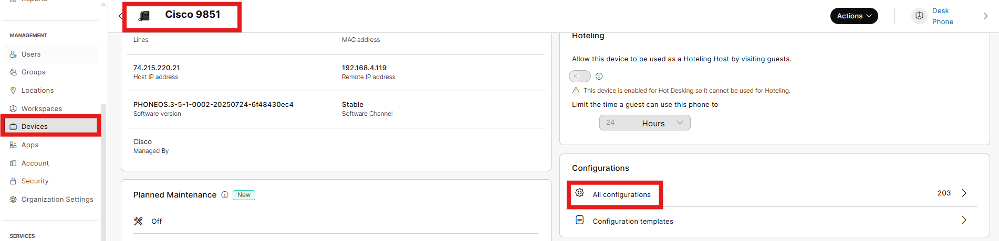
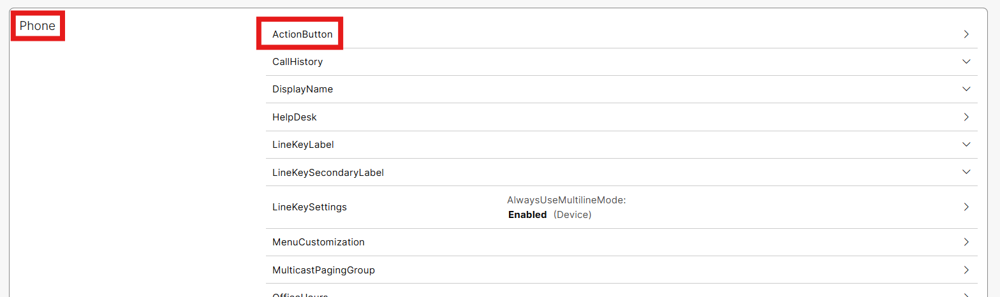
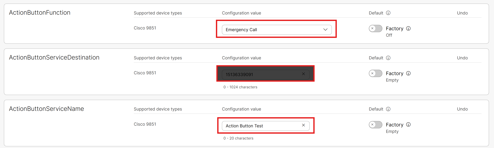
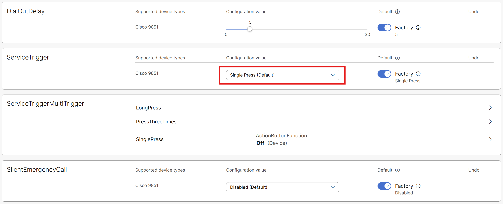
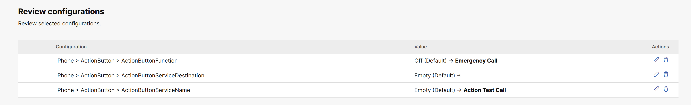
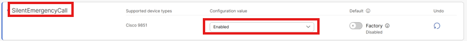

# 98XX Actions Buttons

- The 98XX phones are very powerful and have a ton of new features, enough that an entire lab could be devoted to 98XX set up alone. With that in mind we are going to focus on one important feature, the new action button. Click on Devices in the left menu and then select your 9861/9871 phone. From the Configurations tile select All Configurations.

- Scroll down to the Phone section and click Action Button.

- Set the Action Button Function to Emergency Call, set the destination to your cell phone including the 1 (as in 11 digits) and give the service a name (Action test call).

- Service trigger will be set at single press and everything else will be Factory Default. Then click Next.

- We will see the option to review our configurations and click apply.

- Now press the action button one time and you should see a red warning on your phone indicating the action button has been pressed and that you have 5 seconds to cancel the action; if you do nothing, the call will be made to your cell phone.

This delay is allowed in case of accidental pressing of the action button. Rather than configuring a single press, you could configure the service for a press and hold or even press three times. You can configure each one of those options to do different things if you desire.

- Let’s make one additional change, click on All Configurations when looking at your phone in Control Hub, scroll down and click on the action button. Scroll to the very bottom and enable the silent emergency. Then click Next and then Apply.

- If you click your action button again, the call will look very similar; however, once the call is placed, your phone screen will go completely dark, and you will be on a one-way audio call. The person on the other side can hear everything happening in the room but you cannot hear them. With the multi-trigger options, you can configure the phone both ways if you choose.

Action buttons can be flexible so in addition to making a call, they can also make an HTTP Post to one of your 3rd party systems.
