# Analytics, Reporting and Troubleshooting

Webex Calling has powerful Analytics and Reporting capabilities built directly into the product. If your manager asked you how many calls came into a particular location yesterday, last week and last month, how long would it take you to gather that data? Using Webex Calling, this data could be gleaned in under a minute and potentially under 30 seconds. Did you also know that you can schedule daily or weekly jobs providing you access to the reporting information that you need or that with the right administrative role, CDRs can be pulled from the Webex Calling Platform? Did you know that Call Manager data and analytics can be displayed in control hub by setting up Connected UC? As you explore Analytics and Reporting, know that there will not be a lot of data at your disposal, so don’t be shocked to see lots blanks documents.

!!! note "Note"

    On the left side of the screen under monitoring, click on Analytics and then the calling Tab. By default you land on the Media Quality Tab. This section gives you a high level overview of media quality across your enterprise. Note that by default you are looking at metrics for the last 7 days. These search scope can be modified to yesterday, last week or the last 90 to 365 days.

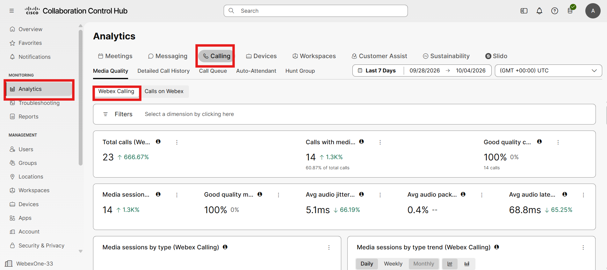

- If you click on the Detailed Call History Tab, you can filter by location, user external calls, etc.

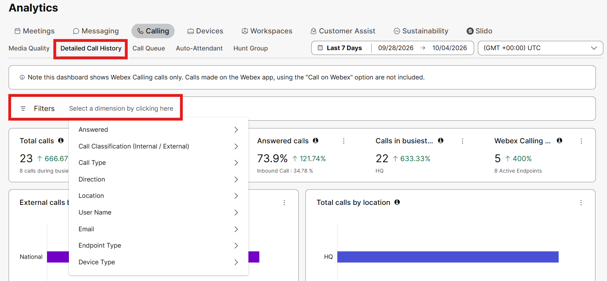

- The KPIs here are really powerful. As you look at the data below, you can see the total calls at 23. That is a 666.67% increase over the previous 7 days.

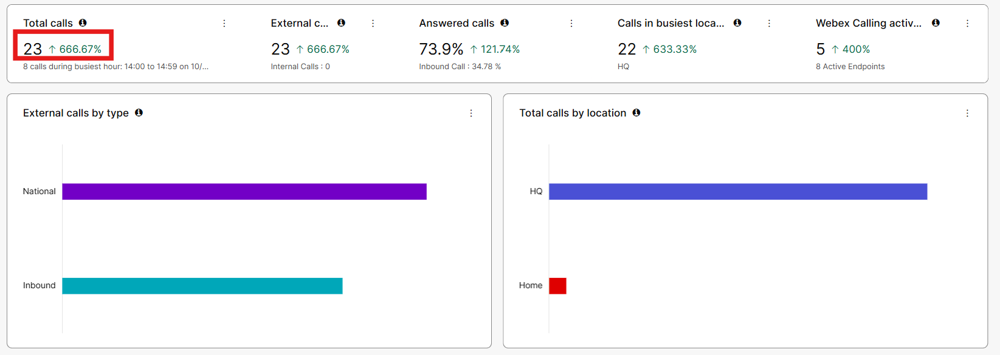

- If you click on Call Queues, you can see Queue Stats, Agent Stats and even Live Queue stats. These metrics reflect the native or include call queues.

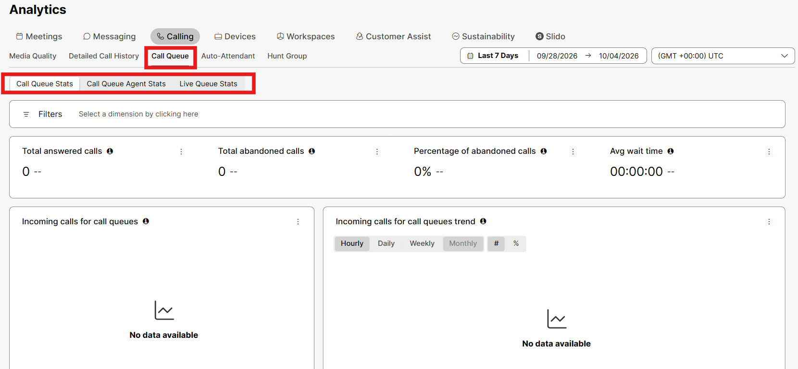

- Across the top, there are additional metrics for Auto-Attendants and Hunt Groups too. The AA analytics also include what time of day distribution metrics and even which buttons were pressed.

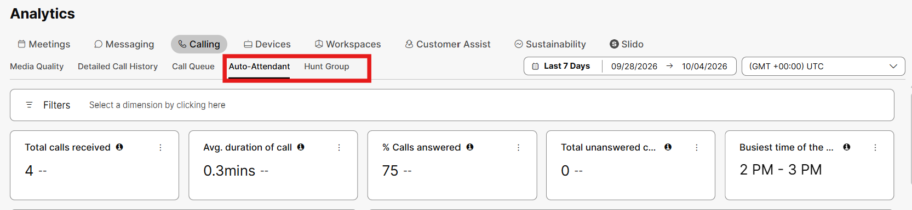

- If you click on Reports in the left menu, then scroll down to Calling you can see the reports on Usage, Quality and Inventory.

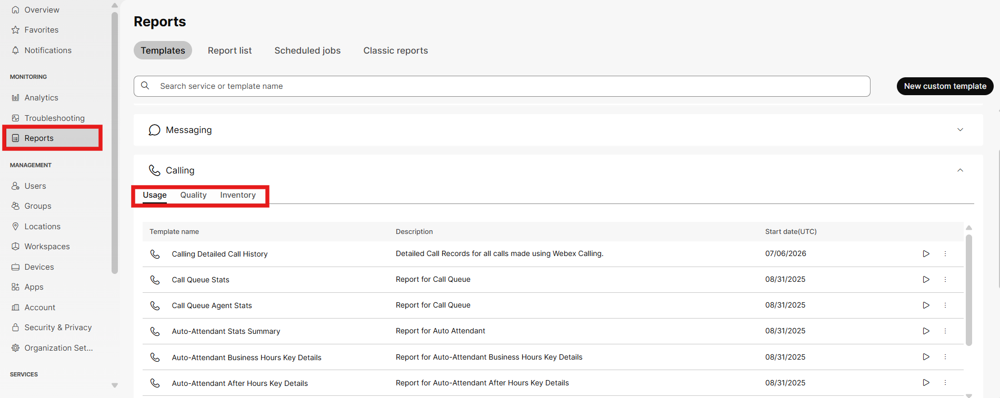

- If you click on Call Queue Stats, you can see the detailed items included in this report.

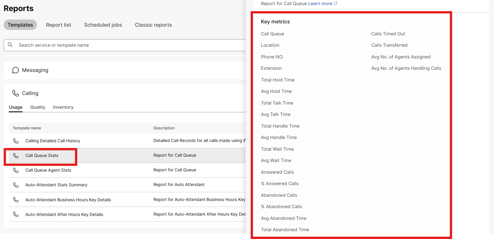

- If you were trying to get metrics and even potentially manage some of your UCM tasks, Connected UC will help you accomplish this. Under Services in the left menu, click on connected UC. Once your UCM is set up and connected to the Cloud, there will be a new tab in Analytics that will show call manager data. Details can be found [here](https://help.webex.com/en-us/landing/ld-npxwpmz-WebexCloud-ConnectedUC/Webex-Cloud-Connected-UC).

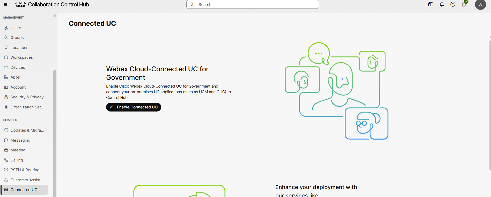

- As a final step, lets look at troubleshooting. Click on Troubleshooting in the left Menu under Monitoring.

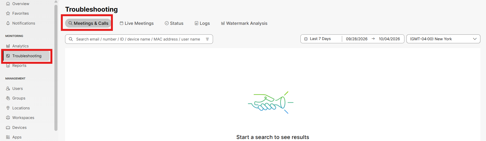

- If you search for calls made by your admin user, you should see several calls logged in the system.

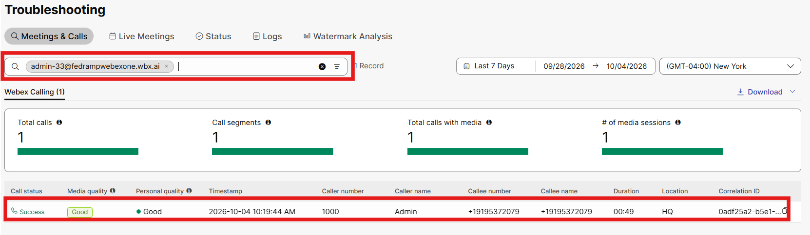

- Click into one of your calls and check out all of the data that webex was able to glean from that call. If there was an issue, you should be able to determine what devices people are using, what ip addresses they have, and other relevant details.

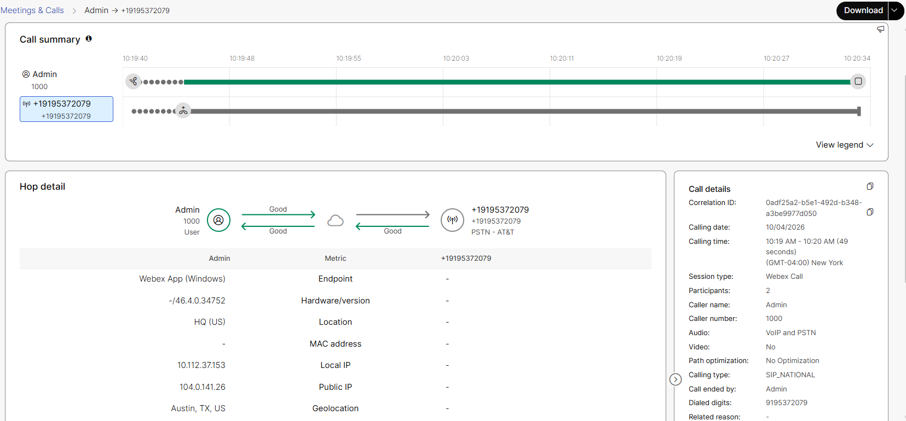

This was just a small and simple overview of analytics, reporting and troubleshooting but hopefully it helps you understand the quantity of data that is quickly available. If you manager asks, how many calls came in last week to the HQ location, Analytics will show you that data in a matter of seconds. If they said, what about the last 30 days, simply change the 7 days to 30 and you are set.

You have successfully completed this Lab, hopefully you found it insightful and have a better understanding of the capabilities of the Webex Calling for Government Platform.
