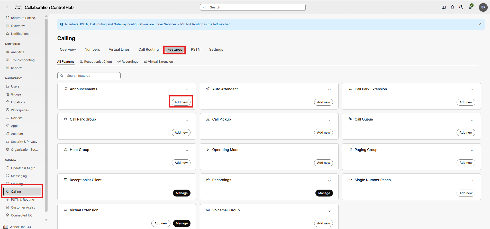
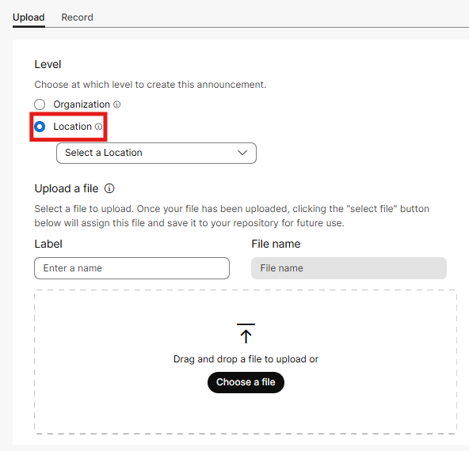
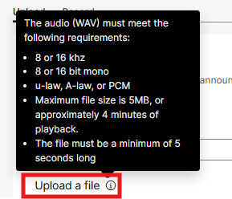
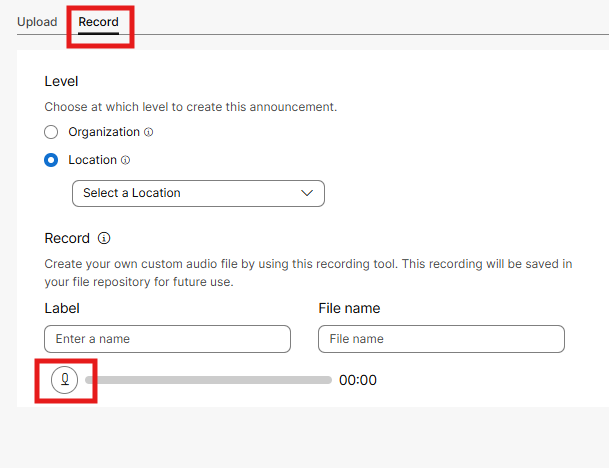

# Announcements

- Announcements are where we typically upload Music on Hold files (MOH) as well as greetings for our Auto Attendants, Basic Queues and Customer Assist Queues. From Control Hub click on Calling in the left menu, select Features in the top menu and then choose Add new in the announcements tile.

- The ability exists, as shown below, to upload files at a location level thus making those files available to any feature aligned in the same location. The other option is to upload files at the organization level making them available everywhere. The formatting for these .wav files is also shown below. In this lab, we are not uploading any .wav file but you can familiarize yourself with the flow on how it works

- If you click Record (and have a decent microphone and a voice for radio), you can record greetings directly from your browser.

- We will not be uploading custom announcements in this lab so as we get to the greeting’s sections in the above mentioned features, we will leave the default greetings enabled.

Congratulations, you have completed Chapter 1 and now have a working phone system; not configured entirely, but to the point where you could soon be making and receiving phone calls!!!
