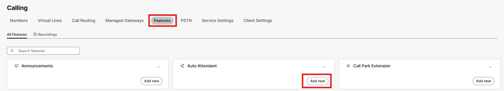
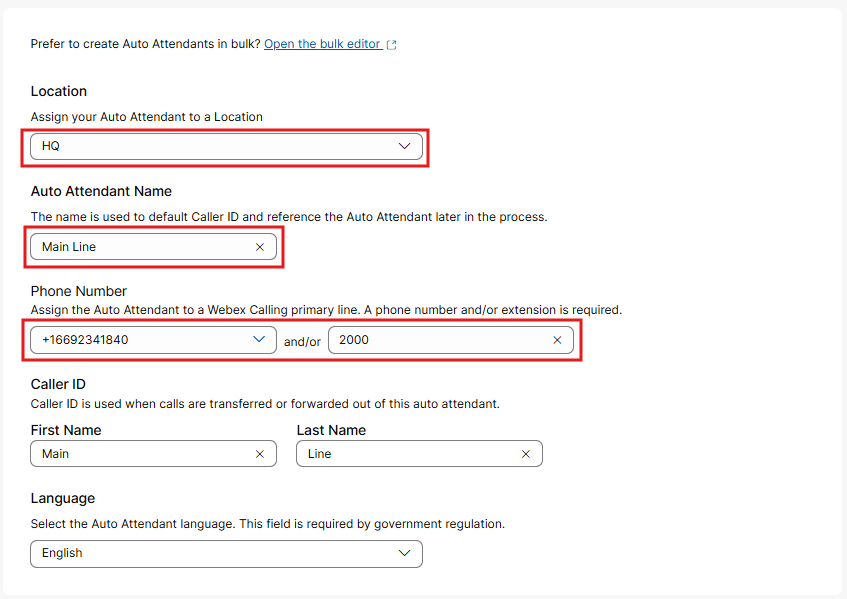
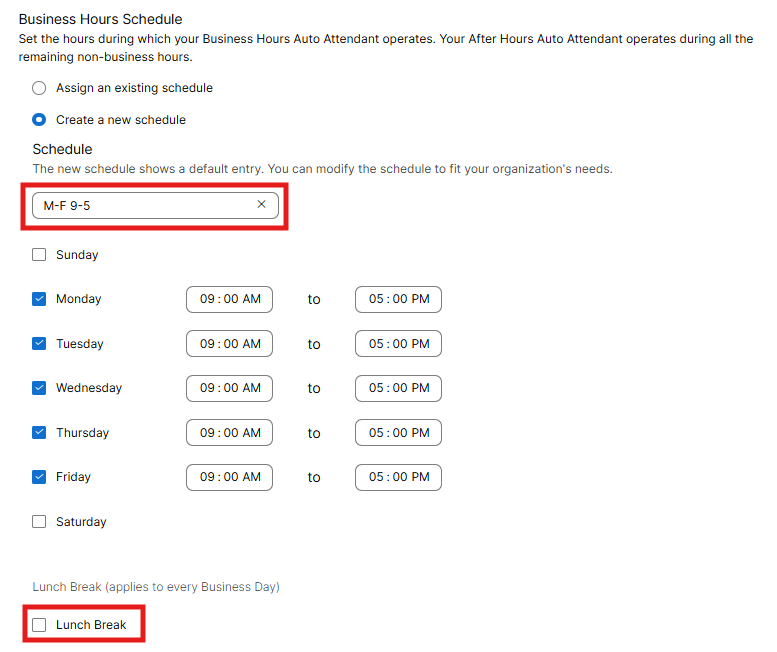
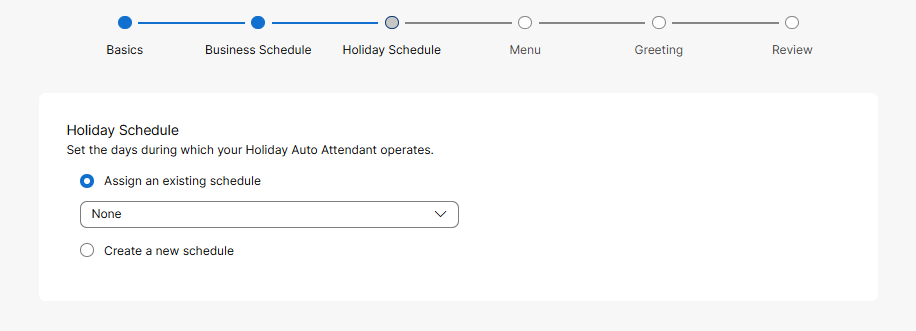
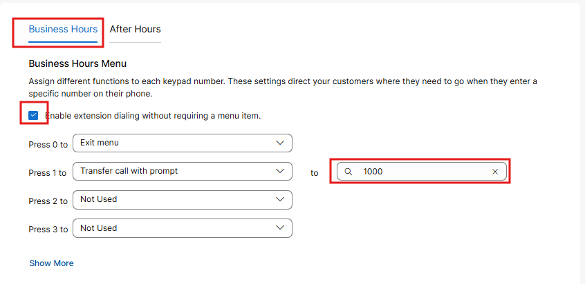
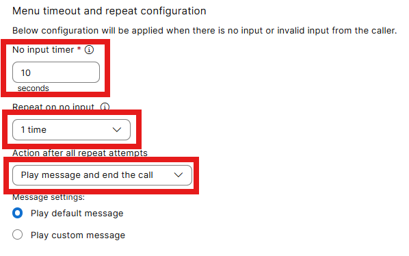
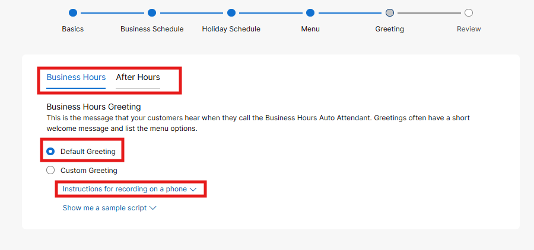
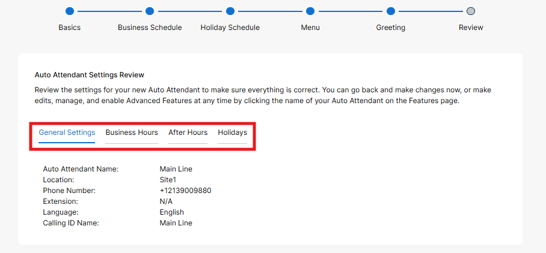
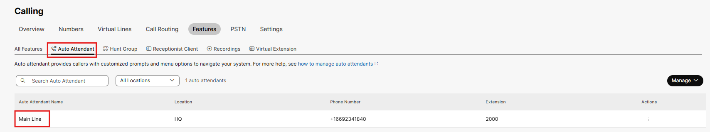
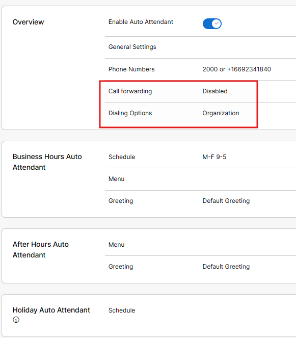

# Auto Attendant (AA)

- Cities, Counties, States and every Government agency in between use Auto Attendants to present routing options to callers so they can navigate complex menu structures and get to the correct person or department in an efficient manner. From the Features Menu in the Calling section, you will click on Add new in the Auto Attendant tile.

- First assign the Auto Attendant to a location, HQ. In doing so, the Phone Number selection displays numbers that are not already assigned to users, workspaces or other features. Select an available phone number and then set the extension to be 2000. This could be the “main number” that was defined earlier when we set up our location. Configure a caller ID name and select Next in the bottom right corner.

- Next, you need to create a new schedule as none have been previously created. Give this schedule a name something like M-F 9 – 5 and then also scroll down and uncheck the lunch break then click next.

- As you see the Holiday Schedule set up, leave the assigned schedule as none and click next. If you click on create new schedule you are required to set up a holiday schedule before proceeding. Even if you go back and select none, it will not work…

!!! note "Note"

    At this point you can configure your business hour menu options then click after hours to set up our closed menu options. Note that “enable extension dialing without requiring a menu item” is already selected. This allows callers to enter a user’s extension number at anytime for direct routing. This will be really handy later as we do not have many DIDs to test with.   For the Press 1 option, select “transfer call with a prompt” and in “to” field search for and add the admin user (1000). Option 2 could be configured to route to your desk phone and so forth. You could set up “After Hours” but for now we will leave it unconfigured. Also worth noting, the “to field” is not limited to configured numbers in Webex Calling, you could route a call to a PSTN number like an answering service if desired. At the very bottom there are options that allow you to repeat the menu and terminate the call if there is no customer input. Configure as shown and click Next.

- You can now assign your greetings to this Auto Attendant. Assuming you uploaded recordings to the announcement feature, you could select the correct recording for the Business and After Hours announcements accordingly. Because you did not upload any files, keep the default setting. If you click the drop down for recording on the phone, there are directions for recording these greetings from a phone (optional). Click Next.

- You can now click through these various sections to review our set up. Then click Create.

- A new header was added to the features section for Auto Attendants making them a little more accessible. If you click on your Main Line, you will see the ability to modify any settings.

- There are a few new options available now that you have set up the Auto Attendant, call forwarding for example as well as dialing options. If needed, you could also assign additional phone numbers to an Auto Attendant in cases where multiple numbers have been published over time.

You have successfully set up your first Auto Attendant. While very simple, this illustrates how easy they are to configure. Of course you can use an Auto Attendant to route to queues, hunt groups and other Auto Attendants if needed.

At this point using your mobile phone, call into the Auto Attendant via the assigned phone number, press option one and that call should ring into your PC where your admin user is signed into the Webex Application. Remember we do not have a real greeting on the Auto Attendant so once you hear the platform answer, you will have to press 1. Feel free to modify your Auto Attendant options to route calls to other users usings the dial by name or dial by extension menu options. We initially enabled dialing extensions without requiring a menu option too, trying calling into your Auto Attendant and entering the 4-digit extension of your Deskpro and see what happens.
