# Call Queues

- As you saw, Hunt Groups are powerful and simple to set up and Call Queues step things up a notch. These queues are feature rich and are included with Webex Calling. Almost every single government customer has use cases that may be addressed by this type of queue. Historically there were many “simple call centers” built using UCCX because this was the only queueing option available to on prem customers. Today, many of these call centers can be converted to Call Queues with little to no feature gaps. If not already on the Calling Features page, navigate to Calling in the left Menu, Features and then within the Call Queue tile, select Add new.

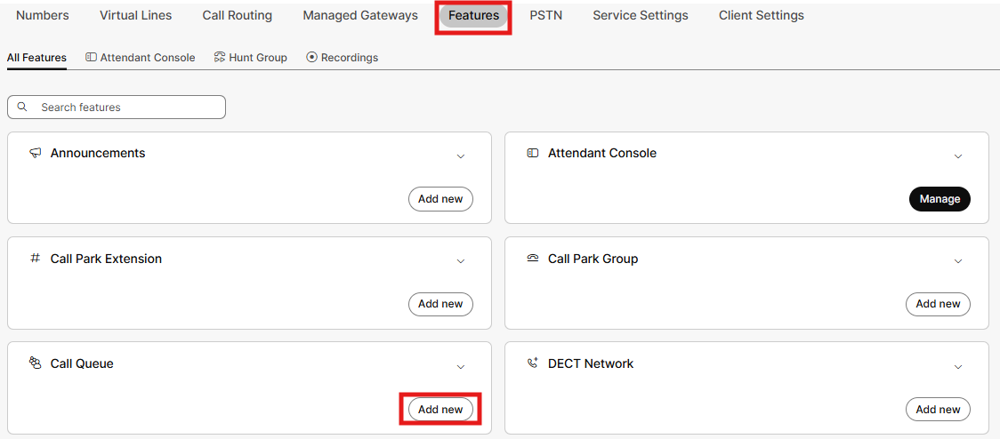

- Next, you will assign the queue to the HQ location, give the queue a name like Basic Queue and set the extension to 4000. Click allow agents to change their caller ID to out pulse the location main number and set that number as being the queue number in the external caller ID section. Queue size we will leave at 10, then click Next. These queues can scale up to 250 calls in queue; however, if you really expected that many concurrent calls, you are a real call center, and Cisco has better Call Center options with Customer Assist.

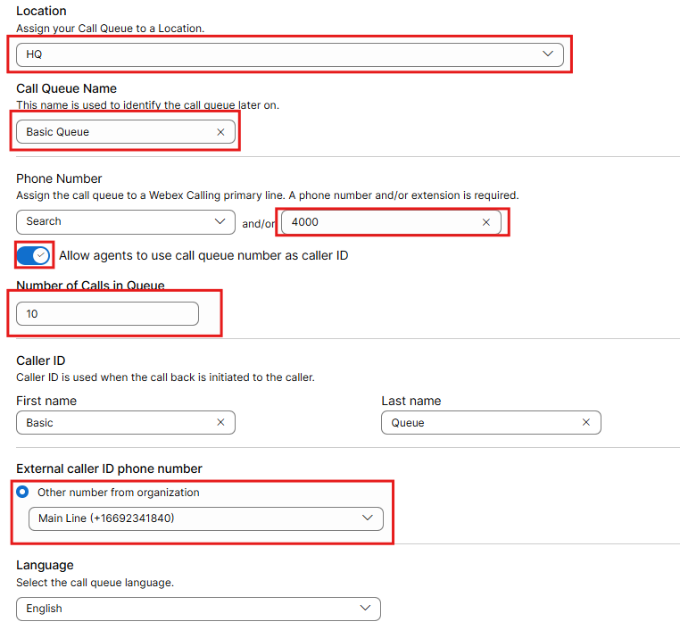

- Take a moment to read about these distribution algorithms by hovering over the “i” just behind each label. Select Circular then press Next.

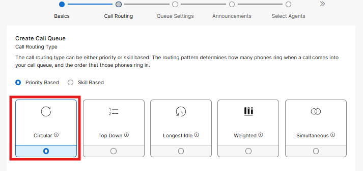

- For now, you will leave this page as default. At this point if an 11th call comes into the queue, they will hear a busy tone. You could also configure this queue to overflow into a voicemail box or another queue if the caller has been in queue for more than a defined period. Feel free to explore your options, but leave it set up as shown, then click Next.

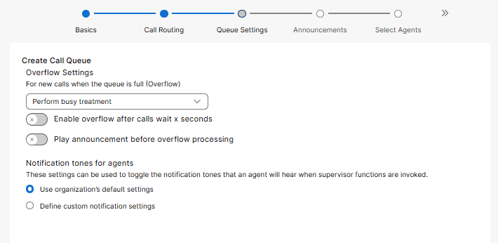

- Next, you get into queue greetings. The Welcome Message is on by default and for now leave the “mandatory message” unchecked. Again, for all of these greetings you will leave them set to the default message. Estimated wait you will leave disabled for now and  \\will set the comfort message to 60 seconds. If you uploaded custom Music on Hold, you could set up that MOH to play for callers waiting in queue; as we did not, we will enable Hold Music and keep it on the default. The last step to enable is call whisper. When this setting is enabled, an agent will hear a prompt identifying the queue for incoming call. Click Next.

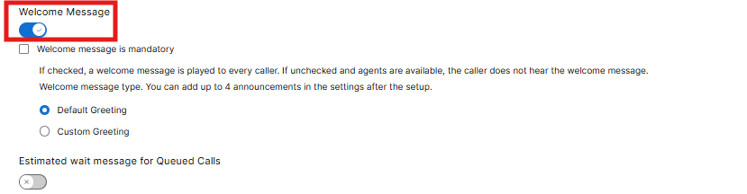

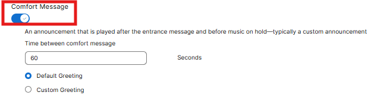

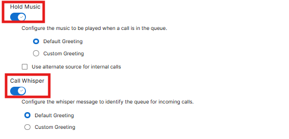

- At this point you will assign agents to the queue. Select the drop down and add in our desk phone, Admin User and User1. Also select “allow agents to join and unjoin” the queue. This option is useful for agents assigned to multiple queues so that they can pick and choose which queue they are a part of on a given day. If you normally staff 4 agents but someone is sick, a configured agent could toggle on the option to receive queue calls for a day and then turn it off once they are not needed. Click Next.

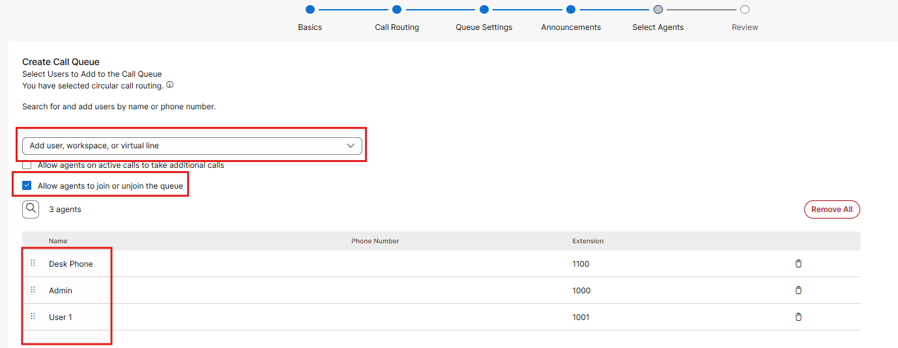

- Now you can review the queue set up, click create and then done

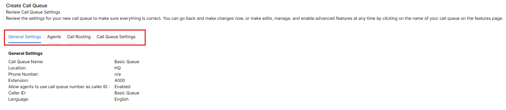

- Now you should be looking at a page displaying your new queue. If you click on that queue, you should see a host of options. Let’s explore just a few before we make test calls.

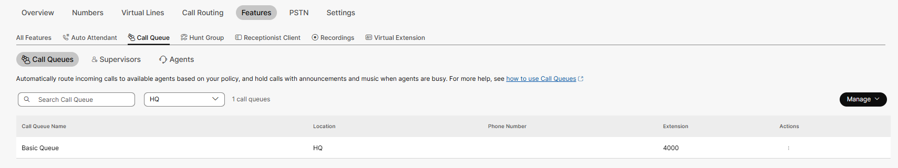

- From this page click on Bounced Calls and you should see a menu like this. Change the 8 rings to 3 rings and check out the other settings, then click Save. Bounce basically means to pull the call back into queue. After you have clicked save, click the highlighted overview to return to the queue menu.

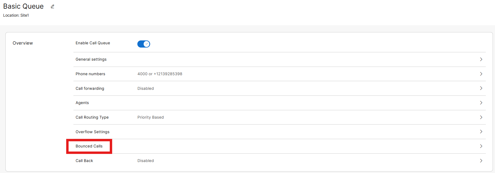

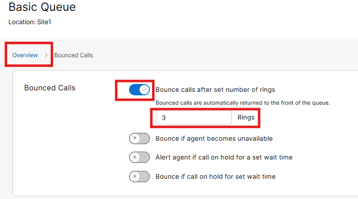

- If you click on Night Service, you can now apply a schedule and manage after hours queue behaviors. Following the example below, enable night service. In theory, you could play a greeting like “Sorry we are closed. Please call back tomorrow” and then perform a busy treatment – all according to the defined schedule. If we changed the busy treatment to transfer to a number, we could route that call to an answering service or even an Auto Attendant. There are tons of potential options that could be set up. After you have clicked save, click the highlighted overview to return to the queue menu.

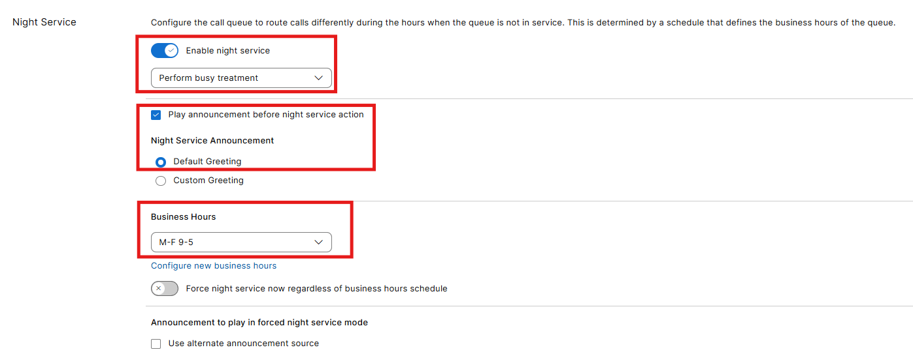

- Next click on Stranded Calls, enable the trigger, select Night service behavior and click save. In this case when calls come into queue but no agents are available, callers will do whatever behavior was set up for Night service.

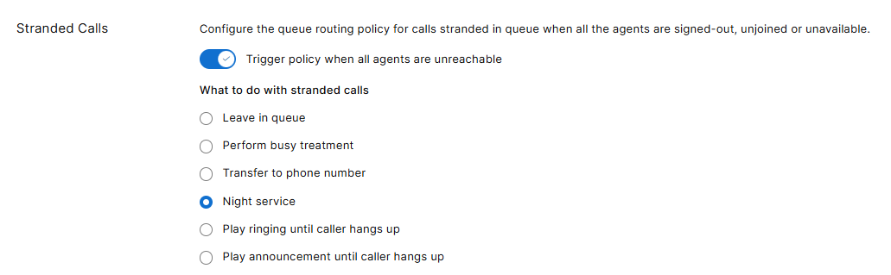

- Next click on Call Back. While you won’t require this feature for the lab, when the estimated wait feature is enabled within announcements, you can enable on call back. And at a high level when your estimated wait exceeds a certain threshold, callers are given the option to receive a call back while maintaining their position in queue.  (this is very hard to demonstrate in a lab because you need to route multiple calls into queue)

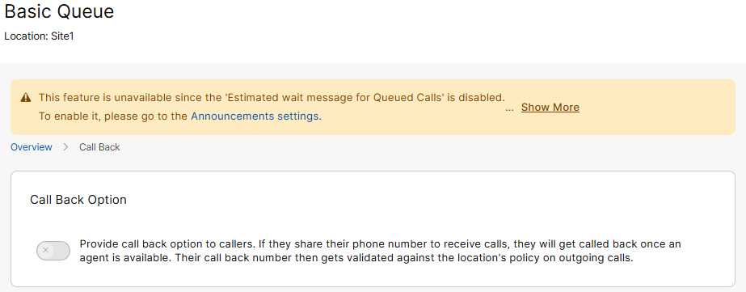

- Now it is time to validate what was set up. Based on how you set up the queues, you can see that the agents can select their outbound caller-id, can change their status and join/unjoin the queue. You may have to exit and relaunch the Webex application for this change to be apparent.

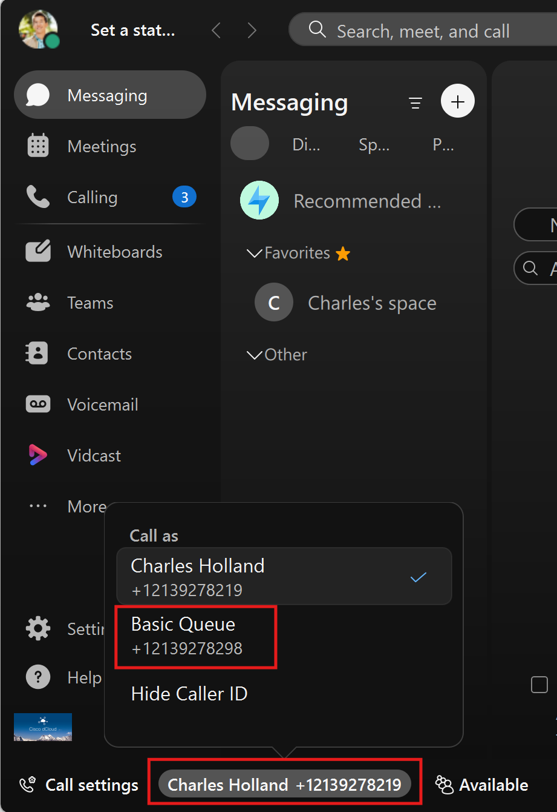

  

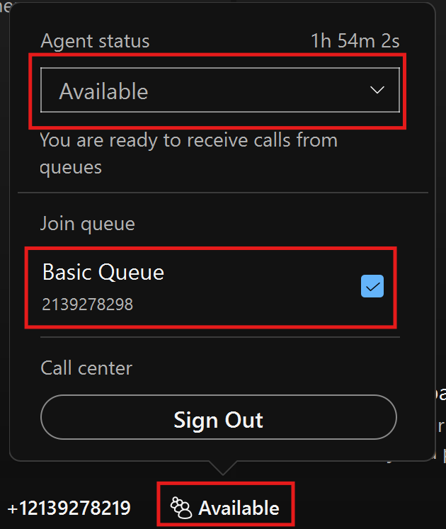

- Even from the Webex app on mobile device, there are options to change caller-id, queue status and join/unjoin queues.

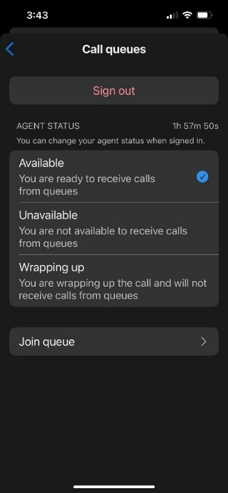

  

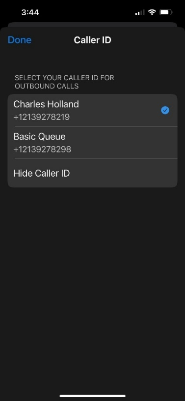

- Also make sure that you reset your desk phone as it has new functionality applied to it. From Control Hub click on Devices in the left menu, then click on your phone and then under the action's dropdown click on apply changes, this should force a reboot of your phone.

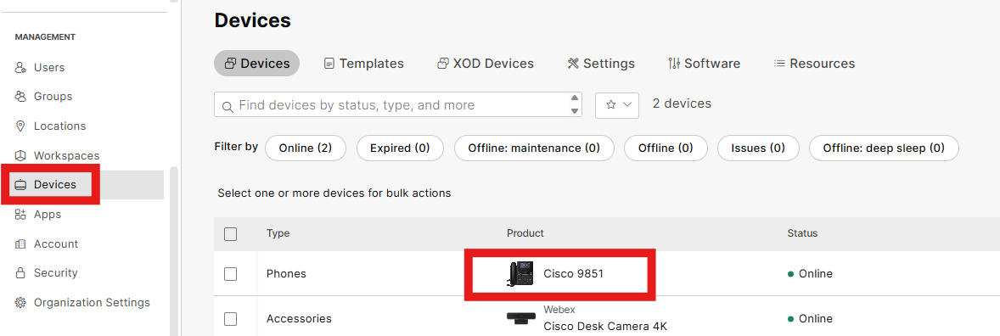

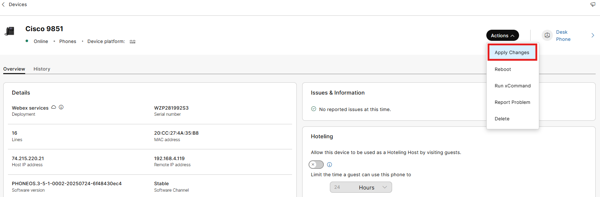

And without screen shots, find and click into the Auto Attendant that was created earlier, find the business hours menu and add your basic queue as option 3. Then click Save.

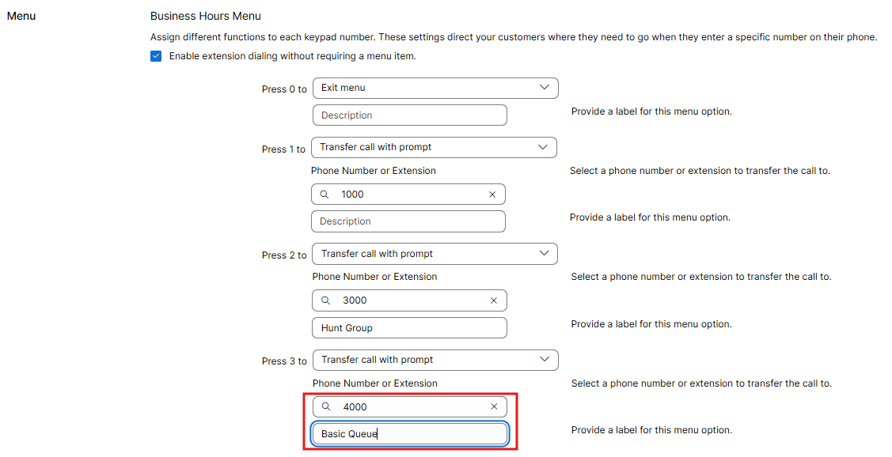

Then make a test call from your Mobile phone into the Auto Attendant by calling and then press option 3. The first call should come to your desk phone. A second call will ring into your PC, and the third call will ring your mobile user. Also dial into your Auto Attendant and click option 3 to route to your queue again. (please remember we do not have a real greeting in the Auto Attendant or queues so you will have to use your imagination when the queue answers unless you recorded a basic greeting from your PC – Bonus work!!!)

You could assign supervisors to these queues as well and using feature access codes, they could barge, coach, intercept calls happening with their agents. With native queueing, supervisors do not have access to live queue data or agent metrics; however, with Customer Assist Queues, supervisors have access to this data in the Webex Application.
