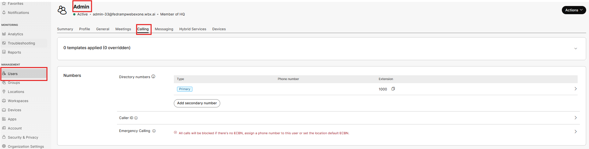
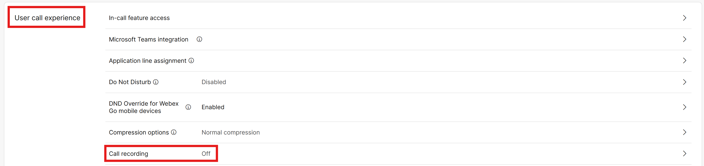
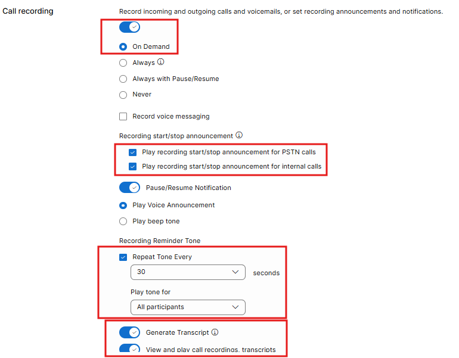
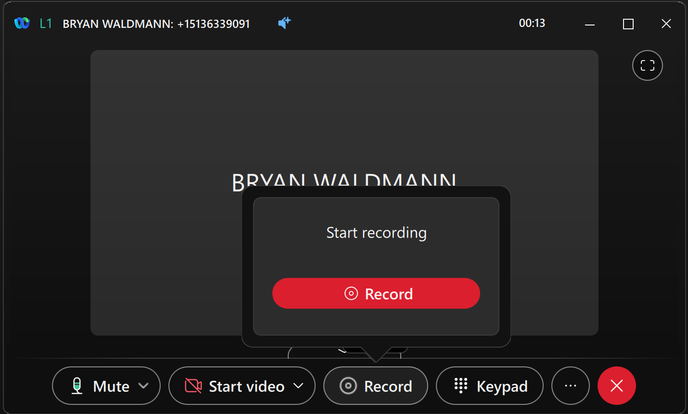
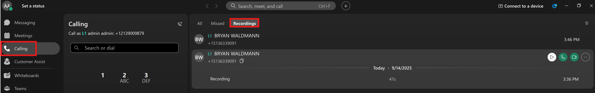
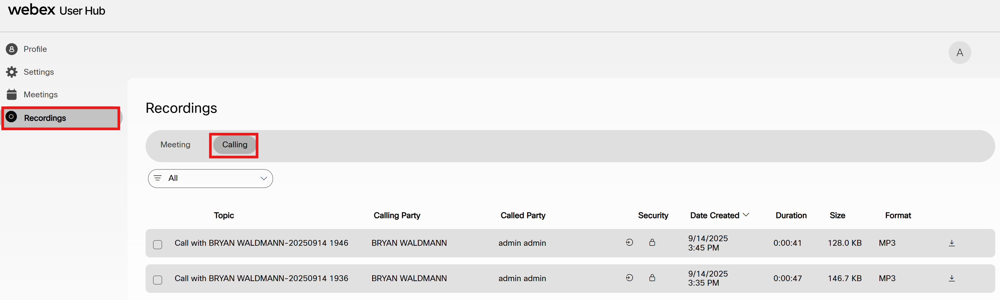
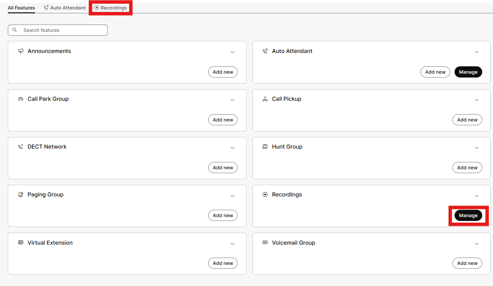
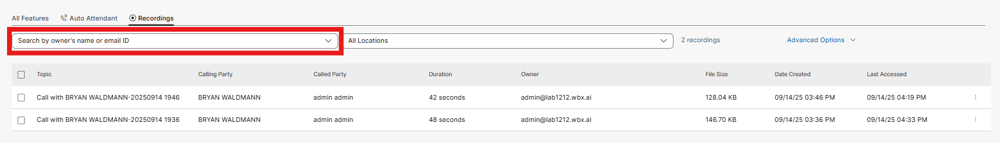

# Call Recording

- At the beginning of this lab, we set up organization wide Call Recording and selected Webex as our default call recording provider. Many government agencies have some sort of call recording requirements, and each has unique retention policies based on local regulations. Let’s set up the Admin User with Call Recording. Select Users on the left menu, Admin and then the Calling tab under the account.

- Scroll down to the User call experience tile and select call recording.

- Configure the following options for the Admin, then click save. These options can be configured per user and some of these features may or may not be required per local laws. The ability to always record with pause/resume is especially useful for those users handling PCI/HIPPA data.

- At this point, exit Webex on your PC and then relaunch the application. Now from your Mobile phone, dial the phone number of the auto attendant and select option 1 which should then ring into your PC.

- Once you answer the call, you will see the mid call window appear and will have a record button (this is because the Admin is empowered to record on demand). Select record and then start recording. The mobile user should hear a prompt saying this call is being recorded and then hear beep tones within the call.

!!! note "Note"

    Within the Webex Application on your PC, the Admin user now has a recording tab and can listen to the recorded calls. Note that Admin user does not have the ability to delete calls at this point. If you scroll just a few slides up, we intentionally did not check the option giving them that capability. Feel free to play back your recording in the Webex application.

- If you browse to the end user portal (user-usgov.webex.com) and sign in as the admin user, you will see an additional portal where the end user has access to recordings. Click on Recording and then Calling.

- There is one other place where call recordings appear and that is in Control Hub. If you click on the Calling in the left Menu, Features and then you can click on Manage in the Recording tile or Recordings in the top pane.

- From there you can search for the Admin user, you will see any recordings that have been made.

- Admins can delete these recordings or even reassign them, but they cannot listen to them. To hear these recordings, there is a separate administrative role in Control Hub called Compliance Officer who will have access to these files.
