# Configure User Accounts

- 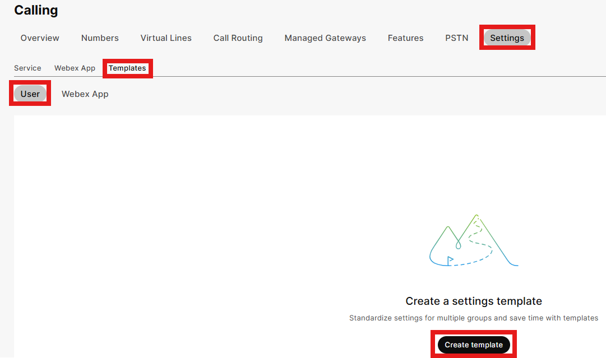
  
  First, we will set up a user-based calling template prior to configuring user accounts. Click on Calling in the left menu, then Settings, Templates, User and then Create Template.

- We will name the template Standard User.

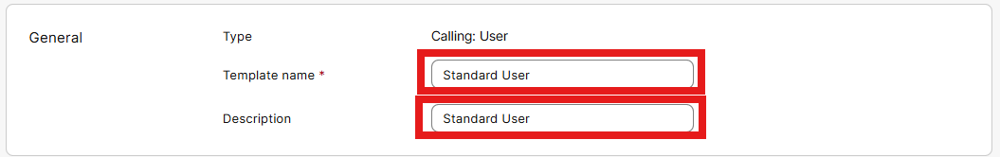

- Scroll down to the Caller ID section and make the following selections.

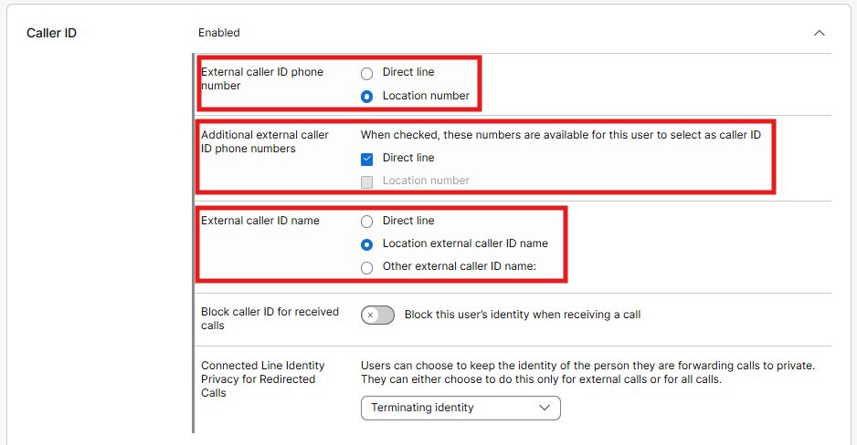

- Then in the Voicemail section, make the following selections.

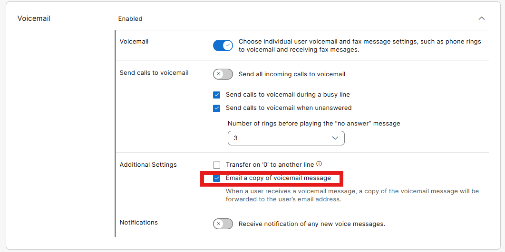

- In the Call Recording section, enable call recording and select the On Demand button. Feel free to check out the other calling options that can be set and then click Create template and next.

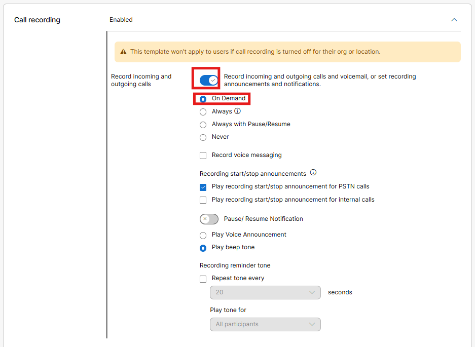

- Search and click on HQ, then click Done. This template is now assigned to any users provisioned in the HQ location.

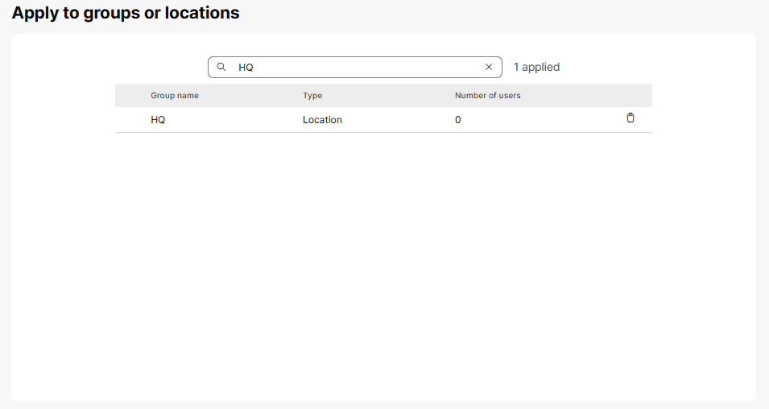

- From Control Hub, click on Users under the Management section and then click on the user account for User 1 (screen shot user in the lab example is different).

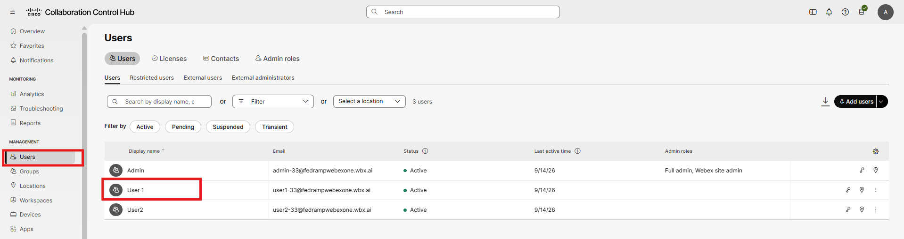

- From the user account, click on Edit licenses.

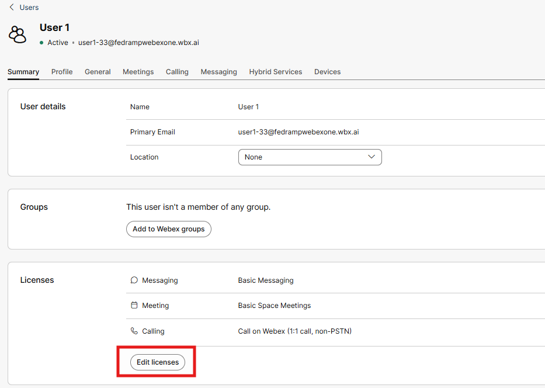

- We then see another summary of the existing entitlements and click edit licenses again.

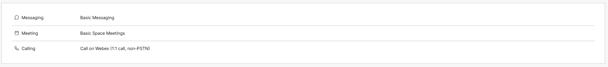

- Click calling, Webex Calling Professional and then Save

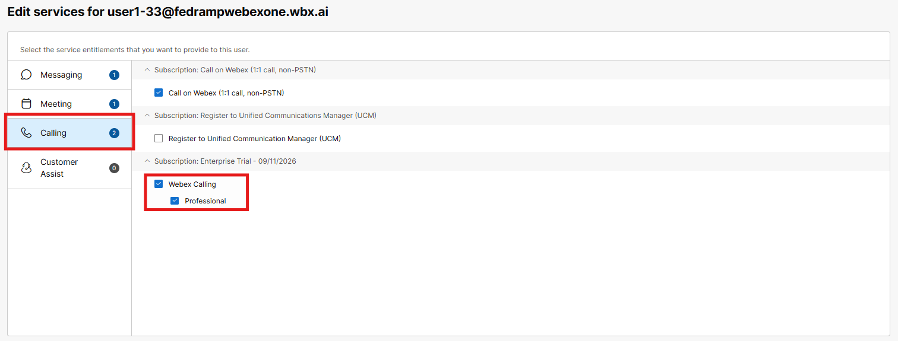

- As you are licensing a user for Webex Calling, you are required to assign the user to a location and assign a phone number and or an extension. Chose one of your available DIDs and assign the extension 1001.

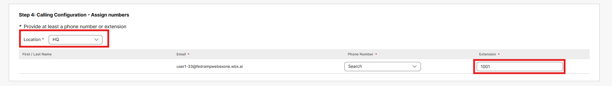

- Lastly, you will see the summarization of the licensing changes you made, click close in the bottom right corner.

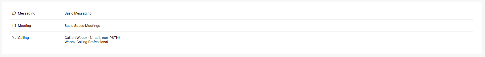

- As you look at the user account and click calling, we see the set up applied to that user including phone number, extension, Caller ID and Emergency callback number.

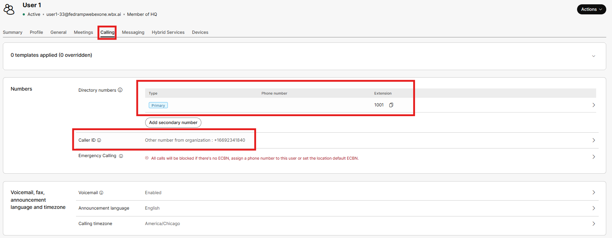

- Features like Voicemail are enabled by default for users, so when we licensed User1 for Webex Calling, the voicemail box was created automatically. In the 3rd tile down from the top, you see voicemail is enabled and if you click into that, you should see that voicemail to email is already enabled; and because this is a user account, Webex Calling assumes that the copy of the Voicemail message should be sent to the user’s email address. If you scroll to the bottom of this page, you can even enable inbound faxing to the user. Faxing and Voicemail to email are not required in this lab and is just pointed out for example purposes.

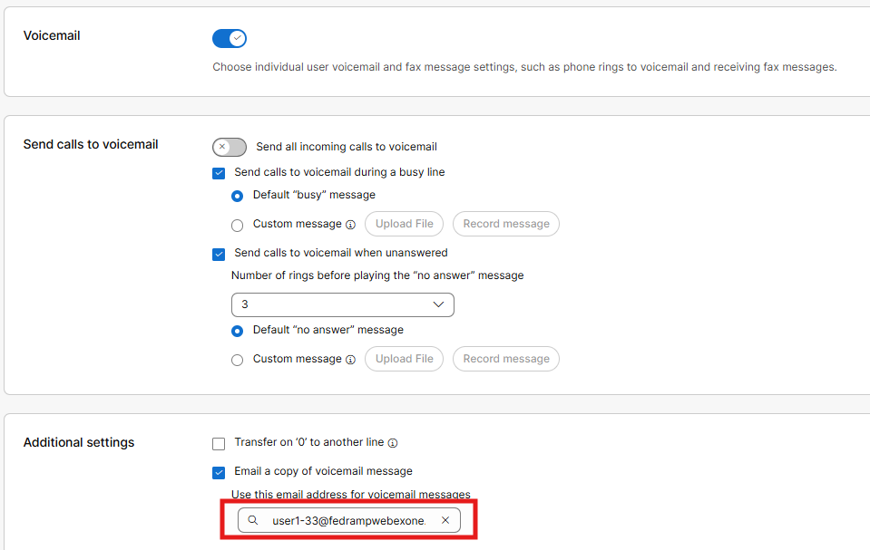

- If you scroll to the top of the voicemail section and click “&lt; Calling”, you are returned to the calling page for the user. Take a moment to look through some of the other features. Outgoing call permissions define the “calling search space” for the user, user calling permissions takes precedence over the setting that’s inherited from the Location settings. Other features like hoteling, hot desking, push to talk, barging, call recording, etc. can be enabled at the user level as well and these will be covered later in this lab.

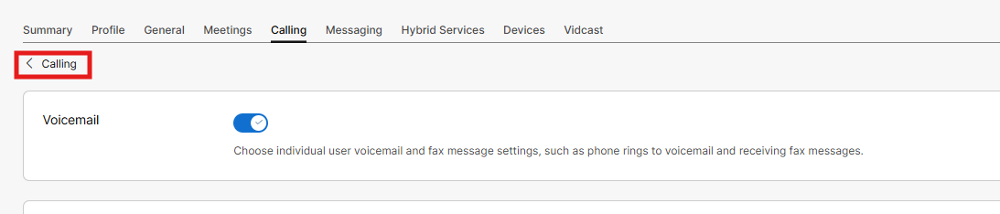

- Unlike Cisco Call Manager, where you must configure soft clients for users, when a user signs into the Webex App on their PC/MAC or iOS/Android devices the calling features load up automatically for them based on the existing configuration work that you have done. The only change you would potentially make to the application configuration is adding shared or virtual lines and this is done in the application line assignment area (you will do this later in the labs).

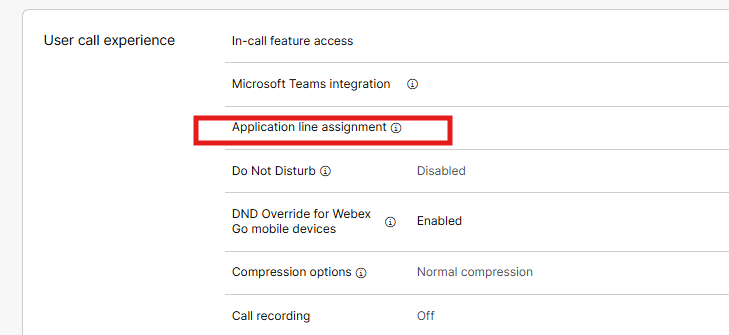

- If you click on Devices in the user’s menu, you could assign a phone to a user.

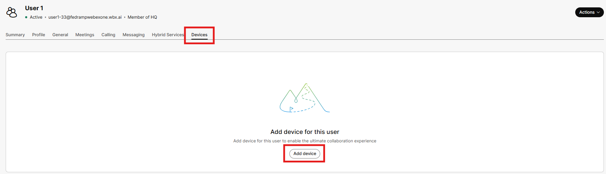

- While not required at this point if you clicked Add device, you would see a new submenu pop up where you could assign a phone to a user via mac address or activation code. (At this point we are not looking to add the phone to the user because we are going to set up a workspace) Exit this device configuration page by clicking Cancel.

- Using the above steps, go ahead and assign calling licenses and extensions to the rest of your users that are provisioned in your Control Hub org. As you are licensing users, you need to configure the location and extension number. You do not need to assign these users phone numbers so that field can be left as None. Click Save then click Close.

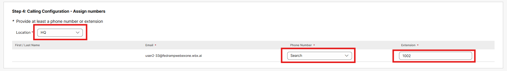

- Here is the dial plan for the rest of the users. While we are very much licensing users manually, in real world scenarios you could use APIs, .csv files and templates to manage users in bulk.

| User | Extension |
| --- | --- |
| Admin | 1000 |
| User1 | 1001 |
| User2 | 1002 |
