# Customer Assist Queues

- Customer Assist Queues and Basic queues configure in very similar ways but have quite a few differences, one of which will be the primary focus of this lab, Supervisor and Agent metrics and visibility. If your call centers require more real time data / queue insights and more call center centric features, Customer Assist is the way to go. There is another full session lab at WebexOne dedicated to customer assist which takes a much deeper dive into the other differences like queue-based recordings, screen pops, wrap up time, wrap up codes and additional reports and analytics.

To get started, click on Customer Assist in the left menu.

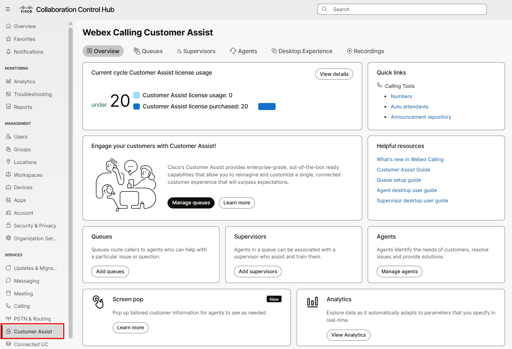

- Click on Queues and then Add Queue.

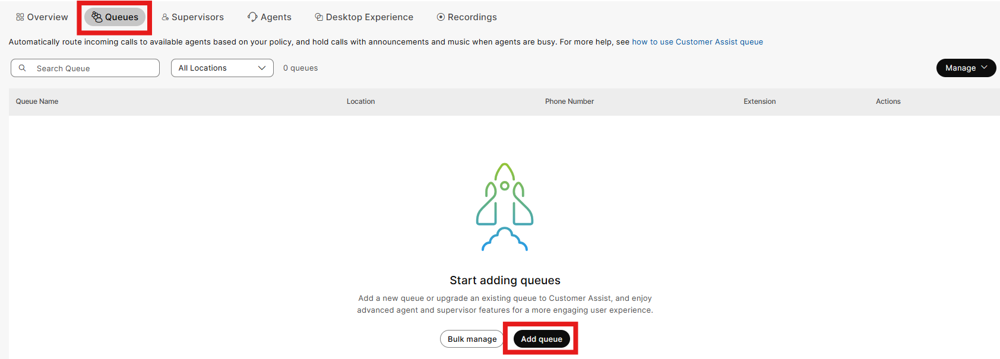

- Associate the queue with the HQ location, name the queue Customer Assist Queue, assign the extension number 4500 and one of your remaining DIDs, and allow agents to use Queue number as caller ID, check the box for the location main line and then click Next. Much like basic queues, the customer assist queues can scale up to 250 calls, but we will keep the queue size at 10.

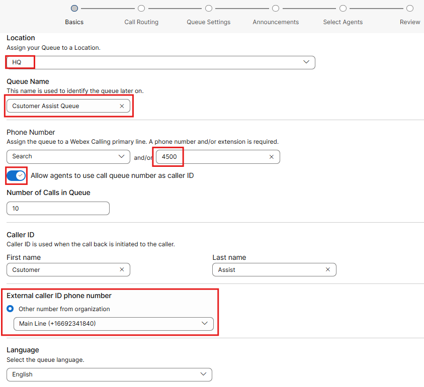

- Select Circular and then select next.

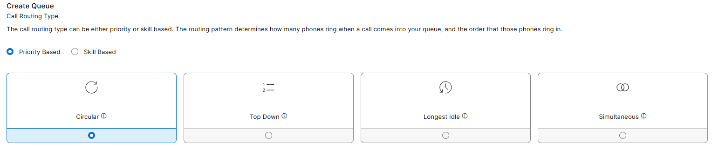

- A new feature associated with Customer Assist Queues is Auto Answer. If the agent is on a supported device, the agent can choose to manually answer a queue call prior to satisfying the auto answer delay, but if they do not answer, the new auto answer feature will accept the call and present a zip tone to the agent. In this case, you will enable the Auto Answer and set the answer delay to 5 seconds.

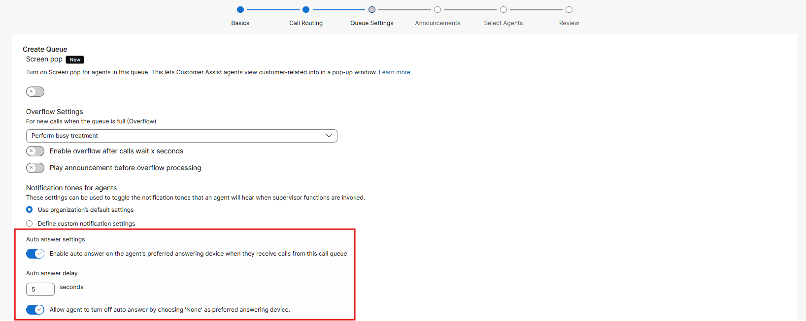

- These announcements are the exact same as the Basic queues, so no changes are required here either for the sake of this Lab, click Next.

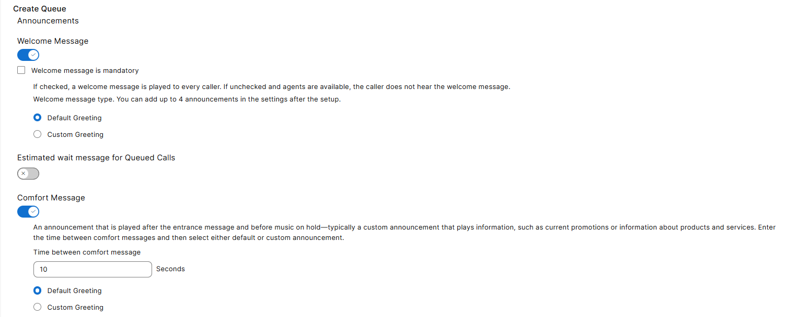

- It is time to add our agents to the queue. Next assign Admin, User1 and User2 to the queue, check the box to allow agents to join/unjoin the queue then click Next.

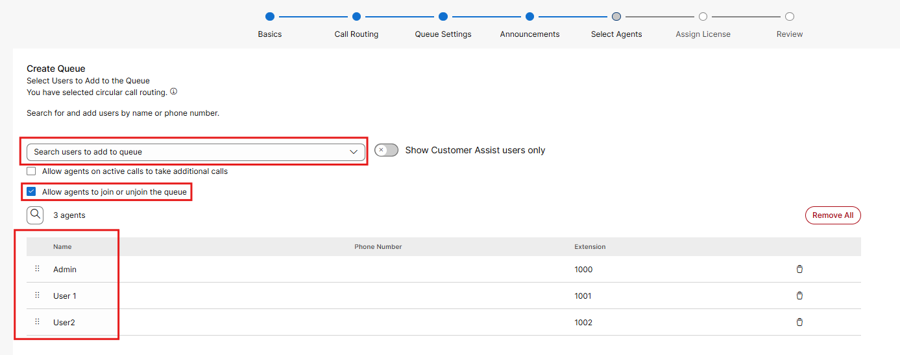

- And because these users do not presently have a Customer Assist license, these licenses will be added to their user accounts as we set up the queue.

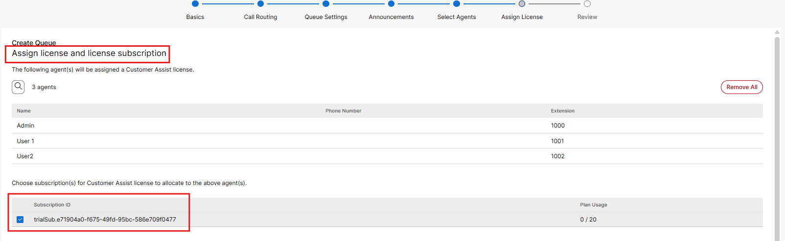

- Then you can review the queue set up, click Create and then Done on the next page.

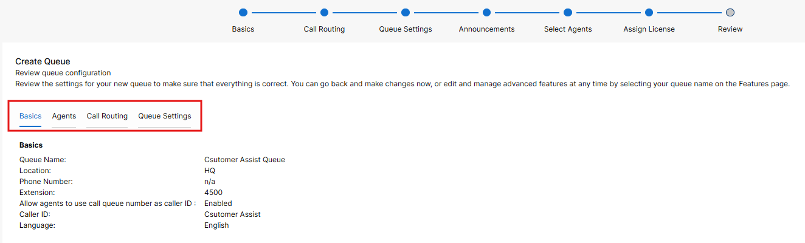

- From the Customer Assist Menu, click on Supervisors. While we had supervisors also in basic queueing, their ability to monitor calls, coach agents and barge into calls were managed via Feature Access Code. With Customer Assist, supervisors have a much more robust experience.

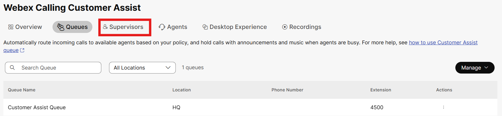

- Now Click Add Supervisor

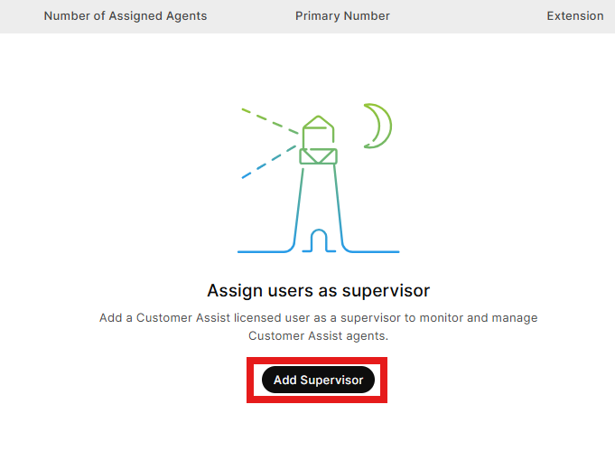

- Select the Admin User as our supervisor then click next.

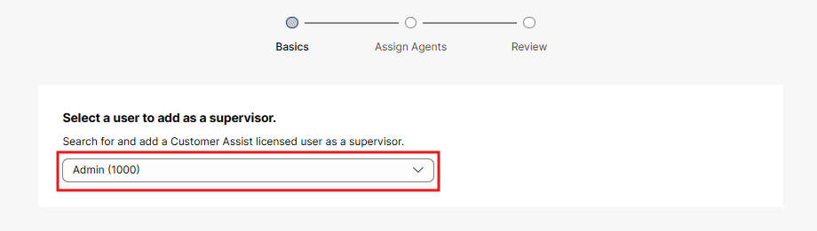

- Then assign the Admin User, User1 and User2 as agents, then click Next.

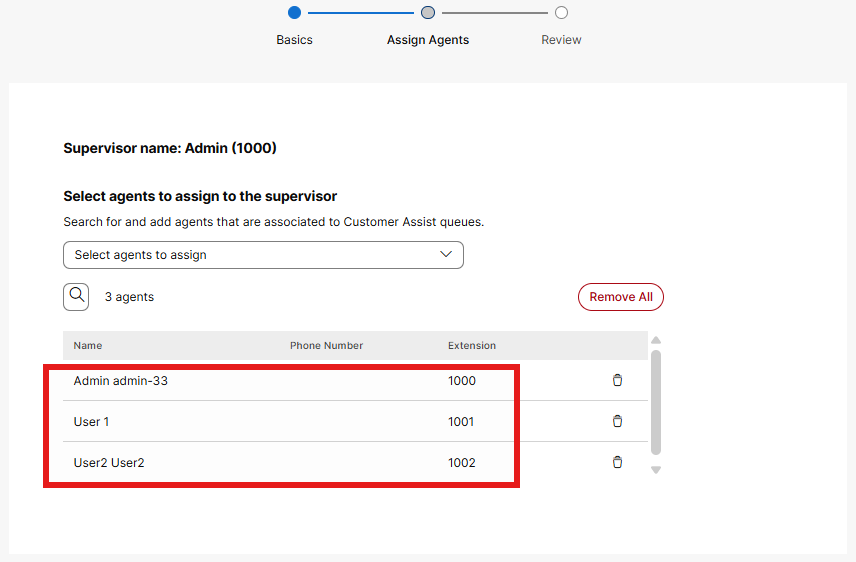

- Review the set up and then click Add Supervisor.

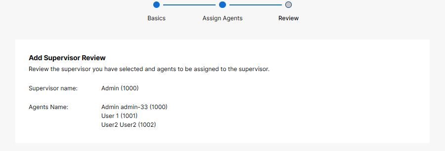

- As previously mentioned, you will not spend a lot of time reviewing other differences between native queuing and customer assist queues in this lab, but it is worth showing you where they are so you could potentially try them out. If you were to click Desktop Experience, you could create wrap up codes and assign them to your customer assist queue.

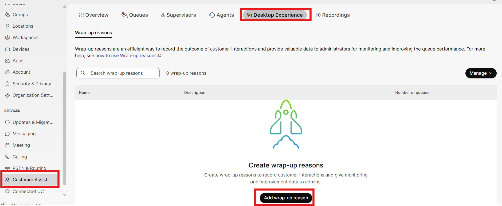

- Then from the within your Customer Assist Queue settings, you could go to Wrap-up reasons and add in a wrap up timer and adjust your reasons.

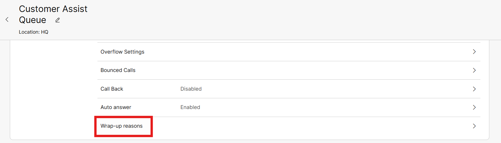

- Also using the native call recording that was already configured within your environment, you could enable queue based recording. This option is found at the very bottom of your queue settings page. This allows you to record every call coming in and out of your agents that are assigned to the queue.

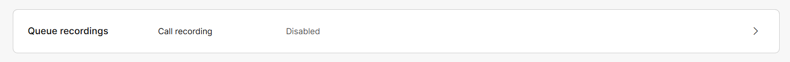

- Now let’s do some testing. On your Mobile phone, you are already signed in as User1 and on your PC you are signed in as the Admin User. You may have to refresh both logins to see the new Customer Assist Features.

When signing into the Webex Application again, you will be prompted for your preferred device. This option is new and is a result of adding in the Auto Answer feature. If you click on select device, you will want to set the Webex Application as your preferred device.

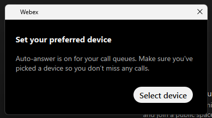

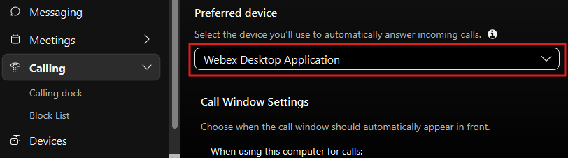

- Next, a supervisor (admin user account on your PC) of a customer assist queue should see the customer assist option in the left menu of the Webex application. As you click through these new menu options, you can see that you can monitor and change the state of your agents.

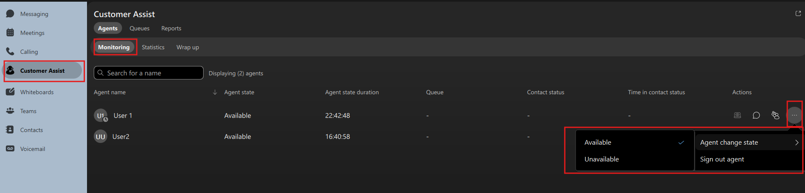

- You can see a host of queue specific metrics from an agent standpoint.

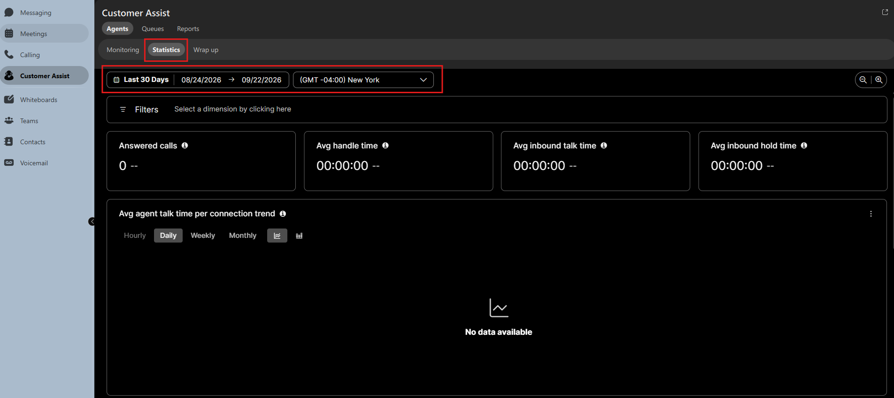

- While in statistics, if you click on filters, you are able to drill down to agent specific metrics so you can focus on individual performance with just a few clicks. Also notice that you can adjust the time frame, to focus on last week, last month or just yesterday.

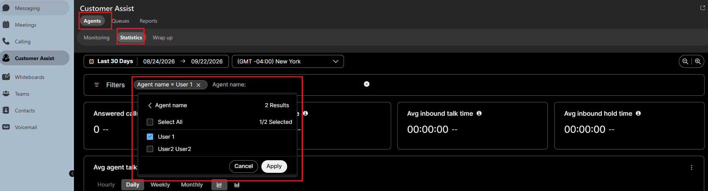

- And if you click the queue button, you can see realtime metrics on queue performence and also a historical look into queue activity.

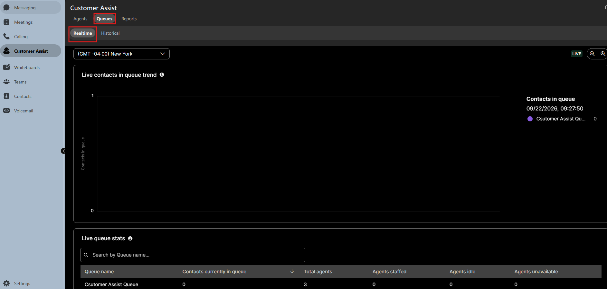

- As an agent in the customer assist queue, you will see the same customer assist option, but it has less visibility; however, you can see queue information. And an exciting feature planned for Q1FY27 for Cisco will enhance agent visibility into peer state and status, allowing agents to make more informed decisions before logging out of a queue.

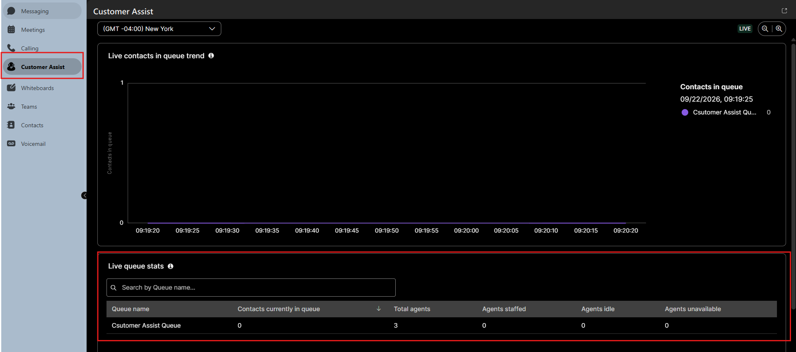

- While mobile users will not have the customer assist icon and features, they can still change state and log in and out of queues.

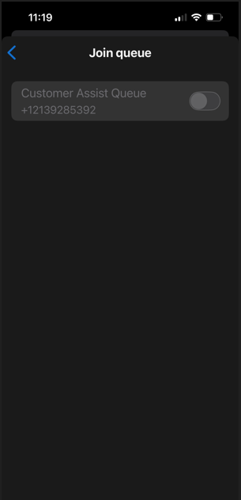

 

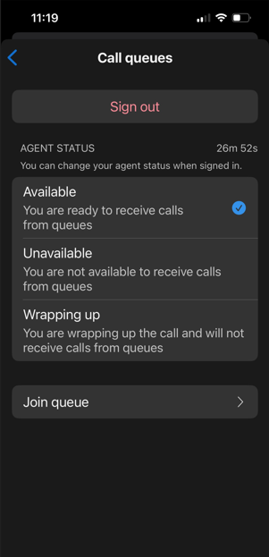

Using your mobile phone, place a call into your customer assist queue and have one of your agents answer the call. Based on how you set up the queue, it should be presented to the Admin user first.  Then while on the call, from your Webex App on your PC, look through the various metrics for the queue and agents in Customer Assist.

Every other feature we set up with Basic queues (bounced calls, night service, call back, stranded calls, etc.) are available within customer assist, they were not needed as the focus of this lab was on the supervisor’s experience.

## Optional Additions to Customer Assist

- Because customer assist queues require a user license, we cannot add our workspace (desk phone) to this queue. If our phone was associated with a user, they would have the ability to join/unjoin the queue and also change their status. After you complete the rest of the lab, you could come back here and work through this setup if desired.

- First you will need to delete the existing desk phone. Go to devices, click the box next to your 9861 and click delete.

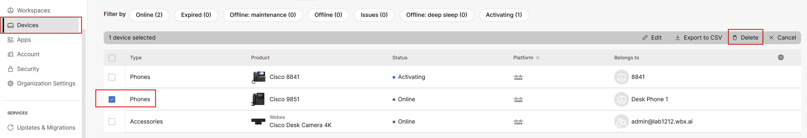

- Check the box to delete resulting empty workspaces and then press delete. This should force the phone to reset and come back with an activation code screen.

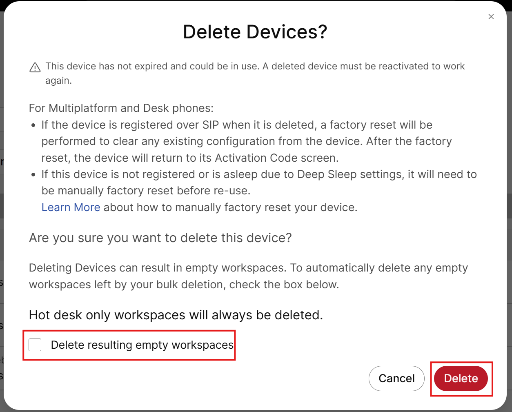

- Next we will assign this phone to the Admin User. Click on users, Admin and then devices. Next click Add devices in the middle of the page.

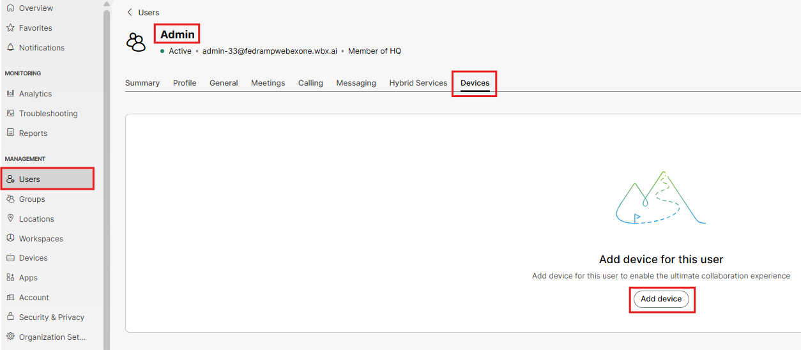

- Select 9800 series phone. Select your phone model (9861), by activation code and then Next. Then a 16 digit code is generated. Type that 16 digit code into your phone and it will register as the admin user.

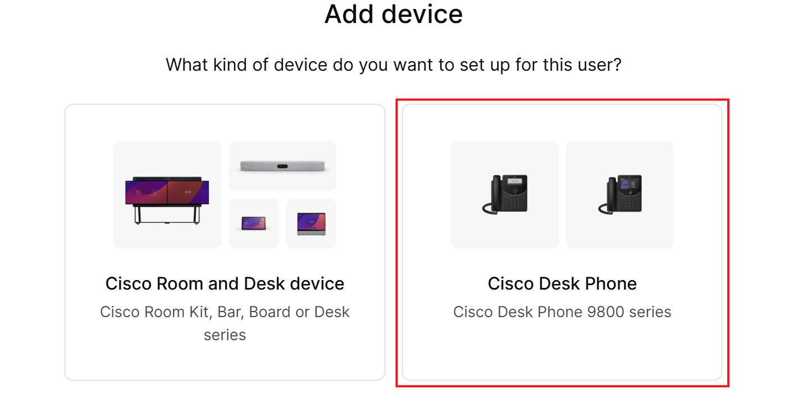

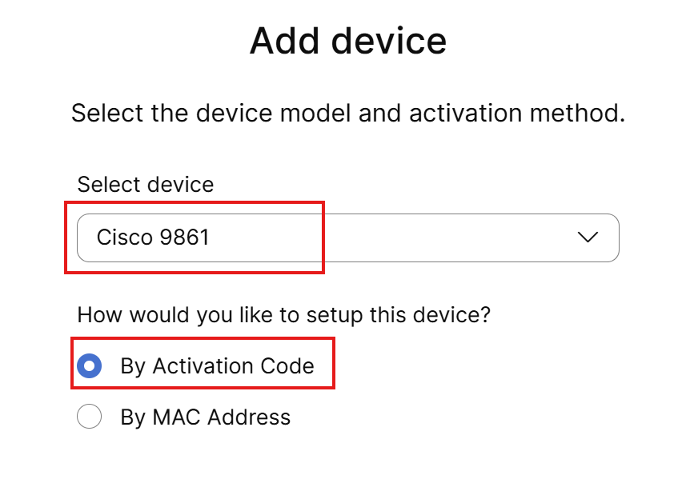

- Once the phone comes online, you should see a queues button. This button will empower the agent to join/leave a queue (if configured), sign-in and sign-out of customer assist and then change agent status. Feel free to play with these options.

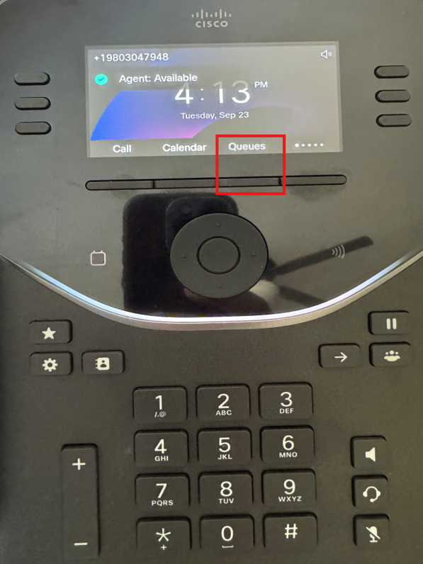
