# End User Portal

- This portal is really an administrative page for end users that allows them to self-service their calling account and features. We will start by looking at the admin controls over these end user features and then take a dive into the portal itself. From Control Hub click Calling in the Left Menu, then click Client Settings in the top Menu, then scroll down to the Hide Calling Settings tile and click on Hide Calling Settings.

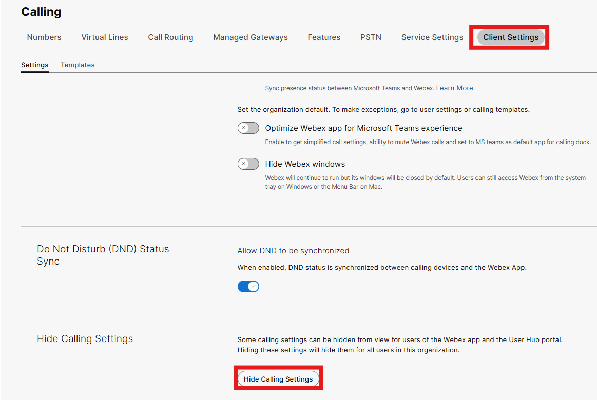

- For the sake of this lab, you will not be toggling these features off but rather just want you to know the ability exists. Take a moment to click on the voicemail and devices tabs to see what options end users have access too. Some administrators do not want end users to be able to selectively reject calls or be able to turn on receiving voicemails in email, so these features could be disabled. You will also notice that these features are also enabled/disabled not only in the end user portal but also in the Webex Application and on devices.

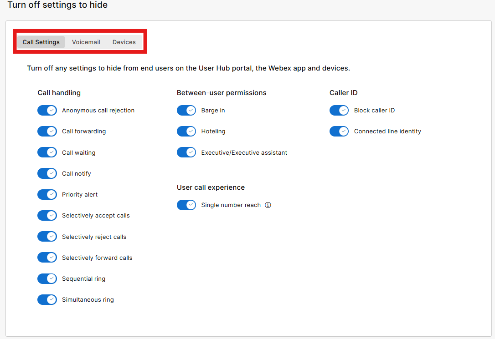

- Within your Webex Application on your PC where you are signed in as the Admin User, if you click on your Avatar and then Settings, you will see this menu appear. As you can see in the calling section, many of the above listed items are available to be configured by end users.

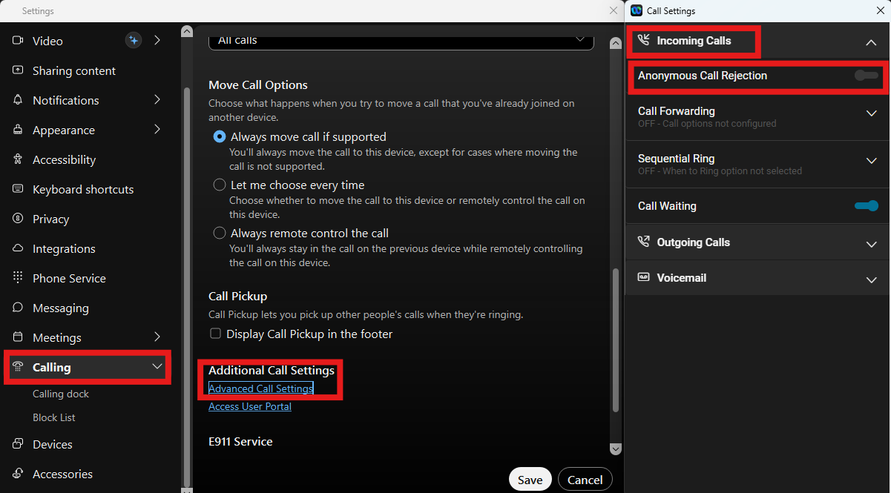

- These Client Settings toggles are global in nature but what if you need to empower or restrict a user who has different needs and use cases? This can be accomplished at the user level too. Click on Users, Admin User, the Calling Tab within his account, and if you scroll all the way to the bottom, you will see the Hide Calling Settings options. If desired, you could define custom user settings and the toggling on or off the features required, then click save.

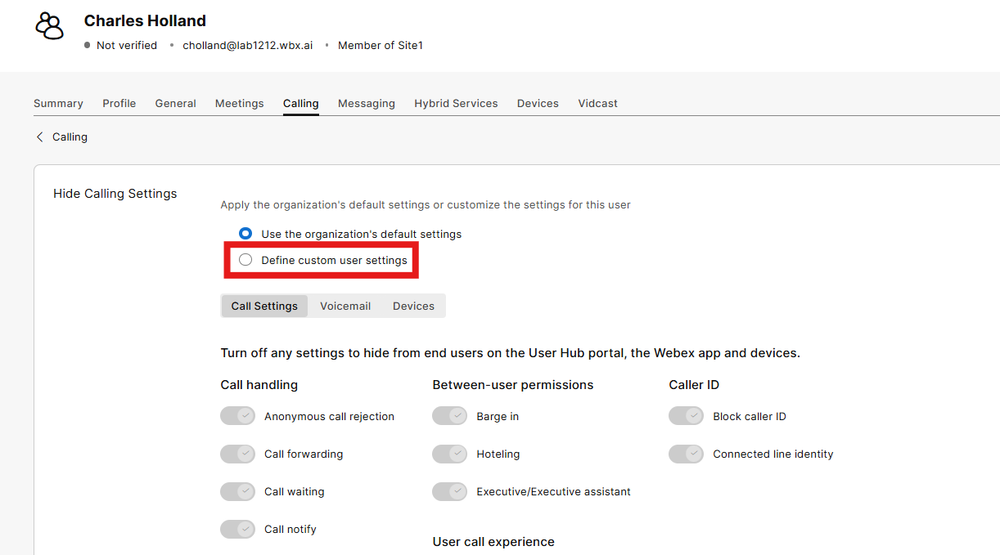

- Now let’s browse to the end user portal where we will again sign in as the admin user. This end user portal for FedRAMP is user-usgov.webex.com. Enter the email address of the Admin User and then on the next screen the password provided with this lab. Once logged in you will see the following screen. Click on Settings before continuing. (If SSO were enabled within Control Hub, access to the Webex application, end user portal and even Control Hub would be integrated with your IDP.)

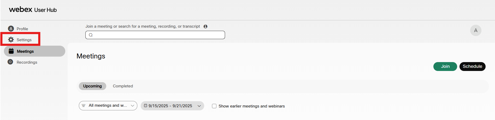

- From Settings, click on the Calling Tab and then Call Settings, you can see all the calling options that the end user can configure for themselves.

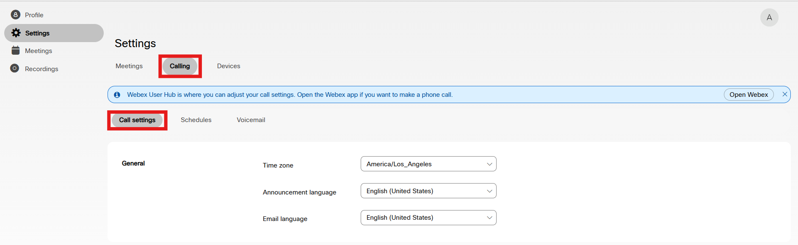

- One of the nicer features being Call Forwarding for example.

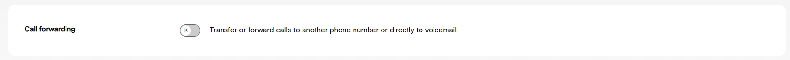

- If you click on the voicemail tab, you will see that end users can self-service voicemail password resets. While this is available for Control Hub admins to do as well, imagine empowering your end users with the ability to reset their own PINs or setting up voicemail to email.

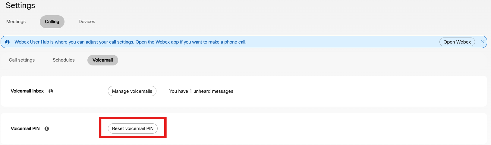

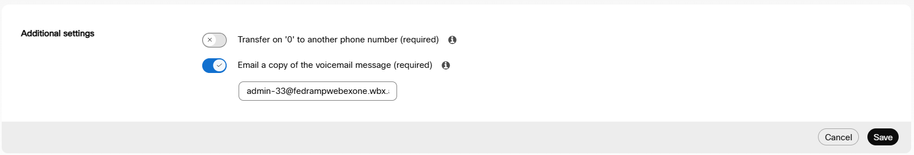

- Manage voicemails again allows you to be able to listen and delete your voicemails from this end user portal.

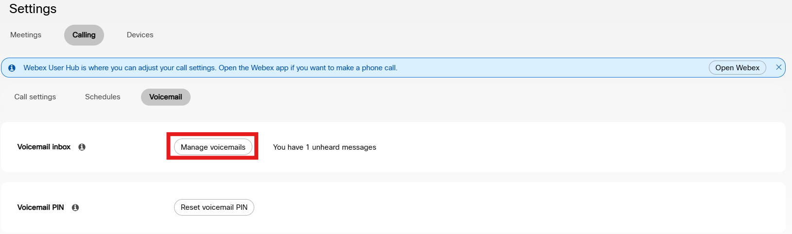

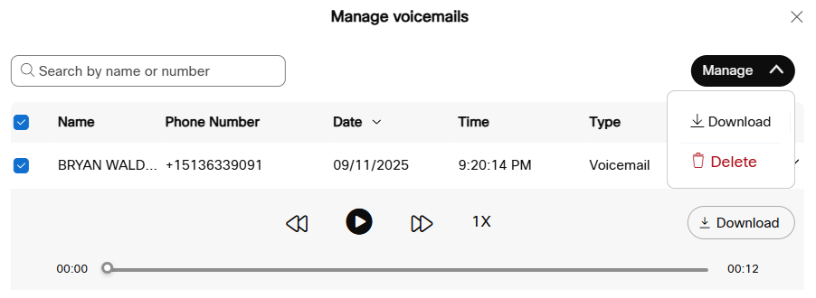
