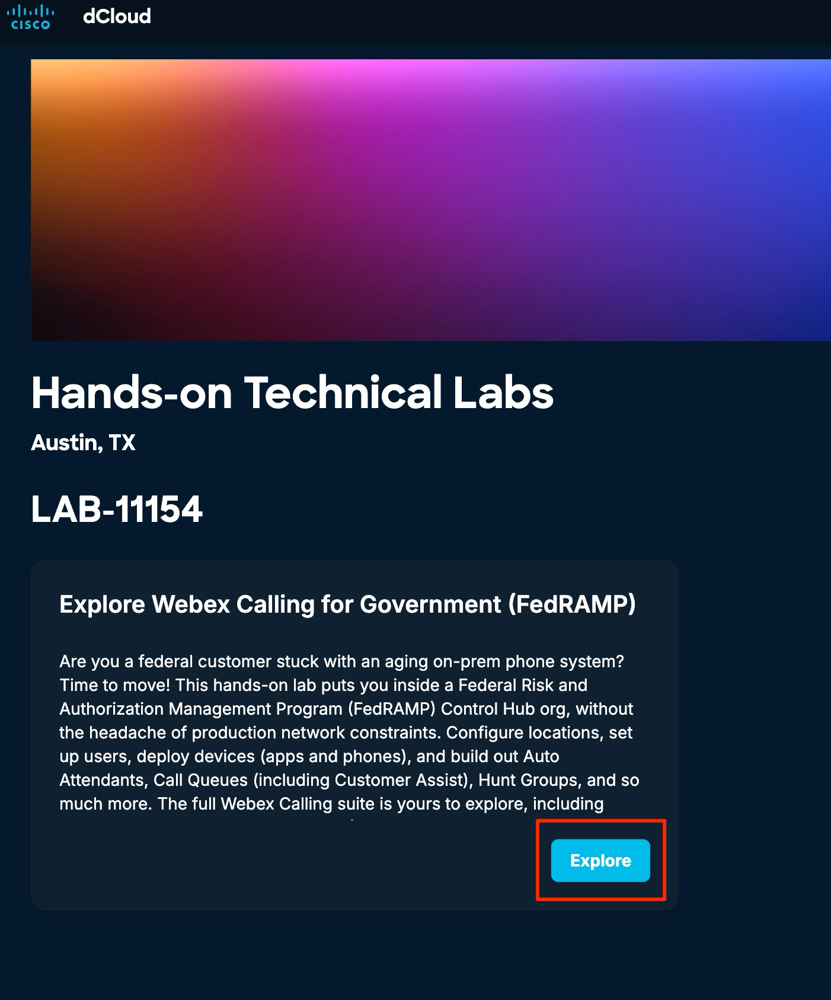
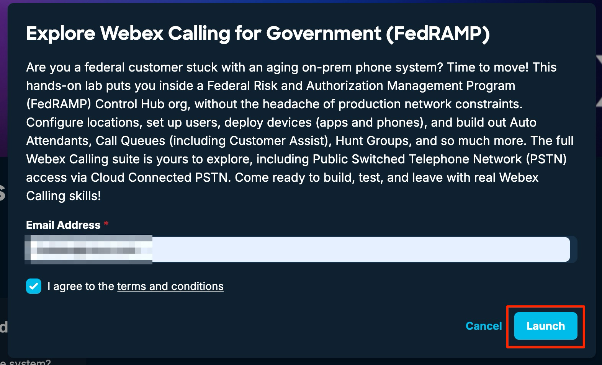
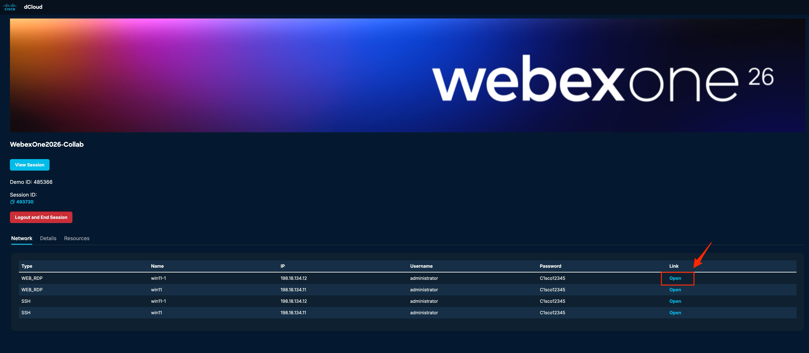

# Getting started / Accessing the Lab 

1. Open a browser on your provided laptop and go to [http://cs.co/Wx1Fedramp](http://cs.co/Wx1Fedramp). From here you will get the credentials and information needed to log into control hub and the webex application.

2. For the other Webex App users that you will set up, you will need a Virtual Windows machine to test with those users.

3. Click this [link](https://www.ciscodcloud.com/apps/expo/81se5n0wls4ypmje4rz7zx3xl) to open the dCloud eXpo page and you should see this below page

4. Click ‘Explore’.

5. You will then be asked to enter your email address, please enter your email address. Check the box to agree to terms &amp; conditions and then click “Launch”.

6. You will be using Workstation1 (wkst1) for our lab. The machine can be accessed by clicking the “Open” option next to it.

