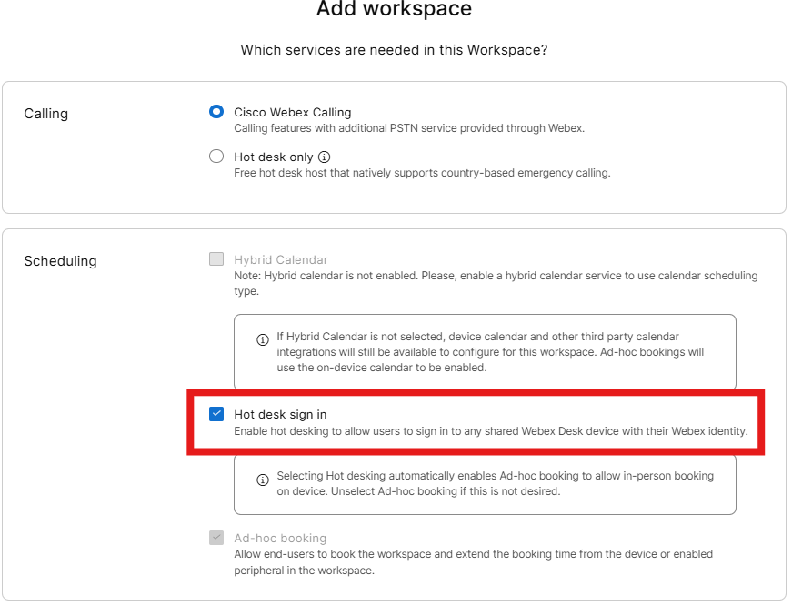
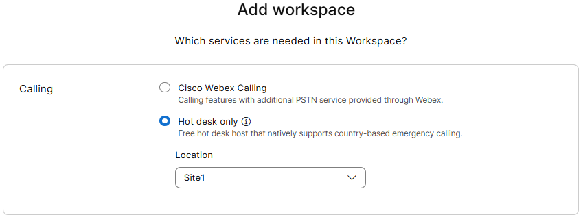
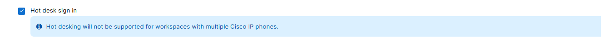
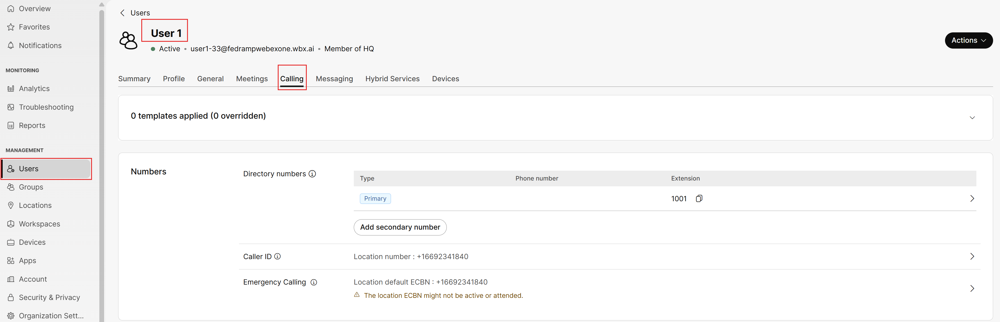
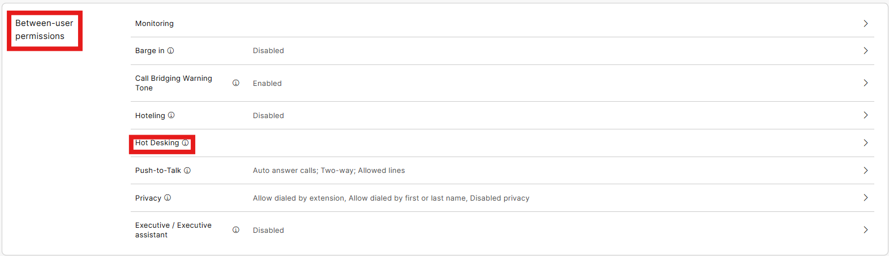
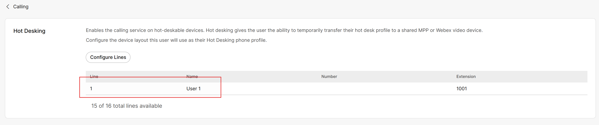
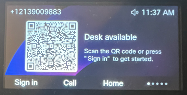
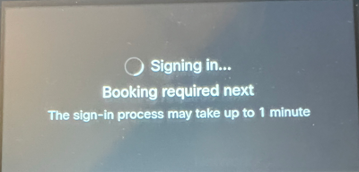
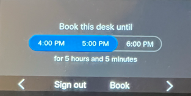

# Hot Desking

- Hot Desking allows a configured user to sign into a physical phone via QR Code or by using their Voicemail credentials. This is useful for Hybrid workers that travel between locations or who rarely come into the office. Our Desk Phone was already set up for Hot desking when we initially configured it. Quick reminder on the 9861 phone, we can click the Sign In soft key to see Hot Desking and Home to take us back to the Normal phone screen.

- If you had selected Hot Desk only, the phone would not have a Webex Calling DN and would only be useful if configured users used the Hot Desk feature. This is not a part of this lab.

- Hot desking only works when there is a single device assigned to the workspace. In instances where you have multiple devices assigned using the professional workspace license, you will get an error when trying to sign in. (As assigning multiple devices to a single workspace was not part of this lab, you should not see the error shown below)

- Let’s validate that our users are enabled for Hot Desking. Go to Users in the left Menu, then click on the User1, then the calling tab within the account.

- Scroll down to Between-User Permissions and click on Hot Desking.

- As you can see, User1 is already enabled for this capability, and we see the configured lines when  Hot Desking is invoked. If required, you could configure a virtual or shared line in his profile. The ability to use the voice portal for sign in is on by default because this attribute was inherited from the HQ location settings.

Let’s do some testing now. Hopefully you are still signed in as User1 on the Webex Application on your mobile device; if not, please sign in as User1. On your 9861 series phone, make sure you see the QR code and a note that says, Desk Available. If you just see our previously configured line appearances, click the soft key that labeled Sign In. Your phone should look like this.

With your user signed into Webex on your mobile phone, use your phone camera to scan the QR code then the screen will look like this as the booking occurs.

Then you will be prompted to select the duration of your reservation and click Book.

The phone will then show the line for User1 and the phone number. Feel free to make test calls internally or externally to test this configuration. To Sign out, click Sign Out
