# Hunt Groups

- Hunt Groups are a form of call distribution which offers no queueing but rather presents calls directly to assigned agents and then will overflow to a configured destination if all agents are unavailable. These hunt groups are simple to set up and very efficient. If you are not already on the Calling Features page, navigate to Calling in the left Menu, Features and then within the Hunt Group tile, select Add new.

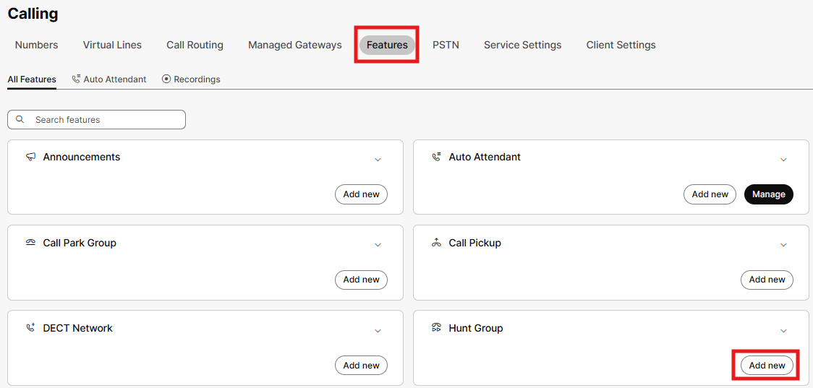

- Very much like our Auto Attendants and every other feature you will set up, you need to attach the HG to a location (HQ) and then assign a phone number and the extension 3000. Also, you have an option which allows your agents to out pulse the hunt group phone number as caller-id versus their private number which we want to enable, then click Next.

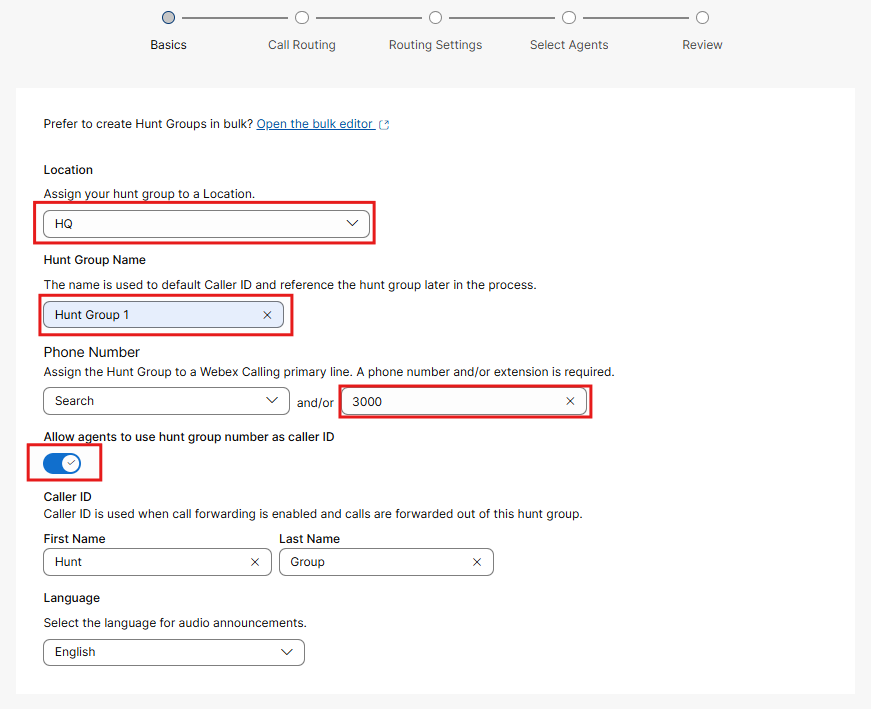

- Next, we can configure our distribution algorithm for sending calls to agents. Feel free to hover over each of the options to learn about how these options route calls. Click on the top down algorithm and set the Hunt Group to advance to the next agent after 3 rings, then click Next.

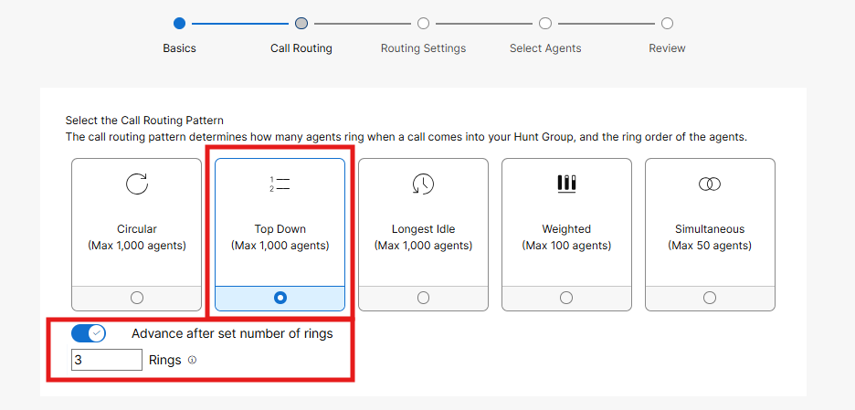

- Take a moment to read these next few options within the Hunt Group Configuration. “Advance when busy” is on be default and really the only item you will test. In production though, you may set up calls to divert to a voicemail group, a user within Webex Calling or even a 3rd party answering service. Click Next.

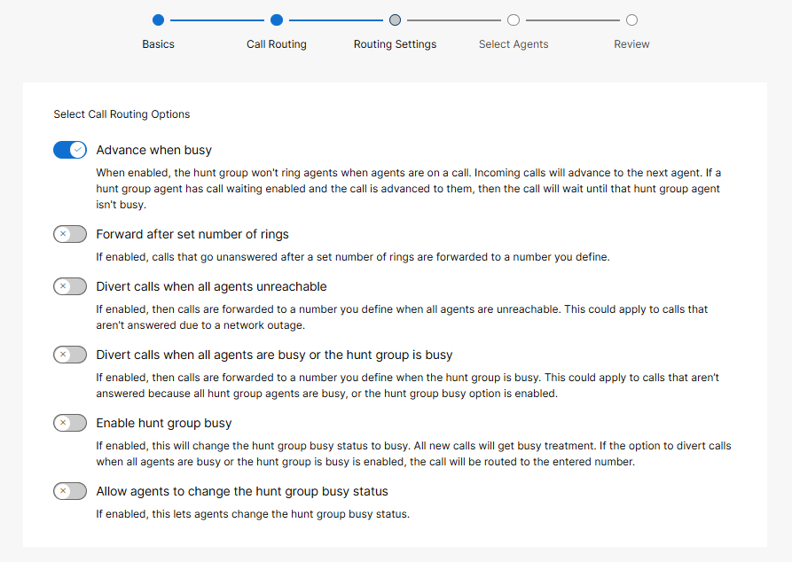

- At this point you can assign your users and or workspaces to the hunt group. Make sure to assign the desk phone and admin user to this hunt group. Because you selected top down as your routing option, we anticipate incoming calls to start at the desk phone, then roll to the admin user. After adding your agents, click Next.

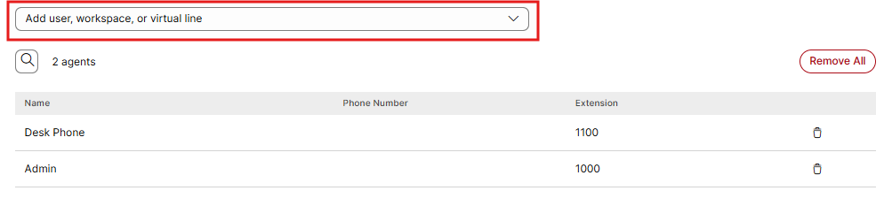

- Now you will see a summary of the Hunt Group that you have built. Click on the tabs to validate the configuration and then click Create.

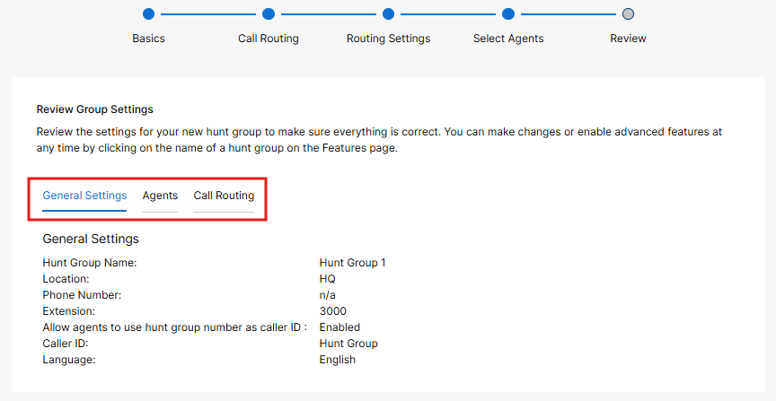

- Again, the Features page has changed to provide easier access to hunt groups. Feel free to click into the hunt group to look at the existing set up and make modifications if needed.

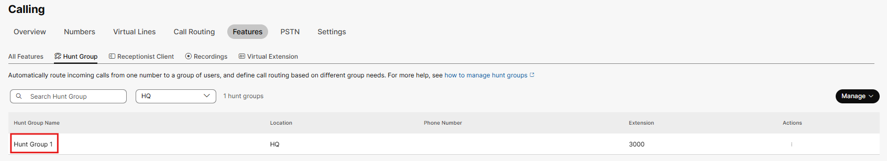

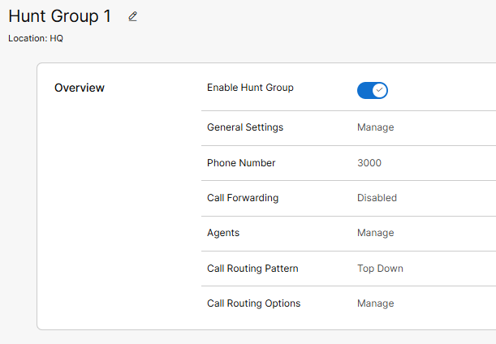

- If you go back to your auto attendant and select the menu option within the business hours tile, you can now add an option to route to your Hunt Group.

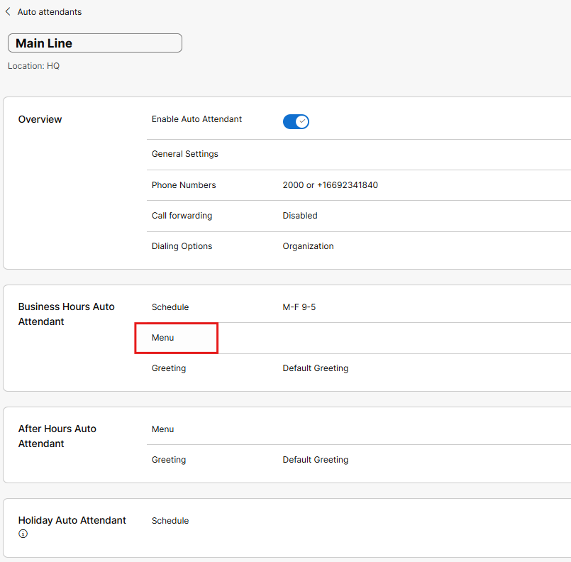

- Option 2 can be configured to route to your hunt group, then press save.

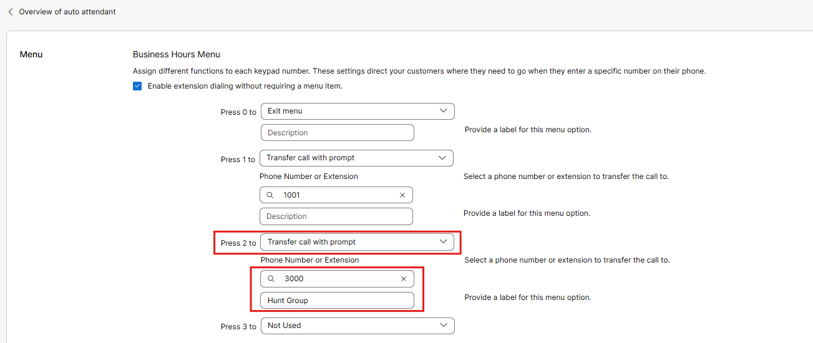

From your Cell phone, dial the DID associated with the Auto Attendant and press option 2. The call should first ring on the desk phone. If you do not answer, it will ring next to the Webex application on your pc where you are signed in as the admin user.

Within the Webex Application, you will see a toast prompt for the inbound call, click Answer (your screen shot will look slightly different from the one below).

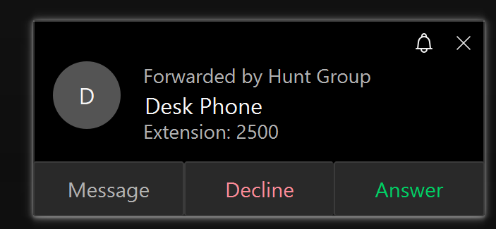

Because you used Top Down as our distribution algorithm, the next call will again start at the desk phone. You can click into the hunt group to modify the call routing pattern to either Circular or Simultaneous and test calls again.

What happens if no one answers? From the Configured Hunt Group, click into the call routing options to configure call coverage to the Auto Attendant (Main Line) that we created earlier and then make the test call again.

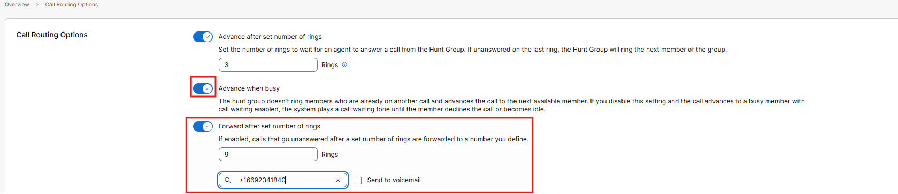
