# Location Set up

- This Lab has a default location “HQ” that was already setup for you. In theory, you would also  provision additional locations for each of your other sites. Locations allow you to define where you get dial tone, how you reach voicemail, 911 settings, and even outbound calling privileges, etc. If you are familiar with UCM, locations are very similar to Device Pools. Click on the HQ location and then the PSTN Tab.

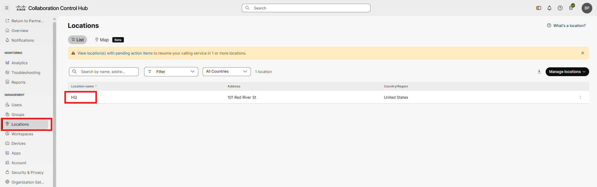

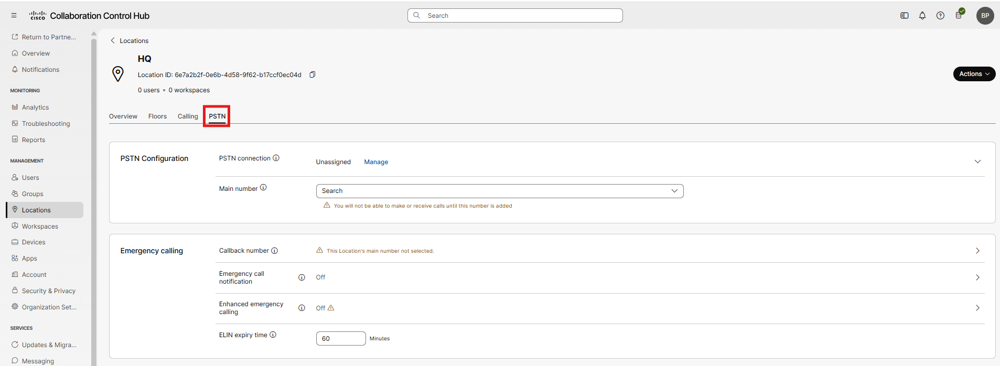

- From this PSTN Tab click Manage

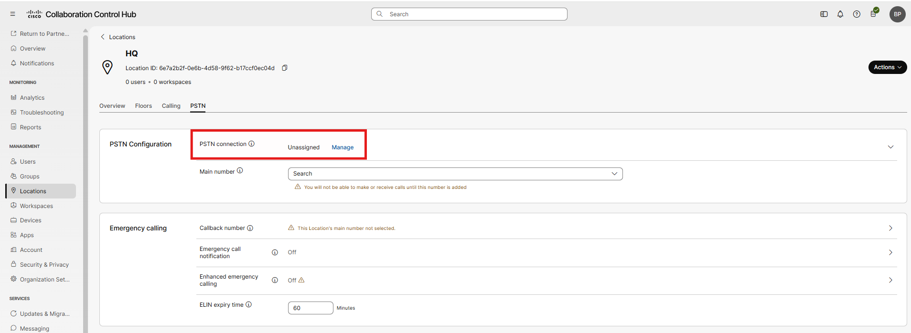

- Then Select Cloud Connected PSTN the click Next.

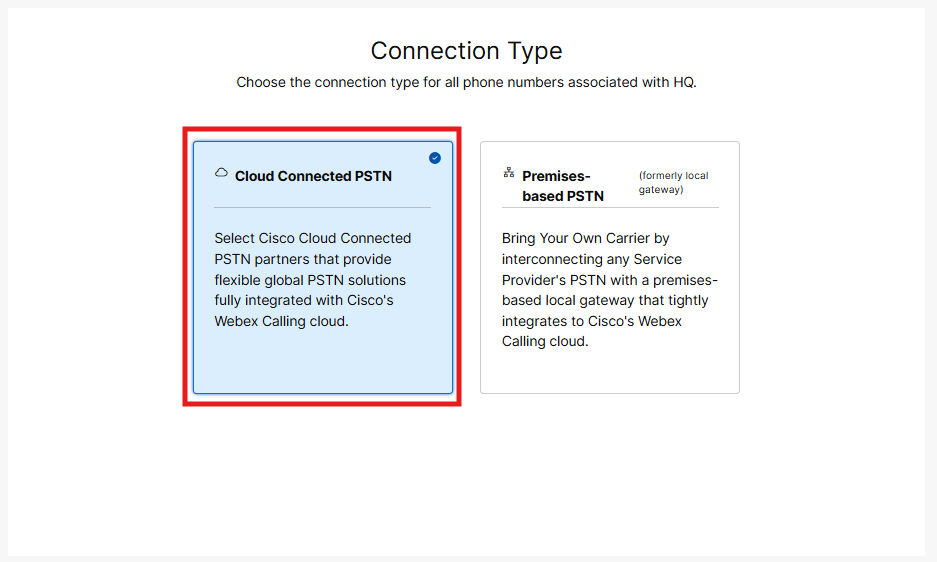

- Select AT&amp;T as the provider for the PSTN service, then click Next. It is super important that you make the correct selection here otherwise your calls will not work properly.

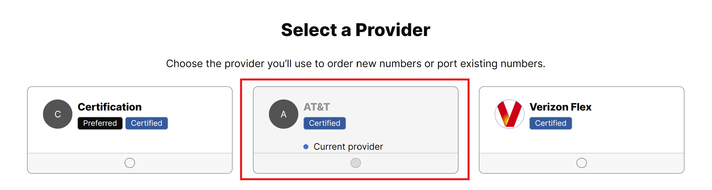

- Next click Save to validate that the Emergency Service Address set up for the location matches the PSAP (Public Safety Answering Point) database.

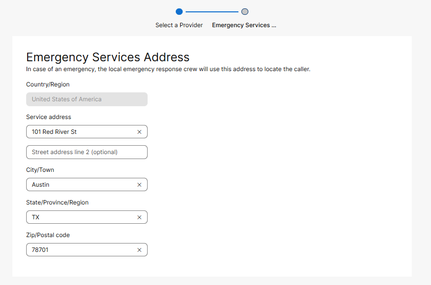

- Assuming all goes well, you should see a screen similar to this. When ready, click Add Numbers Now.

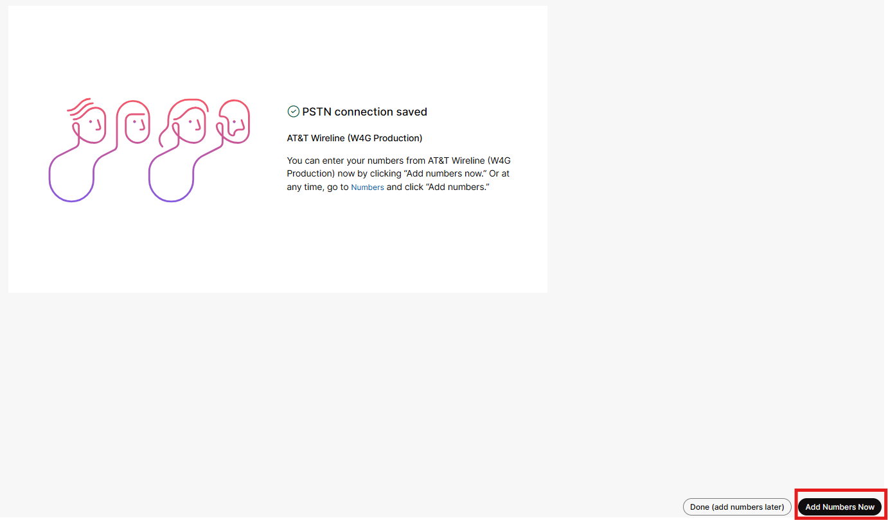

- The HQ location should be defaulted on your screen, then press Next.

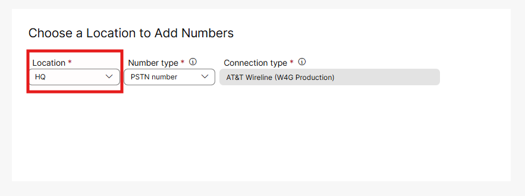

- In your Lab Guide, you were provided 5 DIDs. Add those DIDs, then click Save.

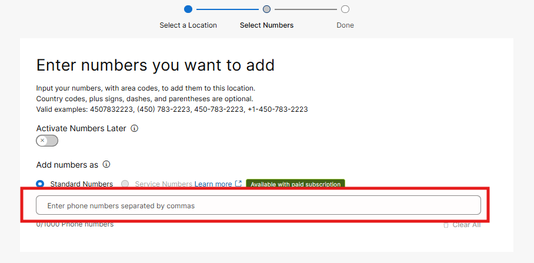

- You should see a screen indicating that your numbers were saved and you are ready to go. Then click close.

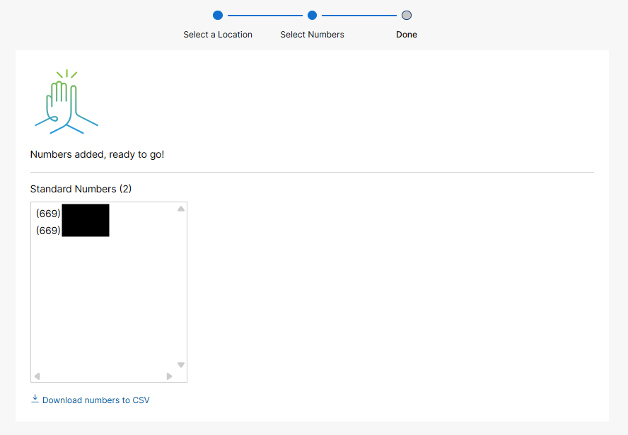

- From there, if you click PSTN &amp; Routing, then the Numbers tab, you should see your new numbers loaded up in Control Hub. (Your numbers will look different from those in the screen shot)

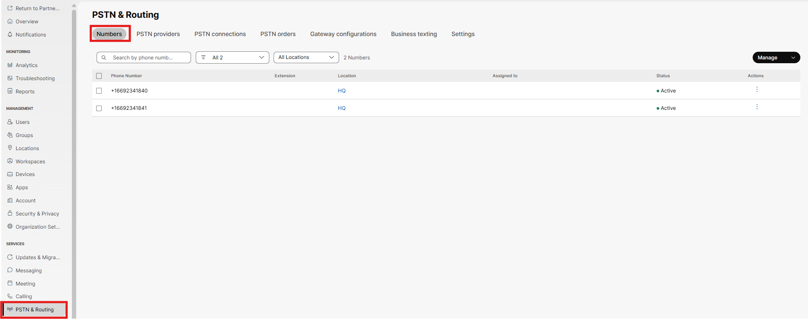

- Now that we have 5 Phone Numbers/DIDs, we will go back to our HQ location and complete some final set up steps. Under Management in the left menu, click on Locations, HQ and then the PSTN tab within the location. Based upon our previous efforts, you will notice that we have a PSTN connection type now defined (Cloud Connected PSTN) but that we are missing a main number. This main number must be assigned for calling to work correctly. Click on the main number drop down and select one of your available numbers, then click save at the bottom right of the page. This action will clear up most of the previous warnings. This main number can still be assigned to Users, Auto Attendants, Call Queues, etc. This main number becomes the default CallerID for users/devices with an extension only and the default Callback Number for Emergency Calls.

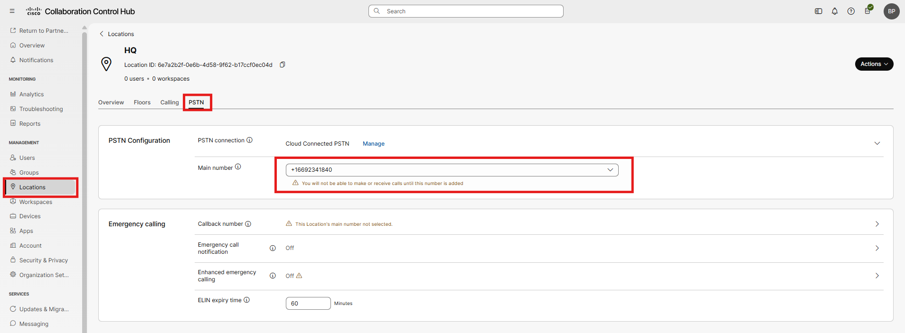

- Click on the calling tab within your HQ location and within the calling features settings tile, select Captions for Webex Calling and scroll through the options here. You can set internal dialing site codes, external dialing prefixes, location based Outgoing Call Permissions (CSS), unique location Music on Hold, etc. We want to focus on two things for this lab. First, enable Voicemail Transcription, which transcribes voice messages in-app and emails a copy to the user -  then click Save.

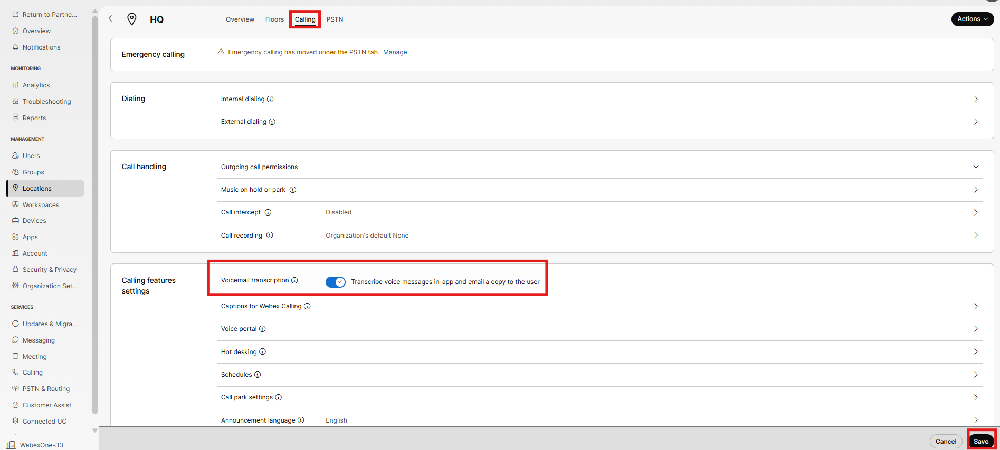

- Just beneath the Voicemail Transcription option is Voice Portal, click here. Voice Portal is the equivalent of a voicemail pilot. If this is not set up and enabled, the messaging key on the phone will not work, nor will calls cover to voicemail. We need to configure two items to make this work, first set the Caller ID to be HQ Voicemail and then set the extension field of the phone number to be 8888 (this can really be any number of your choosing). Then click save.

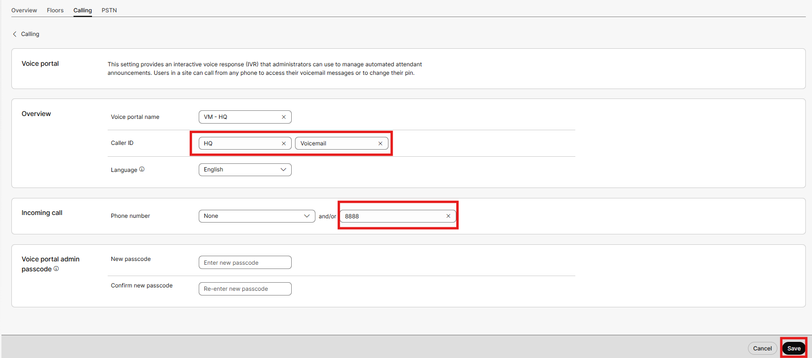

- And while we will not focus much more effort on closed captioning in this lab, it is worth seeing that capability in the Webex application. As seen in the below screenshot we have live captioning of the call for the hearing impaired and a call transcript being generated as the call progresses. Once we setup users and start making test calls, feel free to play with this feature.

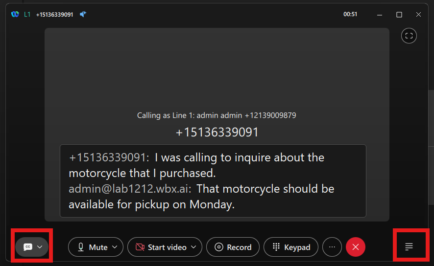
