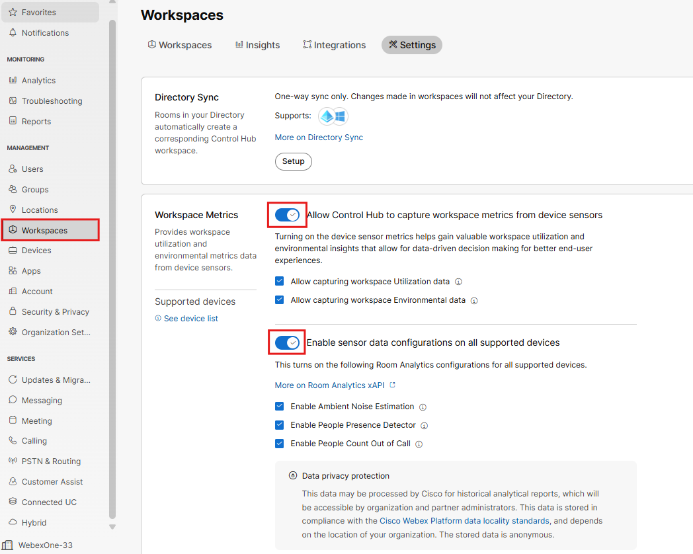
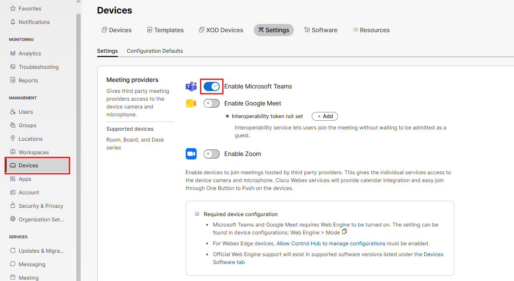

# Join an MS Teams meeting from your video device.

First you need to make a few minor settings changes on your DeskPro to Join an MS Teams meeting.

- In control hub, click on workspaces, then settings and enable the workspace metrics. This allows the DeskPro to be able to capture data about the room itself and occupancy metrics and funnel that data to control hub. This data provides powerful insights into room utilization and overall room health.

- Next go to Devices, then Settings and enable the MS Teams Join option. Upon doing this, your DeskPro should soon display an MS Team button.

- If hybrid Calendar were enabled, you could simply press the green join button to enter this existing meeting. As it is not enabled, you will have to manually join the MS Teams Meeting.

- From your DeskPro, click the MS Teams button and enter in this meeting ID and passcode below. The intent of this is to simply demonstrate the ability of the Webex Registered DeskPros to join an MS Teams meeting. This is a WebRTC join experience. Outside of the scope of this lab, these video devices support MTR experiences and VIMT joining as well. Just jump into the meeting below, say hi, hang up and continue with the rest of the lab.

Meeting ID: 218 952 128 251 51 Passcode: 22Mp6Ny9
