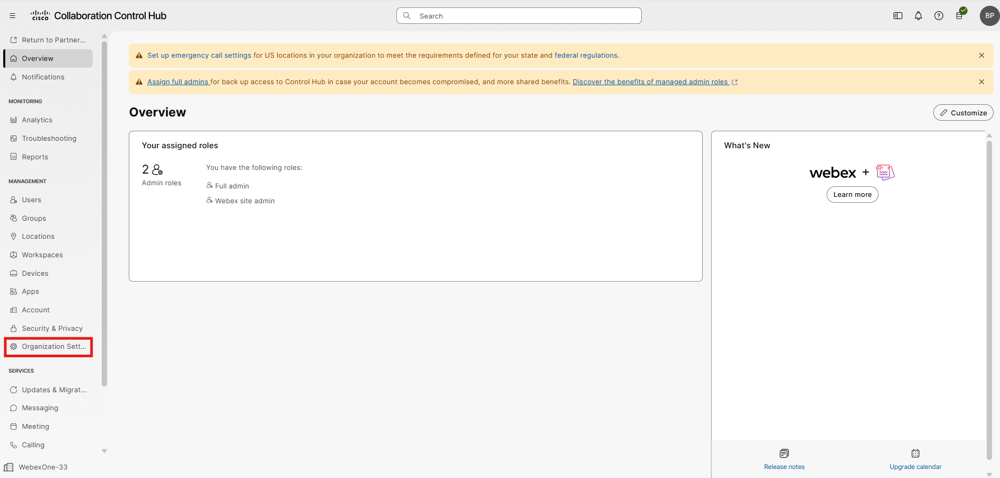
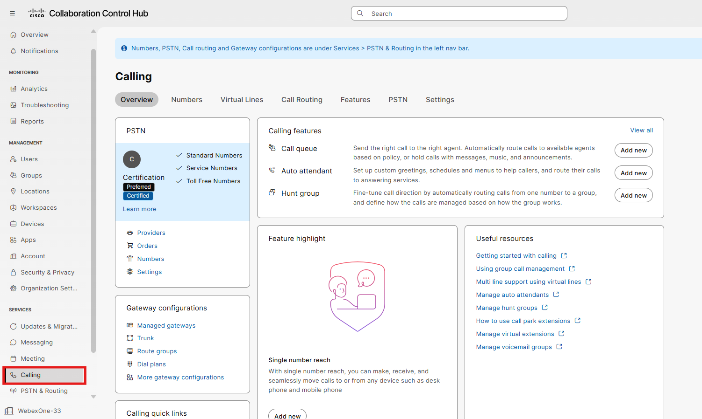
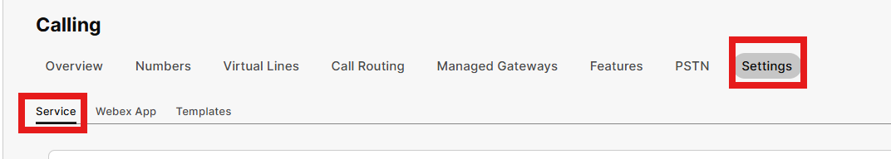
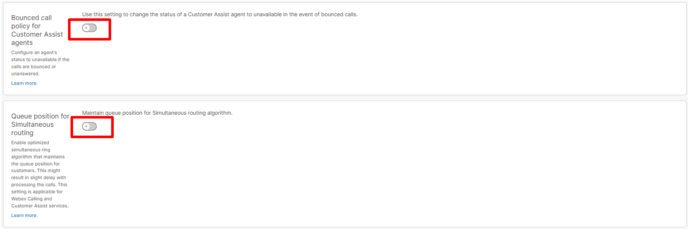
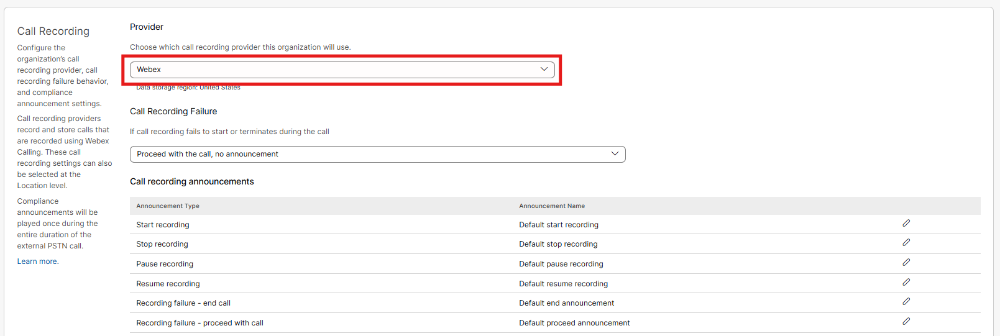
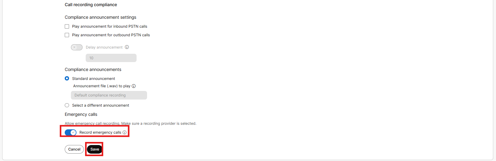
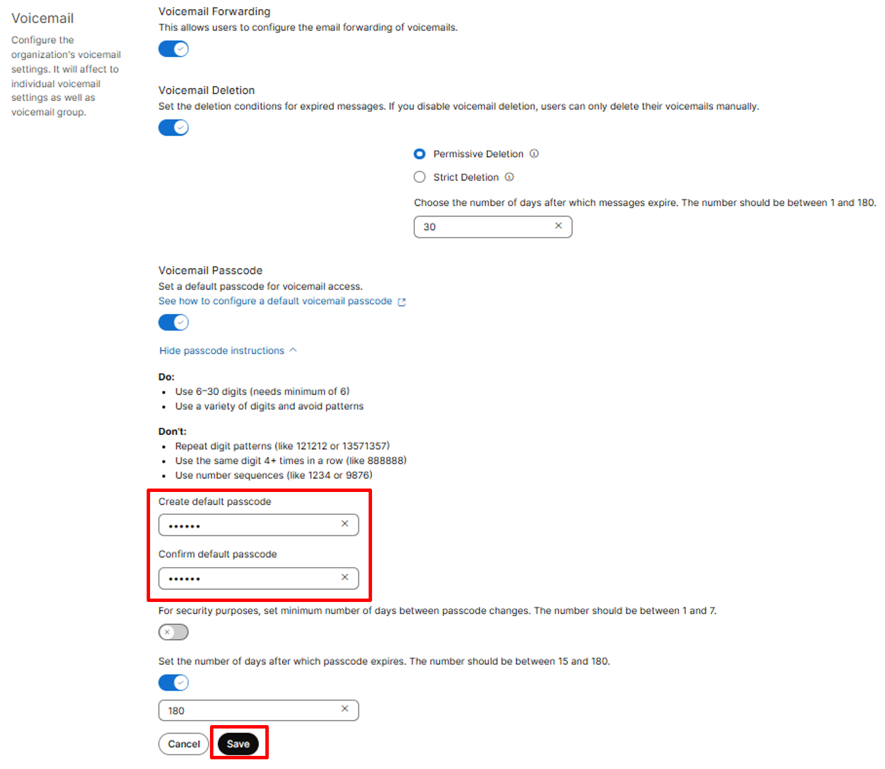

# Organizational / Service Settings

- Open Chrome on your Lab issued PC and browse to Collaboration Control Hub [https://admin-usgov.webex.com/](https://admin-usgov.webex.com/). From here log in as the admin user with the provided password. Collaboration Control Hub is the single pain of glass where you would administer and manage all things related to Webex Calling and devices.

- Once you are logged in to the Control Hub, navigate to Organization Settings under the Management Menu. Feel free to dismiss the warnings at the top of the page by clicking the respective X. 

- Scroll down to Control Hub’s Idle Time (3rd window from the top) and select 4 hours and then click Save.

- Click on Calling under the Services Menu in the left pane.

- Then Click Settings in the Top Menu and then we will be in the service settings menu.

- Scroll down and enable these features (default is off) and click save accordingly. (You can use CTRL F to find these areas easier)

- You want to ensure the default call recording provider is listed as Webex. Worth noting, unlike Commercial Webex which supports many different call recording vendors, native Webex recording is the only supported solution and is included for free with a paid subscription (up to certain storage limits). Also turn on Record Emergency Calls, then press Save.  Please note there are several recording announcements and compliance settings which can be configured depending on your organization requirements.

- Scroll to Voicemail and create a default passcode, something like 113355 and then click Save.

