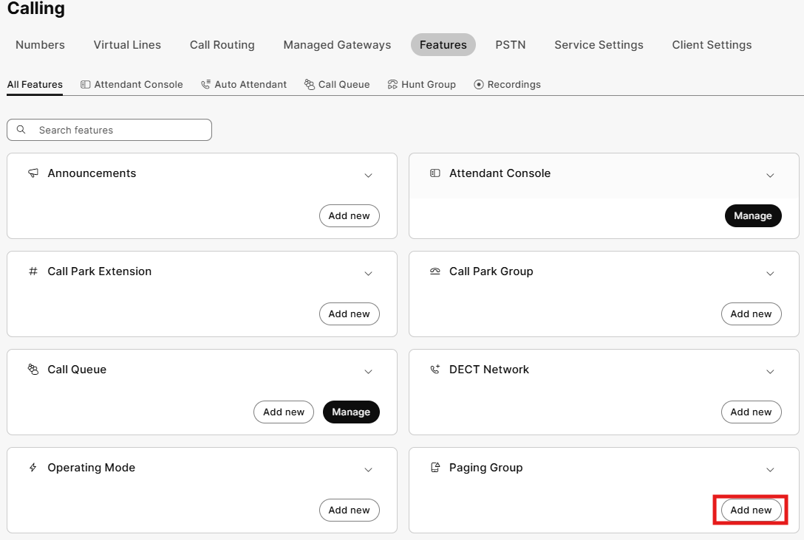
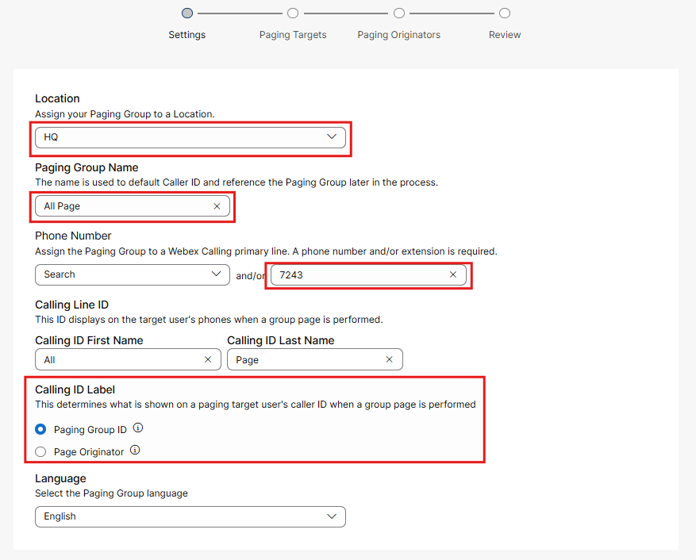
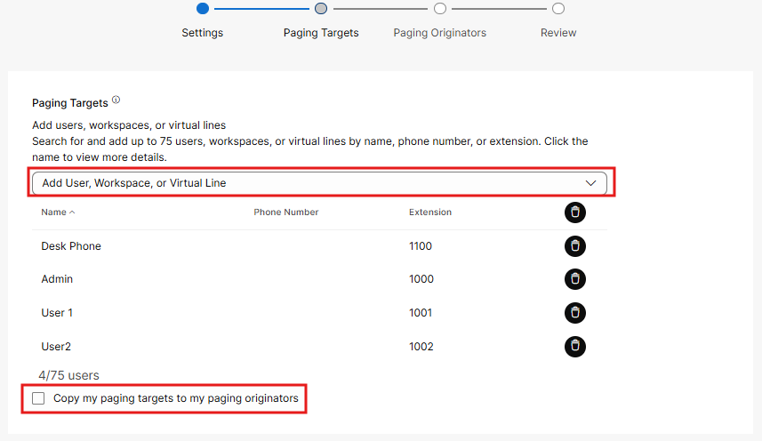
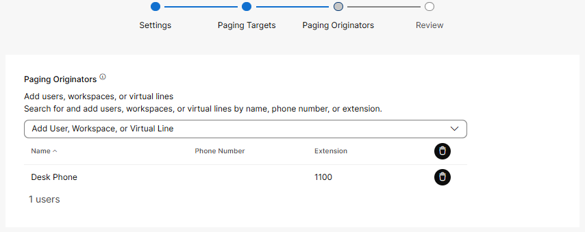
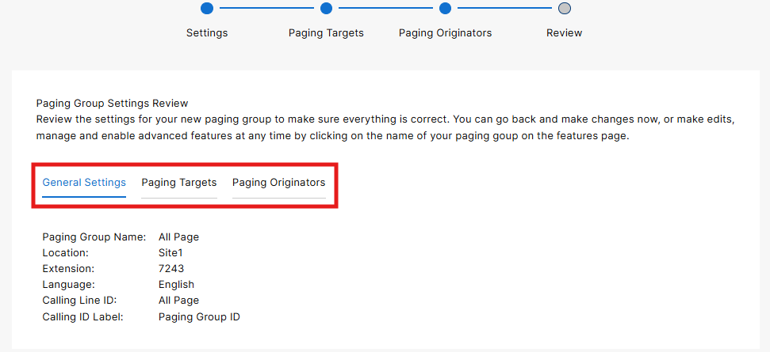
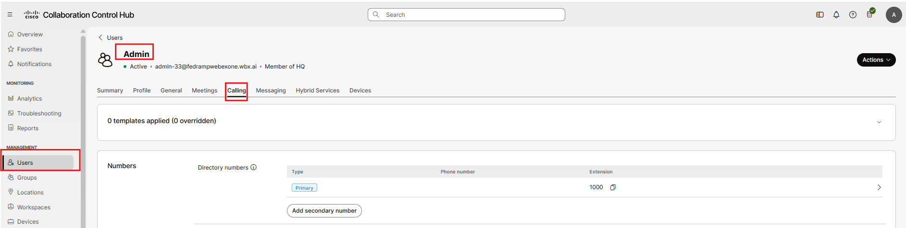
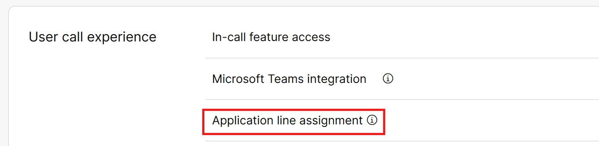
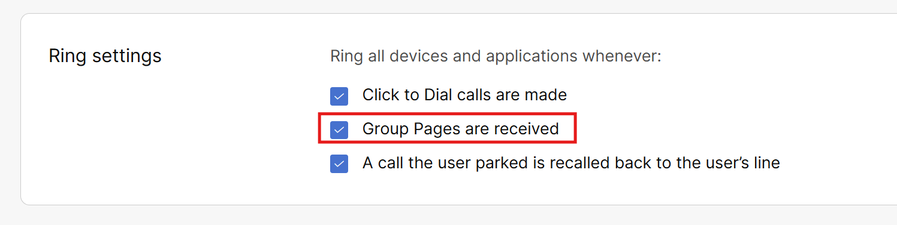

# Paging Groups

- Paging groups allow you to use the native speakers in the phones to generate and receive pages in defined groups. These paging groups can contain up to 75 targets including physical phones and applications users. When you have a need for paging; however, new overhead paging systems are cost prohibitive, this native paging option can be really handy. From the Calling Features menu, click on Add New in the Paging Group tile.

- Much like other features, assign your location (HQ), give the feature a name, and an extension number (not a phone number in this case as you likely do not want your paging group externally facing). Use extension 7243 as that is the word “page” spelled out on a phone keypad. One other cool feature is the ability to change the Calling ID label for these pages. Paging Group ID would show the Caller ID as “All Page” but Paging Originator will display the name of the workspace or user who invokes the page. This could be extremely useful in emergency situations. Click Next.

- Next configure the paging targets or the users/workspaces who will receive the page. Add the Desk Phone, Admin User, User 1 and User 2. Also, assuming you want these same targets to be able to use the paging feature, you can check the box that allows you to make the paging targets also originators. Please check this box and click next.

- If you did not check the previous box, you now have the option to select who can page. If you had an operator and they were the only person entrusted to page, this might be the option you select. If you want everyone who is a target to be able to page, the forementioned option is the better configuration. Again, make sure that your paging targets can be originators for the purpose of this lab and click Next.

- Review your set up and click create.

- There is one last thing to do as by default application users do not receive group pages. You added all the users to the target group but if they do not have physical phones, they will not receive the page in the Webex application by default. Go to Users under Management in the left pane, select the Admin account and click on the calling tab under this account.

- From here scroll down to the User call experience Tab and select application line assignment. Then check the box for Group Pages are received and then click Save.

Now, let’s go to our application Admin user (signed in on your pc) and dial 7243, assuming your microphone is connected to Webex, you should hear your page come through on the desk phone in your pod. And going the other way on the phone if you dial 7243, you should hear the page coming across your PC. If not, check your speakers and potentially exit the Webex application and restart it.
