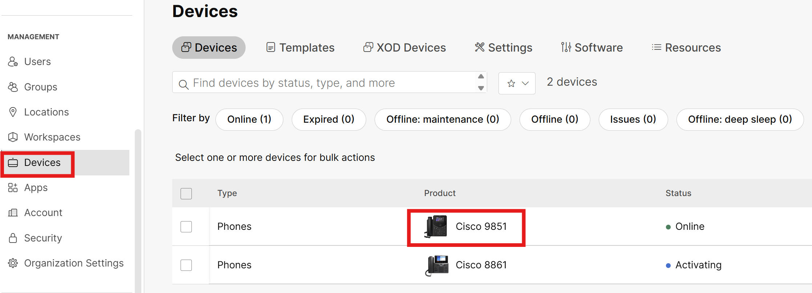
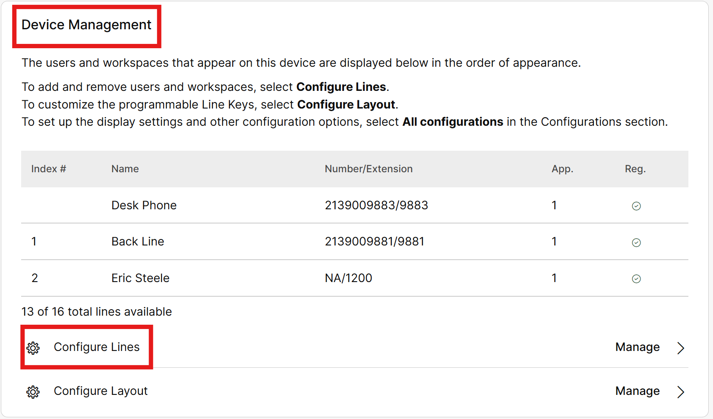
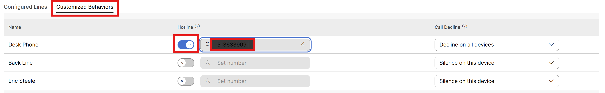

# PLAR/Ringdown

- Hotlines or PLAR/Ringdown are not commonly set up; however, they remain an essential feature in many environments. These can often be found in elevators, safety phones, loading docks or even pool areas. When a user picks up the handset, it is preprogrammed to dial an extension, outside phone number or even 911.

- Go to Devices in the left menu then click the 9861 phone that is online.

- Scroll down to device management and click on Configure lines

- Click on Customized Behaviors, toggle on hotline and enter your cell phone in the set number field, then click Save.

- Then at the very top of the desk phone device page, click on actions and Apply changes.

If not already selected, make sure that line 1 is highlighted and lift the handset. As soon as you do this, the phone should start placing a call to your mobile device. It is worth noting that despite being setup as a Hotline, if the extension/DID for this phone are called, the phone can still answer calls.

For the sake of this lab and the testing we will do, go ahead and turn off the hotline by going through the above steps only we are turning off the already enabled hotline. Make sure to apply the changes to the phone at the end.
