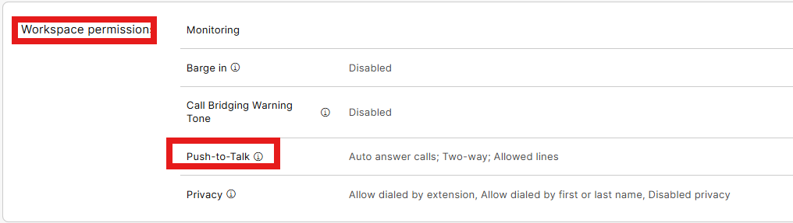
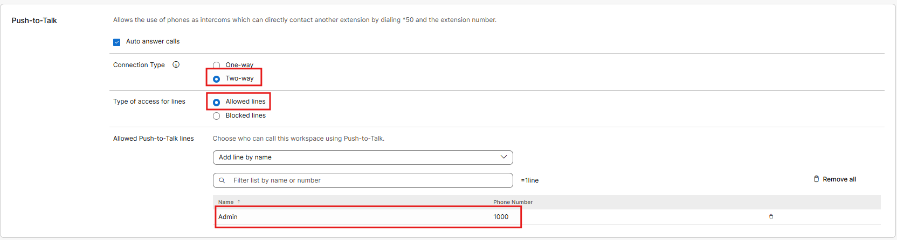
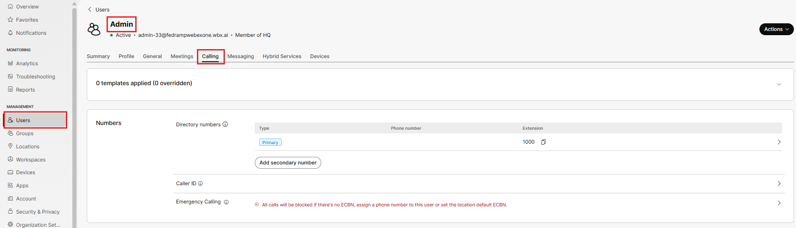
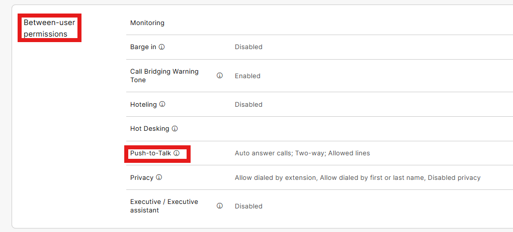
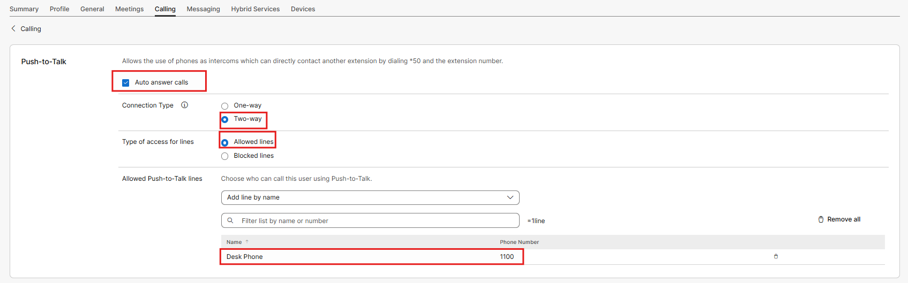

# Push to Talk / Intercom

- This feature allows an operator or receptionist to be able to open a two-way conversation with a user/device on the other side. Or for executives, it allows the assistant in another room to intercom with the executive and vice versus. First, you need to configure the Desk Phone to be able to receive this type of communication. Click on Workspaces in the left menu, the configured desk phone and then the calling tab.

- Scroll down to Workspace permissions and click on Push-to-Talk.

- Then make sure that Auto Answer Calls, two-way connection type and that allowed lines are configured. Then we will search for and add the Admin user on the allowed list, then click Save.

- Now do a similar set up for the users. Go to Users on the left Menu, Admin User and Calling.

- Scroll down to Between-user Permissions and click on Push-to-Talk.

- And much like our workspace, add in our allow users/workspaces, desk phone, then click save.

This feature is tucked behind a feature access code. From your desk phone dial \*50 and the extension of the Admin user (1000) and you should be able to have a 2-way conversation.
