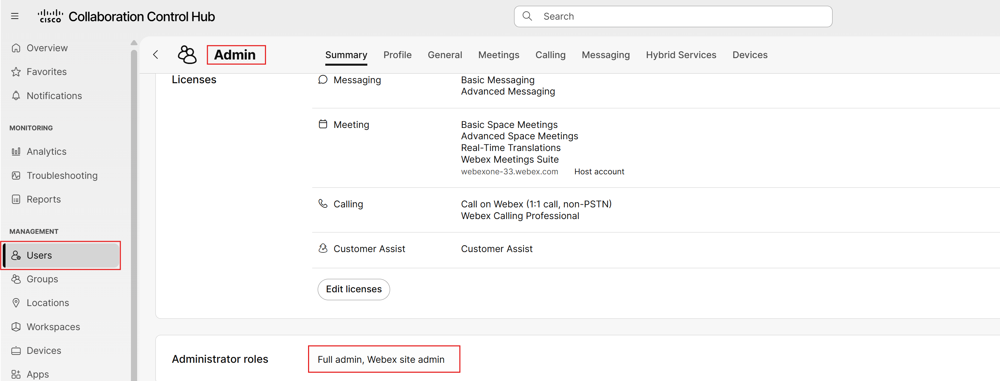
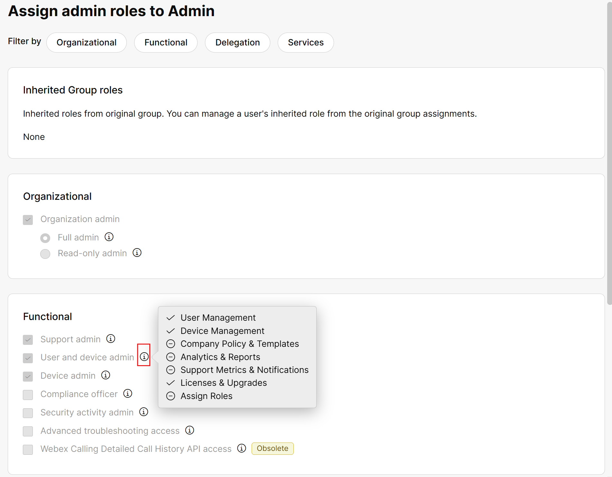
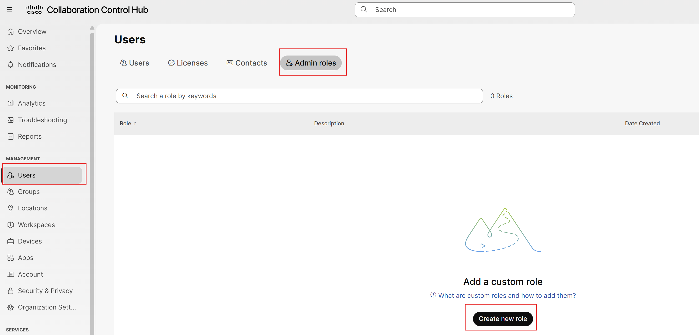
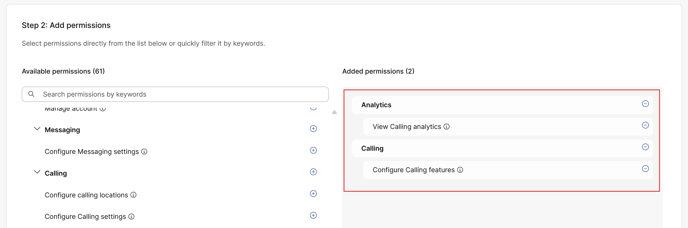
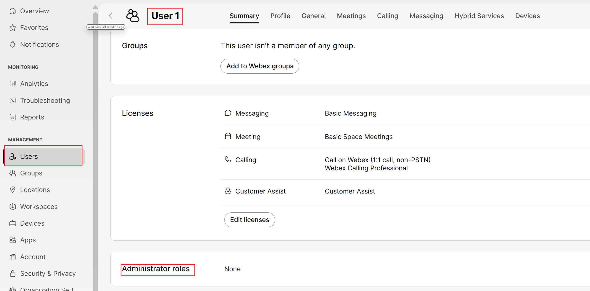
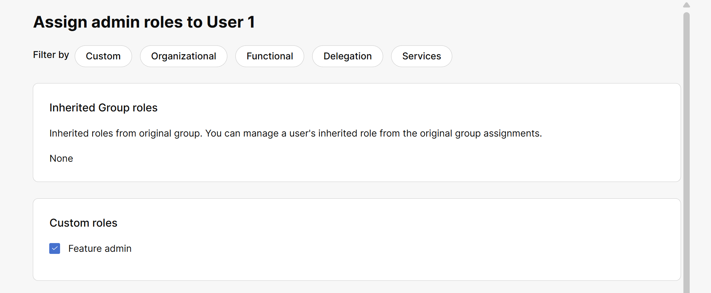
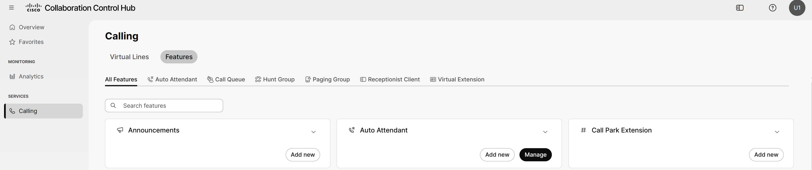
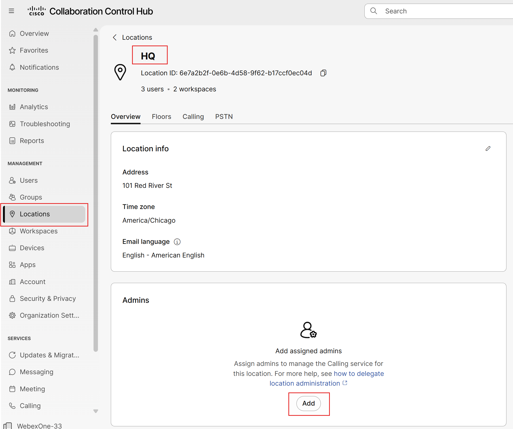
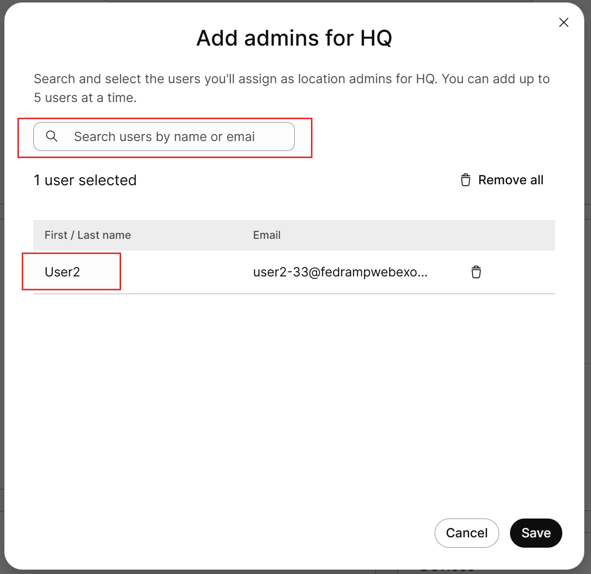
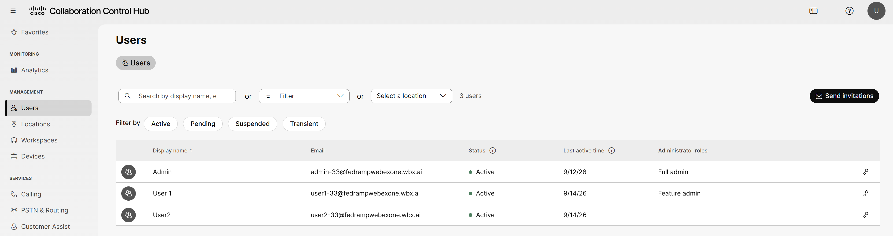

# RBAC and Location Admins

In this section we will cover Admin Roles, RBAC (Role Based Access Control) and Locations admins.

- From Control Hub, if you click on Users, the admin user, and then scroll down to Administrator roles and click.

- From here you should see a screen that shows all the default admin roles in control hub and if you hover of the “i” details will emerge about the capabilities of these roles. These roles can be assigned to any existing user within your organization. If someone just needs access to reports, that role exists (support admin). If someone only manages your video devices, again that role exists (device admin).

- However, what if these roles have too much or too little access, RBAC allows you to create customer roles that you can assign to users. Click on Users again on the left Menu, then click Admin Roles and Create new role.

- Give this role a name “feature admin” and then scroll down to add different roles. In this case as a feature admin, you want to give them the ability to modify features and see Calling Analytics, then click save.

- Now you can assign this role to one of your users. Go back to users and select User1 and scroll down to Administrator Roles and click.

- Then assign the new feature admin role and click save.

- If you open an incognito browser session and browse to admin-usgov.webex.com and then sign in as user1 (you will use the same credentials as you used to sign into the Webex app on your mobile device). As you will see, this view is much different and much more limited than a full admin role. Feel free to play with and adjust privileges with roles.

- Moving onto location admins. The thought process here is that if there are location based techs that need access to the entire configuration for their site so they can modify existing users, replace handsets, changes AAs, etc. location based admins will have those privileges. In this case, go to locations, click on HQ, then Add in the Admins tile.

- Then search for and add User2 as the location admin, then click save. Notice that the admin user is not an option which makes sense because they can see and manage everything already. Also note the User1 is grayed out. This is because they have a custom admin role and again that role conflicts with the location admin role.

- Once again, open a new incognito window, browse to admin-usgov.webex.com and sign in as User2 (credentials provided in the lab documentation). As mentioned, the location admin can see and modify most of the calling capabilities associated with their location.

