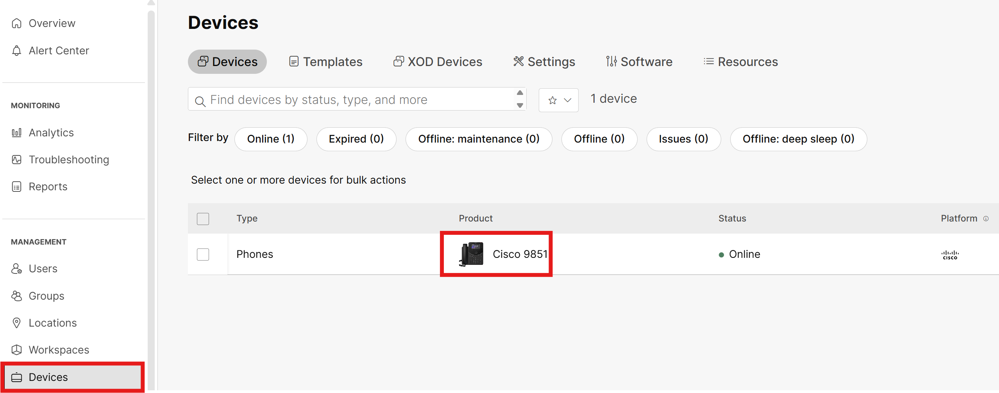
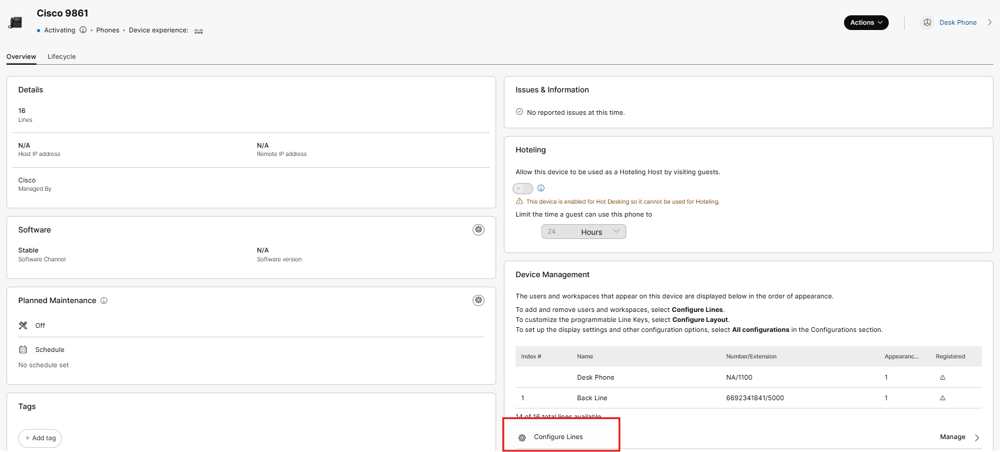
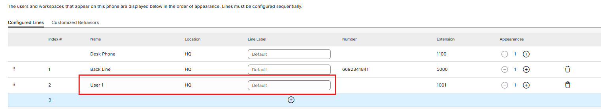
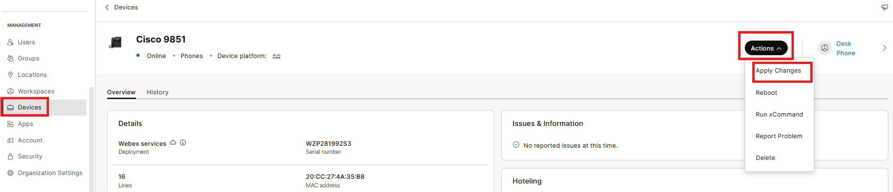
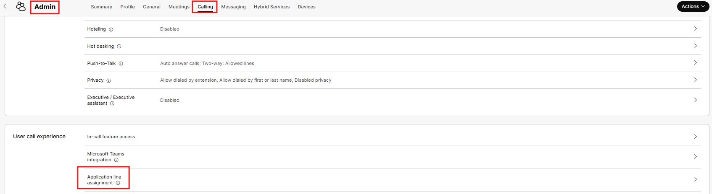
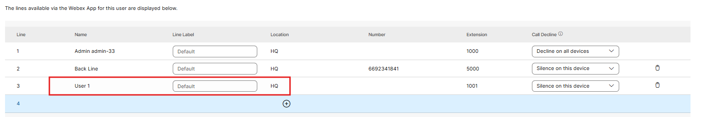
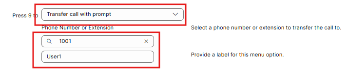
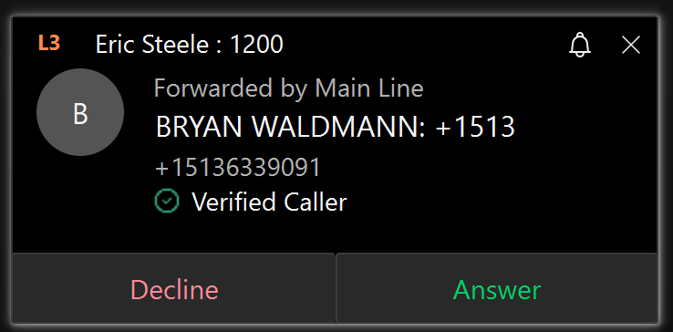
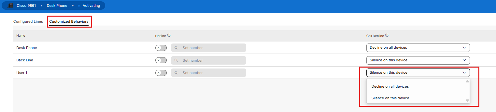
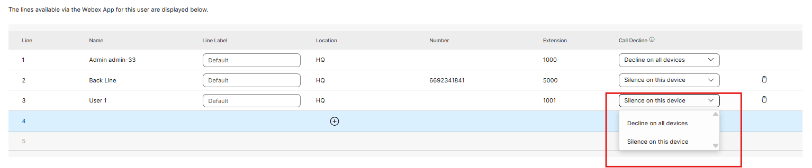

# Shared Lines

- Where virtual lines allow you to create new lines and assign them to Users or Workspaces, shared lines allow you to configure an existing line that belongs to a user or workspace and set it up on another user’s phone, Webex application or on a professional workspace. Start by clicking Devices in the left Menu and then select the Desk Phone.

- Click on Configure Lines within the Device Management Tile

- Then click the plus sign under the backline. Search for and then click on User1 and then click Save.

- Then click the action button in the top right corner and then apply changes.

- As you look at your desk phone you should now see 3 lines on the phone: desk phone, back line and User1. Adding a shared line to an application works in the same way as adding a virtual line to a user account. Let’s assign the same shared line to the Admin user’s Webex Application. This single change to the user account of the Admin user will impact the PC and Mobile experience in the Webex Application. Go to Users, find and select Admin, click on the calling tab within the account and scroll down to the User call experience tile. From here click on Application Line Assignment.

- Next, click on Configure Lines, then click the + symbol and then search for and select User1 then click Save. At this point you will want to restart the Webex Application on your PC.

- Let’s go to your Auto Attendant and configure Menu option 9 to route to User1. As a reminder, click on Calling under the services Menu, Features, Auto Attendants, Main Line and then within the Business Hours Auto Attendants tile, click on Menu options.

From your mobile phone, dial your Auto Attendant and select option 9. You should see this call ring in on the desk phone and on your PC where you are signed in as the Admin User.

If you decline the call on one device, notice it still rings on others. This is configurable at the device level by clicking into Configure Lines, Customized Behavior and then decline on all devices.

At the user level, this is configurable via the application line assignment.

