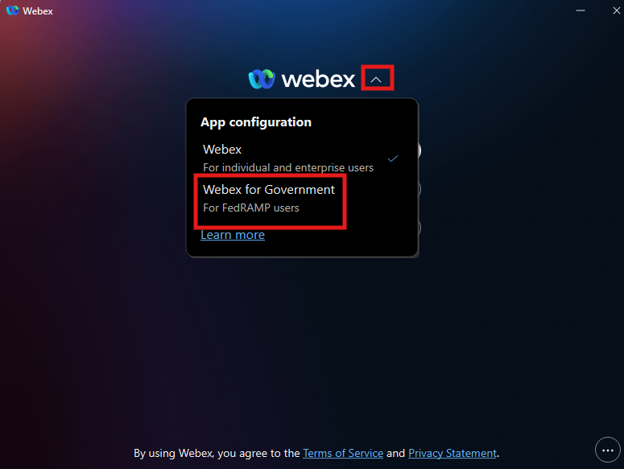
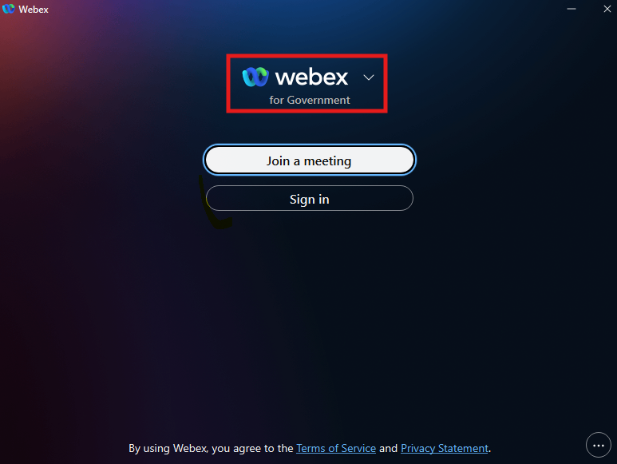
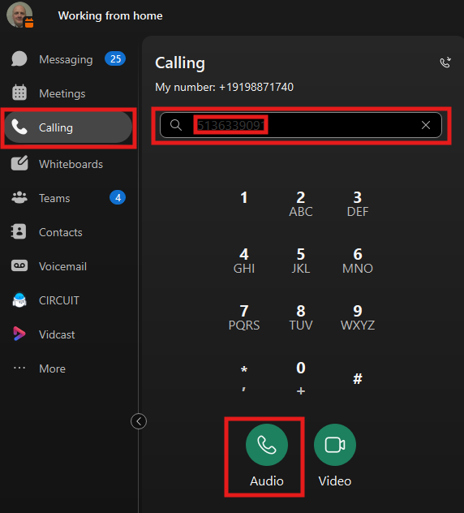
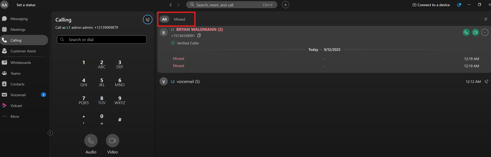
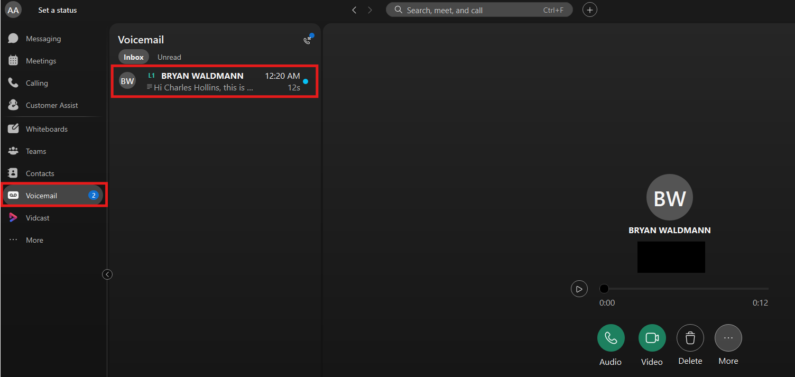
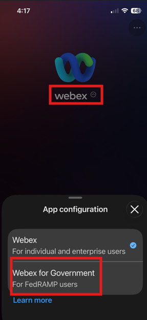
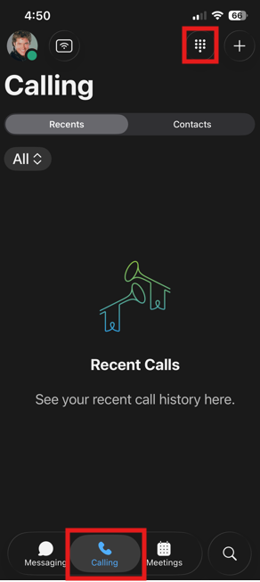

# Make Test Calls (physical phone, Webex App, Mobile)

This next step is crucial, so pay close attention.

- The Webex Application natively supports both Commercial and FedRAMP; however, you must designate where the application is routing. Click the dropdown arrow next to the word Webex, select Webex for Government and when prompted restart the Webex Application.

- After the Webex Application reboots, it should look like this.

- On your lab PC, sign into the Webex application with the admin account for your org. This is the same account you used to sign into Collaboration Control Hub.

- From your dCloud expo information (this should be opened in one of your browser tabs), launch into Workstation 1 and following the above steps, reset the webex application, then sign in as user1. Then launch into Workstation 2, reset the webex application and sign in as user2. These RDP sessions sometimes have audio and sometimes they do not, you are logging into these sessions not so much to hear calls but to validate features and functionality. (link to expo setup directions)

- Once signed in, click the calling section in the left menu, then in the dial pad enter your cell phone number and click the audio call button. A prefix to get an outside line is not required but could be defined at the location level if needed. Also worth noting, a call control window pops up giving you all your mid-call features.

- In addition to the dial pad in the top right window we have our call logs.

- Next from your 9861/9871 phone (Extension 1100), call the extension of your admin user (Extension 1000) and that call should ring on your Webex Application. Quick reminder on the 9861/9871 phone we can click the Sign In soft key to see Hot Desking and Home to take us back to the Normal phone screen.

- From your 9861/9871, call the extension of your admin user ( Extension 1000) but do not answer and leave a voicemail message. In a few moments, we should see some activity in the Webex application on the PC. Now that we see the voicemail, it can be listened to in the Webex application and a few seconds after the voicemail appears, a transcription of the voicemail should also appear.

- Next, we can test the Webex app in the Mobile client.

Much like the Webex Application on the PC, you must configure the application to route to Webex for Government.

- If you have the Webex app in your cell phone (iOS or Android). Sign into the Webex app on your mobile device using the credentials of User1. If you do not have the Webex app in your cell phone – you can quickly download it from Google Play Store or Apple AppStore. Then select the calling tab in your Webex application, the keypad option in the top corner and place an extension call to your 9861 phone (1100).

- Lastly, let’s make a call from the DeskPro to your Desk Phone. Swipe up on your DeskPro and select the home screen option. From there click the call icon and dial extension 1100.  The implications of this setup are simple, this video device can join not only Webex Meetings but meetings on other platforms as well (MS, Zoom and Google) and has telephony capabilities as well. This could potentially eliminate the need for a separate phone in your conference rooms as any of our video devices can be configured in this manner.

At this point, Chapter 2 is complete, and we are ready to jump into our feature specific set up. Based on our experiences running trials, these are the most asked for features when doing trials. There could be a feature that does not align with how you run your environment, so feel free to follow your lab but also to jump to skip features too.

Also worth mentioning again, we are manually configuring users and devices. These can also be provisioned in bulk using AD and Bulk Administration tools. And pat yourself on the back, you setup and laid the foundation of a new phone system in a matter of minutes.
