# Virtual Lines

- Virtual Lines have quite a few use cases within Webex Calling. Some use cases could be a backline into an office outside of normal business hours, a dedicated shared line configured across multiple phones or an overflow line coming off a call queue. Click on Calling in the left Menu, then click Virtual Lines and then click create.

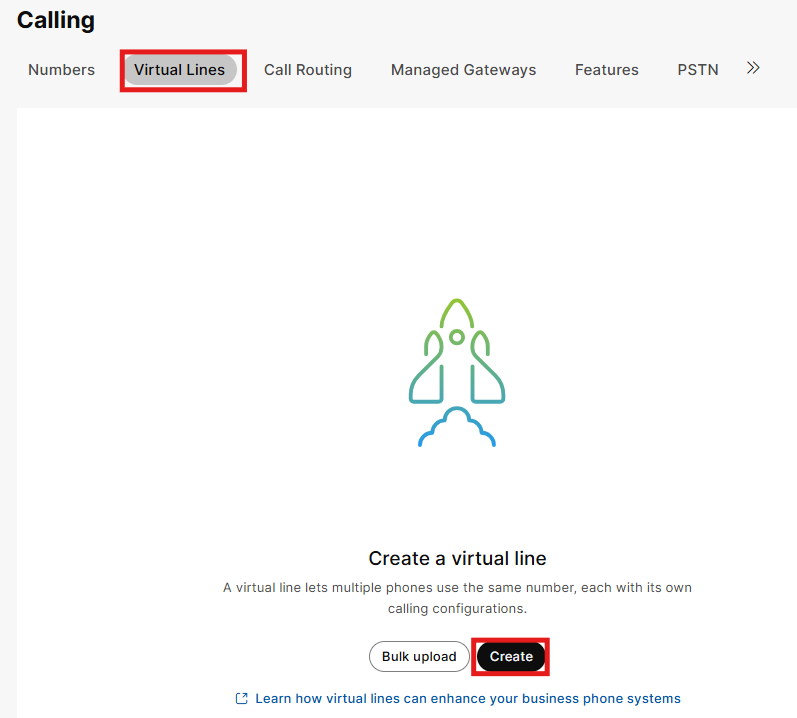

- Give the virtual line a first name, last name, display name and assign the location. After you complete these steps, additional options will populate, go ahead and assign this virtual line one of your existing Phone Numbers and an extension of 5000 and then click Add. <em>Once you specify the location, the ability to add a phone number and or DID will appear. </em>

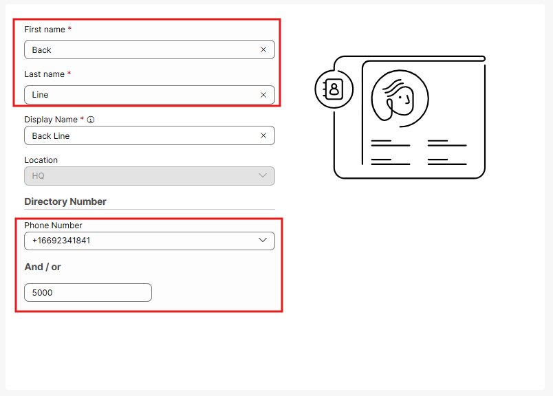

- You will not make any changes on the next screen that pops up, so just click close.

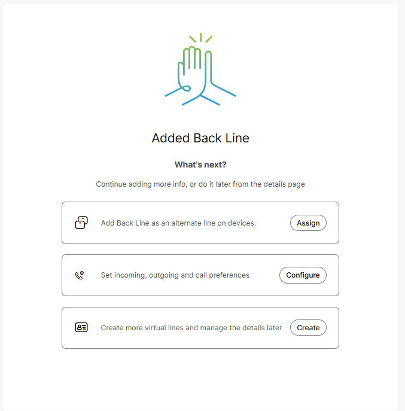

- Once that occurs, you should see the configured virtual line. Click into that virtual line to complete the set up.

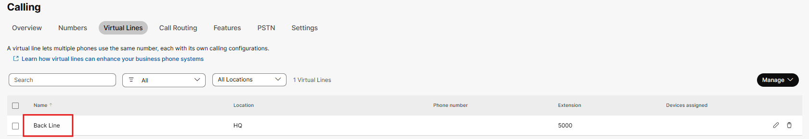

- If you click on the calling section on the virtual line and scroll down you will see that this line closely resembles the settings that a Webex calling user has including voicemail, outgoing calling privileges, unique MOH and even call recording.

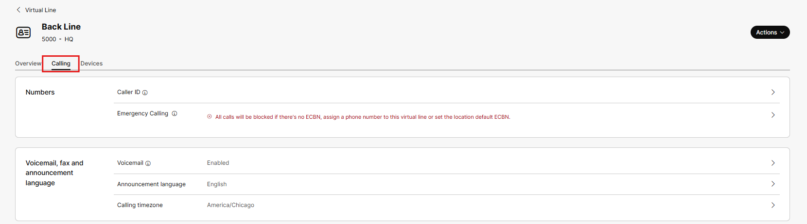

- Next, click on devices within the virtual line and then assign device.

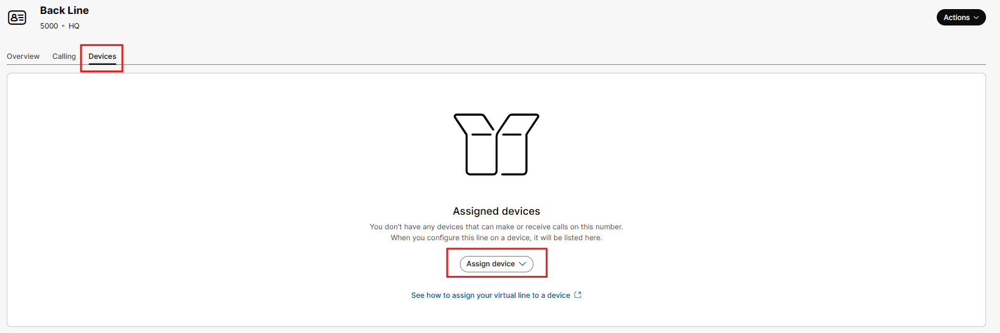

- When you click on assign device, you can add this virtual line to physical phones like your desk phone (requires a professional workspace license which you provisioned initially), user phones and user applications. Take a moment to add this virtual line to your desk phone then click assign.

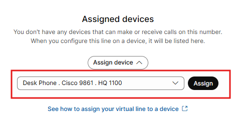

- At this point you will be taken into the line assignment for the desk phone where you can configure where this line appears, by default it is in line 2. Then click Save.

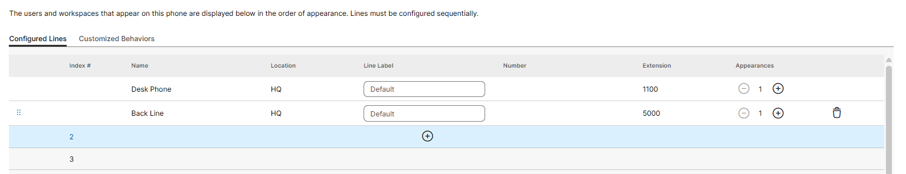

- Navigate to Device in the left menu, then click on your desk phone, click actions and then click apply changes. This will force the phone to reset and apply the virtual line.

- Going back to the Calling, Virtual lines, Backline, and Devices, the assigned devices page looks like this. Now click on assign device and assign this line to the Admin User (Webex app).

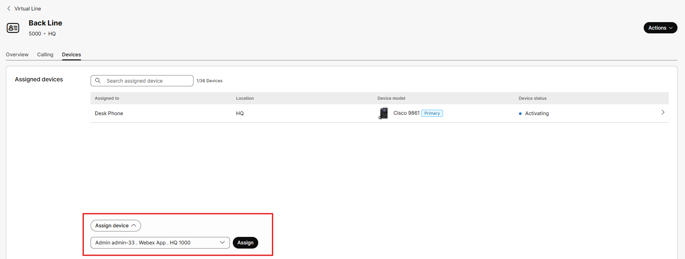

- Much like the physical phone, you will have the ability to modify where this virtual line appears on the Webex application. Line 2 is the default and click save.

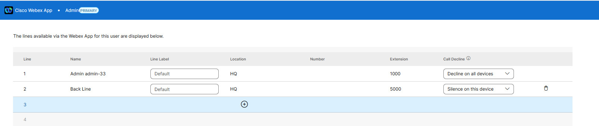

- An alternative way to add virtual lines is of course at the device or user level. Let’s go to Users in the left Menu and click on User1. Once in User1’s account, click on the calling tab and scroll down to application line assignment.

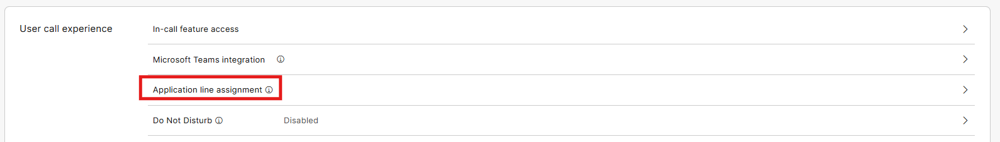

- Then click on configure lines.

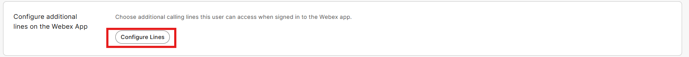

- Once online assignment page, click on the + sign and in the drop-down add the backline. Then click Save.

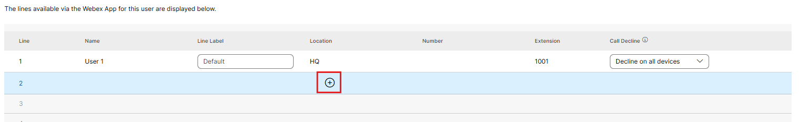

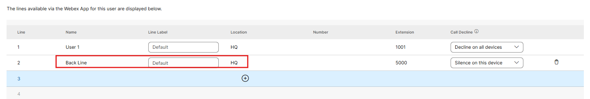

- If you go back to Calling in the left menu, virtual lines, click on the backline, and then devices you will also see User1 added to the list. The point of doing it in two different ways was really to show the flexibility in the platform. If you are working with workspaces or users and need to add an existing shared line, you can do it from those places in Control Hub. If you are working with the virtual lines, you can also add users or workspaces there too.

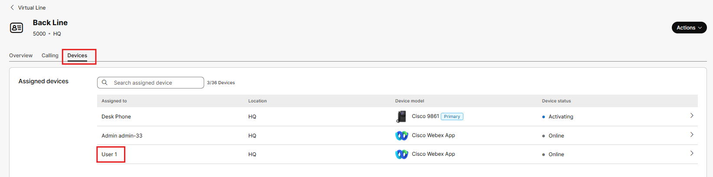

Before you test, make sure you restart the Webex application on your lab PC so that these changes are applied. Using your mobile phone, call into the backline DID to see it ringing on your PC (Admin User) and on the physical phone, then make a call into that DID for the Backline.

- If you require a voicemail only line, where all these calls should cover directly to voicemail, go to Virtual Lines, the backline, the calling tab and select voicemail.

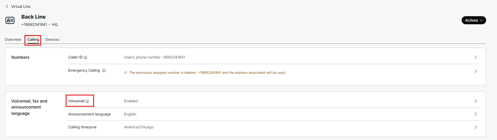

- From here toggle on send all incoming calls to voicemail and click save.

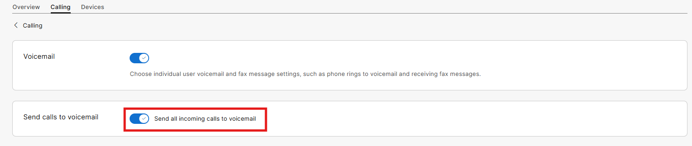

Using your mobile phone, call into the backline phone number and you should immediately hit the voicemail box for this virtual line and leave yourself a quick message. You should see this voicemail on the physical phone associated with the Backline.

- Even within the Webex Application running on your PC, you can choose to call out on line 1 (primary line) or Line 2 (back line). We also see a visual indication that we have voicemail on the left and if we click in at the top, we will see that we have voicemail associated with line 2.

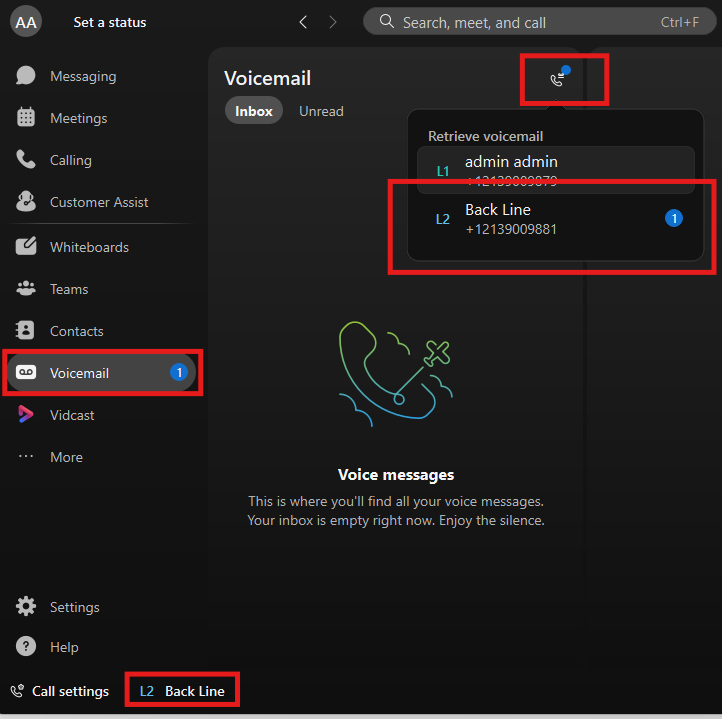
