# Set up and assign a device to a workspace

- You will now add a common area phone/ workspace as part of this lab.

- Click Workspaces under the Left Menu then click add a workspace in the middle of the page. Workspaces are effectively how we create common area phones in Webex Calling.

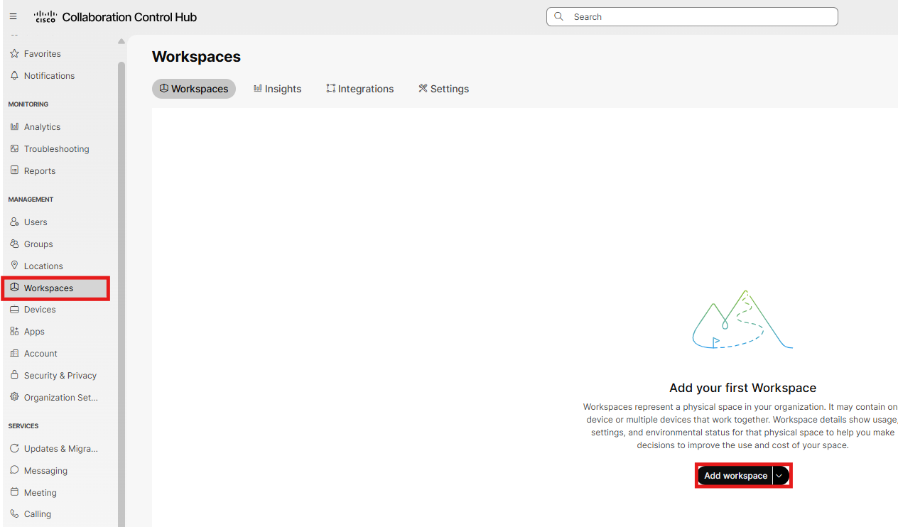

- Give the workspace Desk Phone and select next.

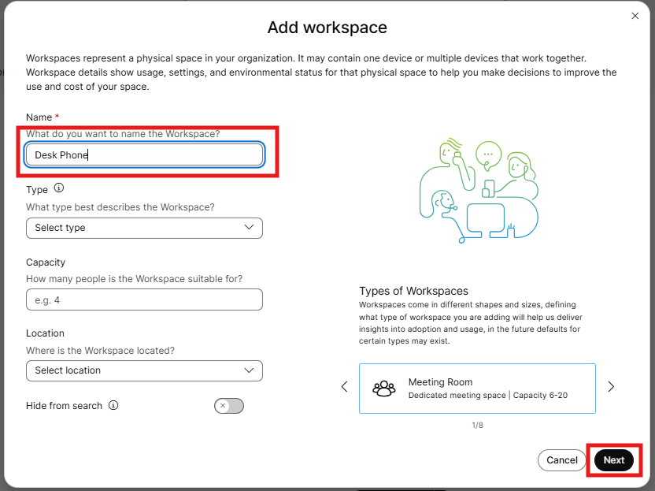

- Select 9800 series phone, select 9861/9871 (depends on the device at your table), by activation code, then select Next.

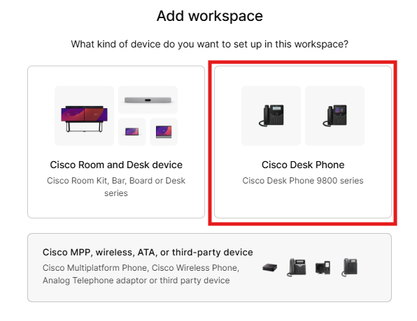

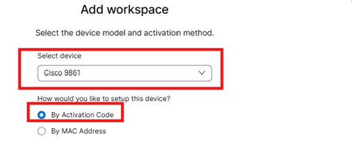

- At this point you have the option to configure the device as Hot Desk only or Cisco Webex Calling. A Webex Calling device has a unique DN and calling privileges whereas a hot desking device is intended to be used for hybrid workers in a shared office space. Select Cisco Webex Calling and check the box under scheduling for Hot desk sign in, then press next.

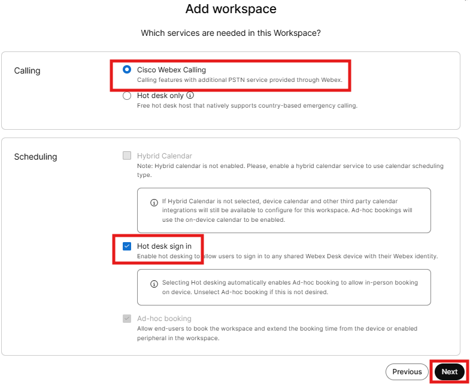

- Next, you need to assign the license to the workspace, choose Professional then click next. This document details the differences between a [Professional and Common Area Workspace](https://help.webex.com/en-us/article/n1qbbp7/Features-available-by-license-type-for-Webex-Calling).

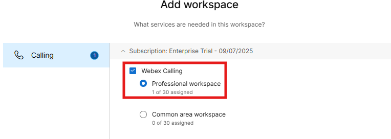

- Then assign the device to a location (HQ), select an available phone number from the dropdown and configure 1100 as the extension, and then click Next.

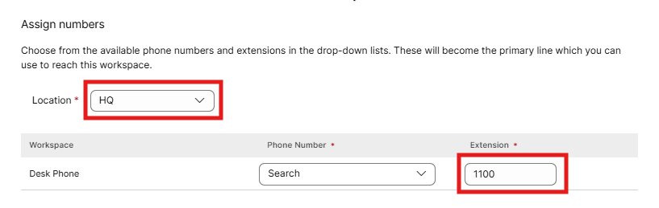

- A 16-digit activation code is then generated which should be entered on your lab 9861 phone. As indicated, this activation code is good for 30 days. This code can be emailed to an end user so they can plug in their phone and enter the code once the device is online. After the code is entered, click on go to Workspace.

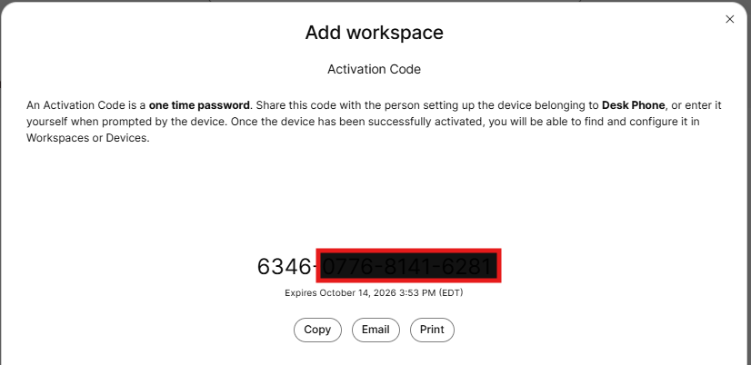

- The workspace should indicate that the phone is either activating or active, depending on how quickly you take the step above and how quickly the device registers. The phone may register to the cloud, pull updated firmware and then come online. This is normal.

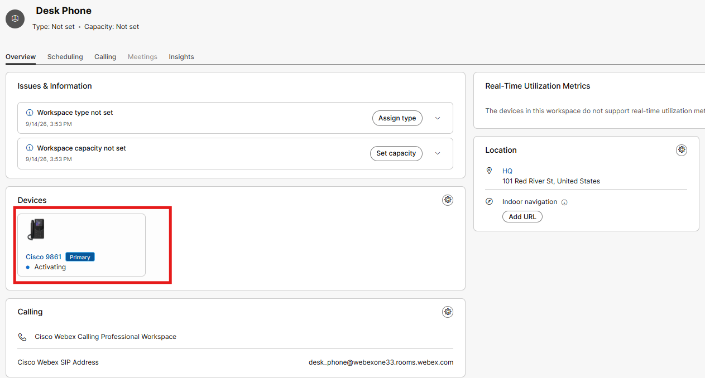

- Next, let’s add your DeskPro as a workspace in control hub. Currently your device is likely being used as a monitor for you PC but it can do so much more. From control hub, click Workspaces then Add workspaces.

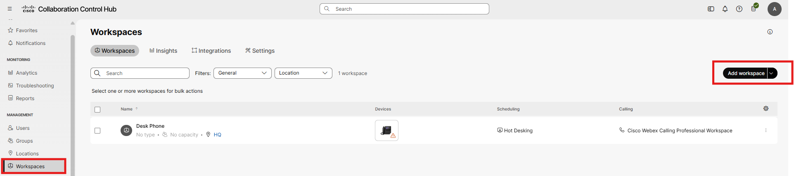

- Call this device DeskPro and click next.

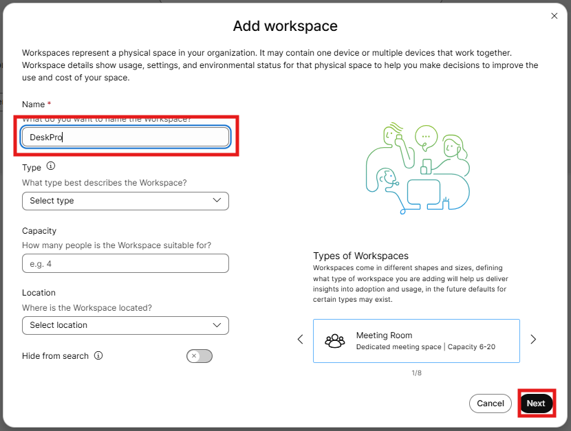

- Select a Cisco Room and Desk Device

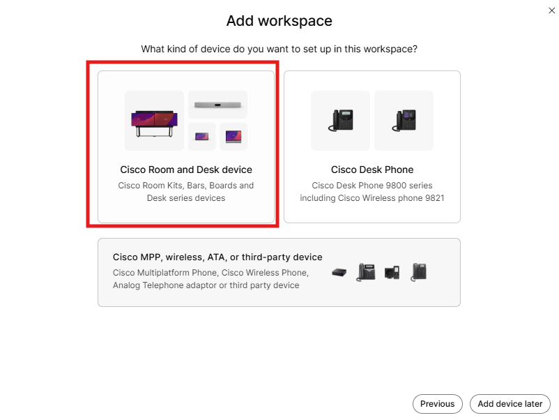

- Select Cisco Webex Calling and then Next

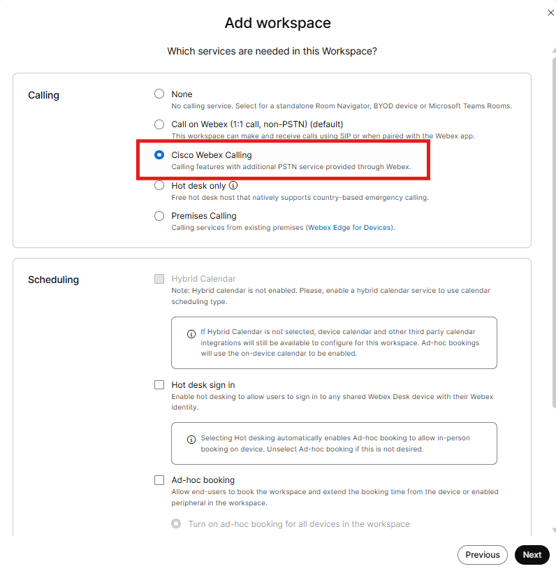

- Assign a professional license then click next.

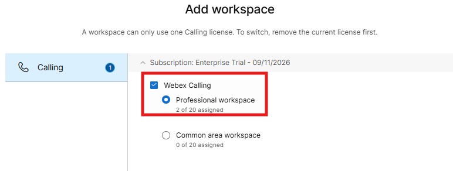

- Assign the device to the HQ location, give it the extension 1101 and press next.

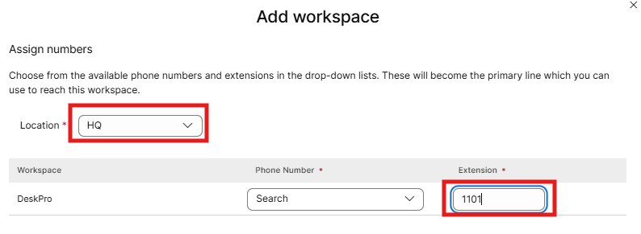

- An activation code will be generated which you can add to your DeskPro. This code will be different from the code for your phone and are not interchangeable because this code is specific for video devices and not a 9861/9871.

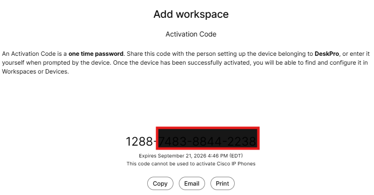
